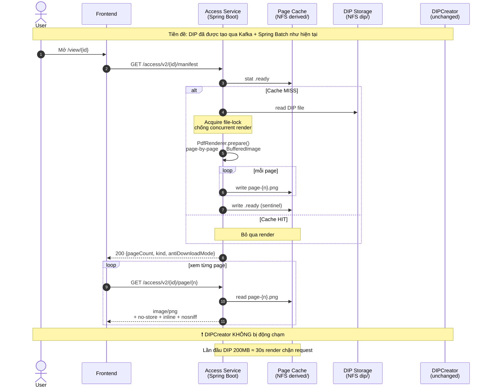
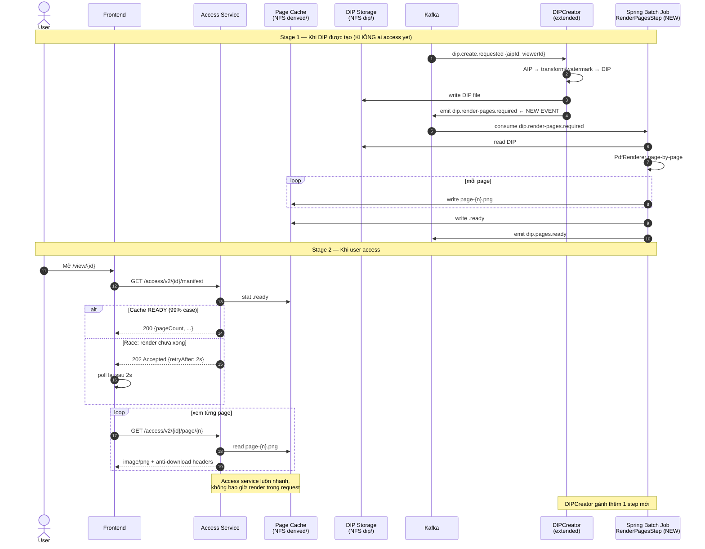

# Phương án migrate: API binary → Image-page Viewer (Anti-Download)

**Phạm vi**: Migrate Access service hiện tại (đang trả binary qua `Content-Disposition: attachment`) sang giải pháp viewer không-cho-tải lấy cảm hứng từ POC `poc-oais-access`.

**Đối tượng đọc**: Tech Lead, Senior Backend Engineer, Architect.

**Status**: Draft — chờ review + spike validation.

---

## 1. Bối cảnh hiện tại

### 1.1 Kiến trúc hệ thống đã có

| Component | Mô tả |
|---|---|
| **DIPCreator** | Service riêng, dùng **Kafka + Spring Batch** để tạo DIP on-demand từ AIP khi có access request |
| **DIP output** | File đã được DIPCreator transform: PDF normalize, encrypt, **watermark static** theo user/timestamp |
| **DIP storage** | Shared filesystem (NFS/SMB) — DIPCreator ghi, Access service đọc |
| **DIP format** | **PDF + Image (PNG/TIFF)** — không có Office/Video |
| **Encryption at rest** | **Plaintext** trên NFS (decryption đã xong trước khi ghi) |
| **Access service** | Spring Boot, hiện expose `GET /access/{id}` → stream binary với `Content-Disposition: attachment` → browser **auto-download** |

### 1.2 Vấn đề

Theo PRD: cần cho phép user **xem** DIP nhưng **không cho tải file gốc**. Endpoint hiện tại với `Content-Disposition: attachment` mâu thuẫn trực tiếp với yêu cầu.

### 1.3 Ràng buộc

- **Backward compatibility**: keep legacy endpoints, deprecate sau (clients hiện tại chưa break ngay).
- **Scale**: >1000 concurrent users, file DIP có thể >200MB.
- **Tech stack**: Spring Boot Java giống POC → tận dụng tối đa code.

---

## 2. Mục tiêu Migration

| Goal | Tiêu chí thành công |
|---|---|
| Block direct download của DIP gốc | Browser không hiển thị "Save As", URL không trả file binary có Content-Disposition attachment |
| User vẫn xem được DIP đầy đủ | PDF render đủ trang, Image hiển thị đúng |
| Backward compat | `/access/{id}` legacy còn hoạt động trong giai đoạn migrate |
| Không thay đổi DIPCreator (tối thiểu) | DIP output, NFS layout, Kafka topic giữ nguyên (phương án A); chỉ thêm event nếu chọn phương án B |
| Đáp ứng scale hiện tại | p99 latency manifest <500ms, page <200ms (cache hit), p99 first-access <30s với DIP 200MB |

---

## 3. Cái có thể tái dụng từ POC

| Component POC | Tái dụng cho production | Hiệu chỉnh |
|---|---|---|
| `Renderer` interface | ✅ Trực tiếp | — |
| `PdfRenderer` (PDFBox) | ✅ Trực tiếp | Bổ sung `MemoryUsageSetting.setupMixed()` cho file lớn |
| `ImageRenderer` (passthrough PNG/JPG) | ✅ Trực tiếp | — |
| **`TiffRenderer`** | 🆕 Build mới | TwelveMonkeys ImageIO TIFF plugin → PNG; multi-page TIFF y như PDF |
| `TokenService` HMAC pattern | ✅ Trực tiếp | Key từ Vault/Secret Manager |
| HTTP response headers + filter | ✅ Trực tiếp | Add rate limit |
| `AccessAuditService` | ✅ Trực tiếp | Sink Kafka topic thay vì local file |
| Frontend `PdfPagedViewer` | ✅ Trực tiếp | Tích hợp vào app hiện tại |
| Frontend overlays (NoContext/Watermark/Blur) | ✅ Trực tiếp | Bỏ Watermark frontend nếu DIP đã watermark đủ |

**Cái KHÔNG cần** (nhờ DIPCreator đã làm):
- ❌ `WatermarkService` (DIP đã watermark static)
- ❌ `OfficeRenderer` (DIP chỉ có PDF/Image)
- ❌ `VideoRenderer` (không có video)
- ❌ Async render pipeline build-from-scratch (Kafka + Spring Batch đã có)

---

## 4. Hai phương án thiết kế

### 4.1 Phương án A — Render inline trong Access service (lazy)

**Đặc điểm**:
- Chỉ thay đổi Access service.
- DIPCreator + Kafka + Spring Batch nguyên si.
- Lazy render: chỉ render khi có user thực sự access.

---

### 4.2 Phương án B — Mở rộng DIPCreator pre-render PNGs (Recommended)

**Đặc điểm**:
- Access service "ngu" — chỉ serve cache, không render.
- Tận dụng kiến trúc Kafka + Spring Batch sẵn có.
- Pre-render: trade storage (lãng phí với DIP không ai access) lấy latency (luôn nhanh).

---

## 5. So sánh A vs B

| Tiêu chí | A — Render inline | B — Pre-render qua DIPCreator |
|---|---|---|
| **Effort triển khai** | 2.5–4 tuần | 3.5–5.5 tuần |
| **Phạm vi thay đổi** | Chỉ Access service | Access service + extend DIPCreator + Kafka topic mới |
| **Latency lần đầu access** | 30s+ cho PDF 200MB | ~50ms (cache hit) |
| **Latency các lần sau** | ~50ms (cache hit) | ~50ms (cache hit) |
| **CPU/RAM Access service** | Cao spike khi render — cần `-Xmx2G+` và worker pool | Thấp ổn định — chỉ I/O |
| **CPU/RAM DIPCreator** | Không đổi | Tăng (gánh thêm render step) |
| **Storage cost** | Tiết kiệm: chỉ render DIP nào access | Lãng phí: render mọi DIP |
| **Concurrent 1000 user / 1000 DIP khác nhau** | Có thể đè Access service | Không vấn đề |
| **Concurrent 1000 user / cùng 1 DIP** | OK (file-lock) | OK |
| **Tích hợp pipeline hiện tại** | Tách biệt | Tận dụng Kafka + Spring Batch |
| **Recovery khi DIP đổi** | Xoá folder cache → render lại | DIPCreator emit lại event → re-render |
| **Edge case: user xem ngay khi DIP vừa created** | Tự render → user chờ 30s | Race nhỏ — frontend poll, hoặc DIPCreator emit ready event SSE |
| **Phù hợp khi** | Cold corpus, ít access | Hot corpus, access dày |

### 5.1 Decision Matrix theo profile hệ thống

| Yếu tố | Điểm A | Điểm B |
|---|---|---|
| Đã có Kafka + Spring Batch (DIPCreator) | — | +2 |
| File >200MB | -1 | +1 |
| Concurrent >1000 | -2 | +2 |
| Volume DIP lớn, access thưa | +1 | -1 |
| Volume DIP vừa, access dày | -1 | +1 |
| Team đã quen với Spring Batch | — | +1 |
| **Tổng** | **-3** | **+6** |

→ **Khuyến nghị: Phương án B**.

### 5.2 Khi nào chọn A

- Quick win cần ship trong 2 tuần.
- DIP corpus chủ yếu lạnh (access rate < 5%).
- DevOps không sẵn sàng deploy code mới cho DIPCreator node.

### 5.3 Hybrid (nếu phù hợp)

Start với A trong 2-3 tuần, đo metrics, sau đó tiến hoá sang B khi:
- p99 latency lần đầu access > SLA
- Access service OOM dưới load test
- Cache hit rate > 80% (chứng tỏ pre-render có giá trị)

Migration A → B chỉ cần thêm Kafka topic + Batch step mới — code render đã có sẵn.

---

## 6. Phased Plan (theo phương án B — recommended)

### Phase A — Foundation (1.5–2 tuần)

| Task | Effort |
|---|---|
| Add new endpoints `/access/v2/{id}/manifest` + `/access/v2/{id}/page/{n}` song song legacy | 2-3d |
| Tích hợp `PdfRenderer` (POC) vào Access service | 2-3d |
| Build `TiffRenderer` mới (TwelveMonkeys ImageIO) | 1-2d |
| `ImageRenderer` passthrough cho PNG/JPG | 0.5d |
| Anti-download response headers + filter | 1d |
| Cache strategy với file-lock + sentinel | 2d |
| Frontend: thay download link bằng `PdfPagedViewer` | 3-5d |
| Unit + integration tests | 2d |

**Output**: 2 endpoint cùng tồn tại. Frontend có thể chọn dùng v2. Mode 1 (basic anti-download) hoạt động.

**Verification**:
- Smoke test: GET v2 endpoint → trả manifest đúng format
- Đo latency với DIP mẫu nhỏ + lớn
- Test render-on-first-access end-to-end

### Phase B — Extend DIPCreator (1–1.5 tuần)

| Task | Effort |
|---|---|
| Thêm Kafka topic `dip.render-pages.required` | 0.5d |
| Spring Batch step `RenderPagesStep` trong DIPCreator | 2-3d |
| Emit event sau khi DIP create xong | 1d |
| Cache invalidation khi DIP version đổi | 1d |
| Monitoring metrics (render duration, queue depth) | 1d |
| Load test: 1000 concurrent DIP create + render | 2d |

**Output**: Cache PNGs được pre-render proactively. Access service không còn block trên render.

**Verification**:
- New DIP → tự động có cache PNGs sau ≤2 phút
- Access lần đầu sau khi DIP ready: cache hit ngay
- Race case (access trước khi render xong) → 202 Accepted + frontend poll thành công

### Phase C — Migrate clients (1–2 tuần)

| Task | Effort |
|---|---|
| Add `Sunset: <date>` deprecation header vào legacy `/access/{id}` | 0.5d |
| Document v2 API cho clients | 1d |
| Migrate frontend(s) sang v2 endpoint | 3-5d |
| Monitor usage of legacy endpoint qua metrics | continuous |

**Output**: Legacy endpoint chỉ còn phục vụ <5% traffic.

**Verification**:
- Dashboard hiển thị traffic ratio v1/v2
- 0 ticket complaint về download không hoạt động (vì attachment đã không còn cho v2)

### Phase D — Decommission (2-3 ngày)

| Task | Effort |
|---|---|
| Confirm legacy traffic <1% trong 7 ngày liên tiếp | wait |
| Remove `/access/{id}` legacy code | 0.5d |
| Update API gateway routing | 0.5d |
| Release notes | 0.5d |

### Phase E (optional, +1 tuần) — Token mode 3

Chỉ làm nếu cần chống user share URL ngoài session.

| Task | Effort |
|---|---|
| Tích hợp `TokenService` POC vào Access service | 1-2d |
| HMAC key từ Vault/Secret Manager | 1d |
| Endpoint `/access/v2/{id}/page-token/{n}` | 1d |
| Frontend prefetch token | 1d |
| Test edge cases (expire, viewer mismatch) | 1d |

---

## 7. Tổng effort

| Scope | 1 dev FT | Team 2 |
|---|---|---|
| **Minimum** (Phase A + C + D, mode 1, render inline) | **2–3 tuần** | 2 tuần |
| **Realistic** (Phase A → D, B render inline → upgrade sau) | **3–4 tuần** | 2-3 tuần |
| **Production-grade B** (Phase A → D với pre-render qua DIPCreator) | **5–6 tuần** | 3-4 tuần |
| **Production-grade B + Token mode 3** | **6–7 tuần** | 4-5 tuần |

So với estimate ban đầu (3-4 tháng cho 1 dev), giảm **~70%** vì hạ tầng async đã có sẵn.

---

## 8. Risks & Validation

### 8.1 Critical risks (cần spike sớm)

| Risk | Impact | Validation |
|---|---|---|
| **PDFBox OOM với DIP 200MB** | Cao — block scale | Spike 1-2 ngày: load DIP mẫu thực tế, đo `-Xmx`, thử `MemoryUsageSetting.setupMixed()` |
| **TIFF multi-page render slow** | Trung bình | Spike: thử TIFF 100MB nhiều page, đo latency vs PDF tương đương |
| **NFS cache invalidation race** | Trung bình | Test 2 process render cùng DIP đồng thời; kết quả phải nhất quán (file-lock + sentinel) |
| **Frontend integration với app hiện tại** | Phụ thuộc app | Spike: copy PdfPagedViewer vào app, render 1 DIP test |
| **Watermark trong DIP có đủ thông tin?** | Cao nếu thiếu | Confirm với DIPCreator owner: watermark có {userId} + timestamp; nếu không → cần thêm dynamic ở Access (+3-5d) |

### 8.2 Medium risks

| Risk | Mitigation |
|---|---|
| Storage cost của pre-rendered cache | LRU eviction sau N ngày; cap tổng dung lượng |
| Kafka backlog khi tạo nhiều DIP cùng lúc | Auto-scale Spring Batch worker; dashboard queue depth |
| First-render latency cho user xem DIP ngay khi tạo | Frontend poll với `202 Accepted`; hoặc SSE notification |
| Ai đó lưu được PNG đơn lẻ qua Network tab | Mode 2/3 tăng strength; hoặc add token mode 3 |

### 8.3 Out-of-scope risks (acceptable)

- User screenshot bằng OS / camera (không công nghệ web nào chống được)
- User dùng accessibility tool (screen reader) — đây là feature, không phải bug

---

## 9. Validation Plan (trước Phase A)

### 9.1 Spike (3-4 ngày)

1. **Memory test**: PDFBox load DIP thực tế lớn nhất (estimate 200-500MB) trên môi trường giống production.
   - Thử `Loader.loadPDF(file)` thường + `MemoryUsageSetting.setupMixed(temp)`.
   - Đo peak heap, time-to-first-page-render.
   - Nếu OOM với `-Xmx4G` → nghiên cứu giải pháp khác (Aspose, hoặc page-streaming PDF lib).

2. **TIFF render test**: load TIFF mẫu thực tế nhiều page.
   - Verify TwelveMonkeys ImageIO plugin handle được.
   - Đo latency render từng page.

3. **NFS cache concurrency test**:
   - 2 process cùng render 1 DIP.
   - Confirm sentinel + file-lock prevent corruption.

4. **DIPCreator integration spike** (cho phương án B):
   - Code review DIPCreator để hiểu Spring Batch job structure.
   - Thử thêm 1 step "noop" để verify pipeline extend được.

### 9.2 Success criteria spike

| Test | Pass condition |
|---|---|
| PDFBox 200MB DIP | Heap <4G, render hoàn tất <60s |
| TIFF 100MB multi-page | Render <30s, không OOM |
| Cache concurrency | 2 process cùng render → cache nhất quán |
| DIPCreator extend | Thêm step mới deploy được, không break existing job |

Nếu spike fail → re-evaluate stack (Aspose PDF, MuPDF Java binding, hoặc shell out to `pdftoppm`).

---

## 10. Open Questions / Decisions Needed

| Question | Decision needed by | Owner |
|---|---|---|
| Watermark trong DIP có đủ thông tin (userId + timestamp)? | Spike phase | DIPCreator team |
| HMAC key storage: Vault / AWS Secrets / K8s Secret? | Phase E start | Security team |
| Cache eviction policy: LRU vs TTL vs hybrid? | Phase A | Storage owner |
| Auth integration cho mode 3: existing JWT? new flow? | Phase E start | Auth team |
| Frontend: tích hợp vào app hiện tại hay viết SPA mới? | Phase A | Frontend Lead |
| Logging sink: file local / Kafka / ELK? | Phase A | Ops |

---

## 11. Rollout Strategy

### 11.1 Feature flag

Add config `oais.access.v2-enabled = true|false`. Cho phép tắt v2 nhanh nếu phát hiện vấn đề.

### 11.2 Canary

| Stage | % traffic v2 | Duration | Rollback trigger |
|---|---|---|---|
| Internal | 100% (chỉ team) | 1 tuần | Bất kỳ lỗi P1 |
| Beta users | 10% | 1 tuần | Error rate >0.1%, p99 latency >SLA |
| Gradual ramp | 25% → 50% → 100% | 2 tuần | Cùng tiêu chí |

### 11.3 Monitoring

| Metric | Threshold |
|---|---|
| `access.v2.manifest.latency.p99` | <500ms |
| `access.v2.page.latency.p99` | <200ms (cache hit) |
| `access.v2.first-render.latency.p99` | <30s (DIP <200MB) |
| `access.v2.error.rate` | <0.1% |
| `access.v2.cache.hit-ratio` | >95% sau 7 ngày |
| `dipcreator.render-pages.queue.depth` | <100 |
| `dipcreator.render-pages.duration.p99` | <60s |
| Heap usage Access service | <70% sustained |

### 11.4 Rollback plan

1. Set `oais.access.v2-enabled = false` qua config refresh → frontend fallback về legacy.
2. Investigate cause.
3. Fix forward — không revert code đã merge.

---

## 12. Success Metrics (post-launch)

| Metric | Mục tiêu |
|---|---|
| % DIP access qua v2 | 100% trong 6 tuần |
| Số ticket "Tôi không tải được DIP" | 0 (đây là feature, không phải bug) |
| Số attempt download bị chặn (audit log) | Increasing trend = good |
| User abandonment rate trên viewer | <5% (so với baseline trước migrate) |
| First-access latency p95 | <10s với DIP <100MB; <30s với DIP <500MB |
| Cache hit ratio (Phase B) | >95% sau warm-up |

---

## 13. Tham chiếu

- POC walkthrough: [`docs/POC.md`](./POC.md)
- POC source: project root `poc-oais-access/`
- OAIS Reference: ISO 14721:2012
- PDFBox docs: https://pdfbox.apache.org/3.0/
- TwelveMonkeys ImageIO: https://github.com/haraldk/TwelveMonkeys
- HLS.js: https://github.com/video-dev/hls.js

---

## 14. Sign-off Checklist

- [ ] Tech Lead review
- [ ] DIPCreator owner xác nhận extend feasible
- [ ] Security team approve token mode 3 design (nếu áp dụng)
- [ ] Spike kết quả pass tất cả success criteria
- [ ] Storage budget approved cho pre-rendered cache (phương án B)
- [ ] Monitoring + alerts đã setup
- [ ] Rollback plan đã test trên staging
- [ ] Frontend team ready với migration plan
