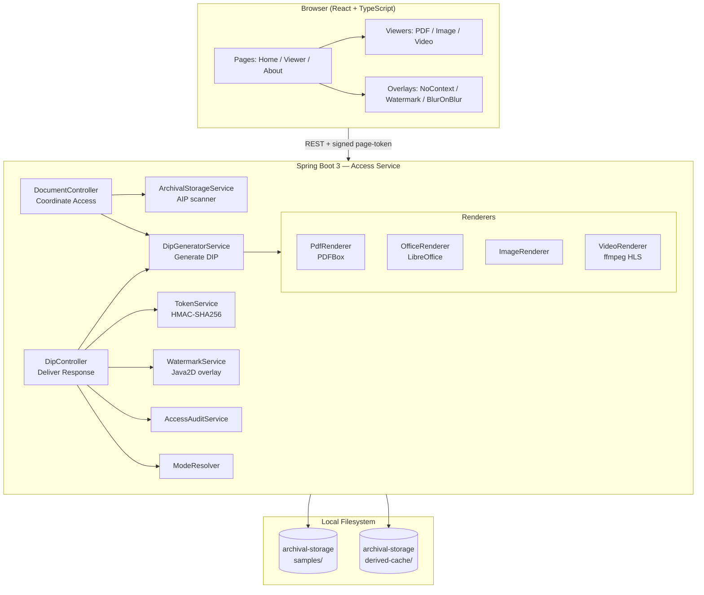

# Tài liệu thuyết minh POC: OAIS Access — Document Viewing System

**Version**: 0.1.0
**Stack**: ReactJS (Vite + TypeScript) + Spring Boot 3 (Java 21)
**Reference**: OAIS — ISO 14721:2012 (Open Archival Information System)

---

## 1. Mục tiêu

Theo `prd.md`, POC chứng minh khả năng xây dựng một hệ thống cho phép người dùng:

- ✅ **Xem (view)** tài liệu trực tuyến trên trình duyệt
- ❌ **Không cho tải (download)** trực tiếp dưới dạng file gốc

POC tập trung vào functional entity **Access** trong mô hình OAIS — phần giao tiếp với người dùng cuối để lấy DIP (Dissemination Information Package) từ AIP (Archival Information Package).

## 2. Phạm vi POC

### Trong phạm vi (In Scope)

| Hạng mục | Mô tả |
|---|---|
| Document types | PDF, Office (DOCX/XLSX/PPTX), Image (PNG/JPG), Video (MP4) |
| Anti-download | 3 cấp độ: Basic / Watermark / Token-based |
| Frontend viewer | Paginated PDF viewer, image viewer, video player |
| Storage | Local filesystem (`archival-storage/samples/`) |
| Audit | Append-only JSON log mỗi lần access |

### Ngoài phạm vi (Out of Scope)

- Authentication thật (chỉ pseudo `viewerId` UUID per session)
- Upload UI (file đặt thủ công vào samples folder)
- DRM thật (Widevine/PlayReady) cho video
- Persistence của HMAC key qua restart
- Optimization cho file > 50MB hoặc > 100 pages
- Search / list filtering nâng cao

---

## 3. Kiến trúc tổng quan



---

## 4. Mapping POC ↔ OAIS Access functional entity

| OAIS Concept | POC Implementation | File trong code |
|---|---|---|
| **AIP** (Archival Info Package) | File trong `samples/` + `AipMetadata` | `model/AipMetadata.java` |
| **DIP** (Dissemination Info Package) | Page-PNG / HLS segment trong `derived-cache/` | `service/renderer/*` |
| **Coordinate Access Activities** | `DocumentController`, `DipController` | `controller/` |
| **Generate DIP** | `DipGeneratorService` + `Renderer` strategy | `service/DipGeneratorService.java` |
| **Deliver Response** | Streaming + cache-control + page token | `controller/DipController.java` |
| **Access Aids** | Manifest endpoint mô tả pages, kind | `model/DipManifest.java` |
| **Audit** | JSON line vào `logs/access-audit.log` | `service/AccessAuditService.java` |

---

## 5. Cấu trúc thư mục

```
poc-oais-access/
├── prd.md                       # PRD gốc
├── README.md
├── docs/
│   ├── POC.md                   # File này
│   └── MIGRATION.md             # Phương án migrate
├── docker-compose.yml           # Backend + frontend container
├── archival-storage/
│   ├── samples/                 # AIP gốc (file mẫu đặt vào đây)
│   └── derived-cache/           # DIP rendered (gitignored)
├── backend/                     # Spring Boot 3 + Java 21 + Maven
│   ├── pom.xml
│   └── src/main/java/com/poc/oais/access/
│       ├── AccessApplication.java
│       ├── controller/          # REST endpoints + exception handler
│       ├── service/
│       │   ├── ArchivalStorageService.java
│       │   ├── DipGeneratorService.java
│       │   ├── TokenService.java
│       │   ├── WatermarkService.java
│       │   ├── AccessAuditService.java
│       │   ├── ModeResolver.java
│       │   └── renderer/        # PdfRenderer / OfficeRenderer / ImageRenderer / VideoRenderer
│       ├── config/              # AccessProperties, WebConfig (CORS)
│       └── model/               # AipMetadata, DipManifest, DocumentKind
└── frontend/                    # Vite + React 18 + TypeScript
    └── src/
        ├── api/                 # client, types, viewerId, mode
        ├── pages/               # HomePage, ViewerPage, AboutPage
        └── components/
            ├── viewer/          # PdfPagedViewer, ImageViewer, VideoViewer
            ├── overlay/         # NoContextOverlay, WatermarkOverlay, BlurOnBlurOverlay
            └── ModeSelector.tsx
```

---

## 6. Backend Components (chi tiết)

### 6.1 `AipMetadata` — Model AIP

```java
record AipMetadata(
    String id,            // SHA-1(filename), 16 hex chars — opaque, không lộ filename
    String title,         // tên file gốc
    DocumentKind kind,    // PDF | OFFICE | IMAGE | VIDEO
    String mimeType,
    long sizeBytes,
    @JsonIgnore Path sourcePath,
    Instant ingestedAt
) {}
```

**Quyết định thiết kế**:
- ID là hash → URL không lộ filename, đồng thời không thể path-traversal qua input.
- `sourcePath` đánh dấu `@JsonIgnore` → không leak qua API.

### 6.2 `ArchivalStorageService` — AIP Scanner

Scan thư mục `archival-storage/samples/` lúc Spring Boot startup, build index `Map<String, AipMetadata>`.

**Hành vi**:
- One-shot scan (không watch filesystem) — restart để nạp file mới.
- DocumentKind detect theo extension whitelist.
- File extension không hỗ trợ → bỏ qua, không gây fail startup.

### 6.3 `Renderer` Strategy + `DipGeneratorService`

Interface `Renderer` cho phép từng loại document có pipeline riêng:

```java
interface Renderer {
    DocumentKind supports();
    int prepare(AipMetadata aip);        // idempotent — render cache nếu chưa có
    Path resolvePage(AipMetadata aip, int pageNumber);     // PDF/OFFICE/IMAGE
    Path resolveHlsAsset(AipMetadata aip, String fileName); // VIDEO
}
```

`DipGeneratorService` dispatch theo `kind`. Mỗi renderer có sentinel file `.ready` đánh dấu cache đã được build.

#### 6.3.1 `PdfRenderer`

- Dùng **Apache PDFBox 3.0.3**.
- Pipeline: `PDDocument.load(file)` → `PDFRenderer.renderImageWithDPI(i, 150)` → ghi `derived-cache/{aipId}/page-{n}.png`.
- DPI 150 cân bằng giữa rõ nét và size (~150-300 KB/page A4).

#### 6.3.2 `OfficeRenderer`

- Dùng **LibreOffice headless** qua `ProcessBuilder`:
  ```
  soffice --headless --convert-to pdf --outdir {tmpDir} {sourcePath}
  ```
- Sau khi convert sang PDF, chuyển tiếp cho `PdfRenderer.prepareFromPdfFile()` — tái dùng pipeline.
- Timeout 60s (configurable).
- Edge case: LibreOffice không tồn tại → throw `RENDERER_UNAVAILABLE`, viewer hiển thị lỗi friendly.

#### 6.3.3 `ImageRenderer`

- Passthrough: trả file gốc làm "page 1" (hoặc watermarked version nếu mode 2/3).

#### 6.3.4 `VideoRenderer`

- Dùng **ffmpeg** segment MP4 → HLS:
  ```
  ffmpeg -i {source} -codec: copy -hls_time 6 -hls_list_size 0 \
         -hls_segment_filename derived-cache/{id}/seg-%d.ts -f hls \
         derived-cache/{id}/master.m3u8
  ```
- Whitelist filename `^(master\.m3u8|seg-\d+\.ts)$` → chống path traversal.

### 6.4 `TokenService` — HMAC Page Token

Cấu trúc token: Base64URL của `{aipId}|{page}|{viewerId}|{expiresEpoch}|{hmac}` với `hmac = HMAC-SHA256(key, payload)`.

**Properties**:
- TTL mặc định 30s (configurable qua `oais.anti-download.page-token-ttl-seconds`).
- Verify dùng `MessageDigest.isEqual` để chống timing attack.
- Key 32 bytes random sinh khi startup → restart invalidates tokens (POC limit; production sẽ dùng Vault/Secret Manager).

**Validation steps**:
1. Decode Base64URL.
2. Verify HMAC khớp.
3. Check `aipId` khớp URL.
4. Check `page` khớp URL (cho HLS dùng `page=0` làm "session token").
5. Check `viewerId` khớp `X-Viewer-Id` header → chống share URL giữa user.
6. Check `expiresEpoch > now`.

### 6.5 `WatermarkService` — Server-side overlay

Server-side overlay text chéo lên `BufferedImage` trước khi encode PNG, dùng `Graphics2D` với:
- Font SansSerif Bold, size = `max(18, width/40)`.
- Color RGB(255, 0, 0, 90), composite alpha 0.18.
- Rotate -30° quanh tâm ảnh.
- Render lưới chéo full canvas → user crop vẫn dính watermark.

Template configurable: `oais.watermark.template = "{viewerId}-{timestamp}"`.

### 6.6 `ModeResolver`

Đọc effective mode theo thứ tự:
1. Query param `m=1|2|3` (cho ``/`<video>` không thể gửi custom header)
2. Header `X-Anti-Download-Mode` (cho fetch JSON)
3. Default từ `application.yml`

### 6.7 `AccessAuditService`

`@Async` ghi JSON line vào `logs/access-audit.log`:
```json
{"ts":"2026-05-05T15:21:15.154Z","aipId":"e10de8a0...","viewerId":"viewer-1","event":"PAGE_DELIVERED","details":{"page":1,"ip":"127.0.0.1","mode":2}}
```

Event types: `MANIFEST_FETCHED`, `PAGE_DELIVERED`, `HLS_SEGMENT_DELIVERED`, `TOKEN_REJECTED`.

### 6.8 `DipController` — Endpoints

```
GET  /api/dip/{id}/page-token/{n}             → {token, expiresInSeconds}
GET  /api/dip/{id}/page/{n}?t={token}&m={mode} → image/png stream
GET  /api/dip/{id}/hls/{file}?t={token}&m={mode} → application/vnd.apple.mpegurl | video/mp2t
```

Response headers tiêu chuẩn:
- `Cache-Control: no-store, must-revalidate`
- `Content-Disposition: inline; filename=""`
- `X-Content-Type-Options: nosniff`
- `Referrer-Policy: no-referrer`
- `Cross-Origin-Resource-Policy: same-origin`
- `X-Anti-Download-Mode: {1|2|3}`

### 6.9 Bảo mật

| Threat | Mitigation |
|---|---|
| Path traversal qua AIP id | ID là SHA-1 hash, lookup qua index map, không concat path |
| HLS segment filename injection | Whitelist regex `^(master\.m3u8\|seg-\d+\.ts)$` |
| Token replay | TTL 30s + bound `viewerId` |
| Token tampering | HMAC-SHA256 + constant-time compare |
| User chụp screenshot | Document POC limit; mode 3 blur khi mất focus (best effort) |

---

## 7. Frontend Components

### 7.1 Routing & State

- React Router: `/` → HomePage, `/view/:id` → ViewerPage, `/about` → AboutPage.
- TanStack Query cho fetch (manifest, list).
- ViewerId UUID lưu sessionStorage, gắn `X-Viewer-Id` cho mọi request.
- Mode hiện tại lưu localStorage, propagate qua header + query param.

### 7.2 `HomePage`

Fetch `/api/documents`, render grid cards. Mỗi card có icon theo kind, title, mode badge, page count.

### 7.3 `ViewerPage`

Fetch manifest theo `:id`, dispatch component theo `kind`:
- PDF / OFFICE → `PdfPagedViewer` (chung component, OFFICE đã được convert sang PDF page-images server-side)
- IMAGE → `ImageViewer`
- VIDEO → `VideoViewer`

Bao bọc bởi 3 overlay tùy mode:
- Mode 1+: `NoContextOverlay` (luôn render)
- Mode 2+: `WatermarkOverlay`
- Mode 3: `BlurOnBlurOverlay`

### 7.4 `PdfPagedViewer`

- Fetch tuần tự `/api/dip/{id}/page/{n}`.
- Mode 3: prefetch token cho page hiện tại + 5 page kế, refresh trước expiry.
- UI: prev/next, page input, zoom (CSS transform), responsive container.
- Render qua `` với `draggable={false}` + `onContextMenu={preventDefault}`.

### 7.5 `VideoViewer`

- HLS.js (Safari fallback native HLS).
- Mode 3: custom Hls Loader rewrite URL → inject session token vào tất cả segment requests.
- `<video>` attributes: `controlsList="nodownload noremoteplayback"`, `disablePictureInPicture`.

### 7.6 Overlays

- **NoContextOverlay**: bắt `contextmenu`, `copy`, `dragstart`, `selectstart` ở document → `e.preventDefault()`.
- **WatermarkOverlay**: `position: fixed`, lưới chéo `transform: rotate(-30deg)`, opacity 0.18, refresh timestamp 5s/lần.
- **BlurOnBlurOverlay**:
  - `visibilitychange` + `blur` event → toggle CSS class `viewer-blurred` (filter: blur(20px)).
  - DevTools heuristic: `outerHeight - innerHeight > 160` → blur (best effort, document POC limit).

### 7.7 `ModeSelector`

3 radio buttons trên header. Khi đổi mode:
- Update localStorage.
- Invalidate React Query cache → refetch manifest với mode mới.

---

## 8. Three Anti-Download Modes (chi tiết)

### Mode 1 — Basic

| Layer | Behavior |
|---|---|
| Frontend | Disable right-click, copy, drag, selection trên viewer; remove download button |
| Backend | Response headers: `Cache-Control: no-store`, `Content-Disposition: inline; filename=""`, `Referrer-Policy: no-referrer` |
| User experience | Browser PDF viewer / image viewer hiển thị. Save Page As không có filename gợi ý |

**Bypassable bởi**: View Source (truy cập blob URL), DevTools Network tab → save image manually. Watermark không có.

### Mode 2 — Watermark

| Layer | Behavior |
|---|---|
| Frontend | Mode 1 + `WatermarkOverlay` CSS lưới chéo (overlay video không phá content) |
| Backend | Mode 1 + `WatermarkService` overlay text `{viewerId}-{timestamp}` lên PNG trước khi serve |

**Bypassable bởi**: User vẫn save được PNG đơn lẻ — nhưng watermark dính trên ảnh, dấu vết user + thời điểm.

**Tradeoff**: render watermark per-request → CPU cost mỗi page view.

### Mode 3 — Strong (Token + Blur)

| Layer | Behavior |
|---|---|
| Frontend | Mode 2 + `BlurOnBlurOverlay`: viewer blur khi mất focus, mở DevTools, hoặc Alt+Tab |
| Backend | Mode 2 + bắt buộc HMAC token bound `viewerId`, TTL 30s |
| Mechanism | `/api/dip/{id}/page-token/{n}` cấp token → `/api/dip/{id}/page/{n}?t={token}` validate |

**Bypassable bởi**: User screenshot bằng OS tool / camera (POC document rõ giới hạn này).

**Tradeoff**: thêm 1 round-trip cấp token; UX thấp hơn nếu page-token-ttl quá ngắn.

---

## 9. API Reference

```
GET  /api/health                                    → {status, antiDownloadMode, archivalRoot}
GET  /api/documents                                 → List<DipManifest>
GET  /api/documents/{id}                            → AipMetadata
GET  /api/documents/{id}/manifest                   → DipManifest
GET  /api/dip/{id}/page-token/{n}                   → {token, expiresInSeconds}
GET  /api/dip/{id}/page/{n}?t={token}&m={mode}      → image/png
GET  /api/dip/{id}/hls/{file}?t={token}&m={mode}    → HLS playlist/segment
```

### DipManifest

```json
{
  "id": "c9eed62bd1534c38",
  "title": "sample.pdf",
  "kind": "PDF",
  "mimeType": "application/pdf",
  "pageCount": 14,
  "hlsUrl": null,
  "antiDownloadMode": 2,
  "requiresPageToken": false
}
```

---

## 10. Demo Flow

### Setup

```powershell
# 1. Đặt sample files
# archival-storage/samples/sample.pdf
# archival-storage/samples/sample.png

# 2. Backend
cd backend
mvn spring-boot:run        # listen on localhost:8090

# 3. Frontend
cd frontend
npm install
npm run dev                # localhost:5173
```

### Smoke test

```powershell
curl http://localhost:8090/api/health
# {"antiDownloadMode":1,"archivalRoot":"...","status":"ok"}

curl http://localhost:8090/api/documents | python -m json.tool
# [{"id":"...","title":"sample.pdf","kind":"PDF","pageCount":14,...}]
```

### Manual demo (browser)

1. Mở `http://localhost:5173` → Home liệt kê 4 cards (PDF/DOCX/PNG/MP4 nếu có đủ samples).
2. Click PDF card → ViewerPage render trang 1, navigate prev/next.
3. **Mode 1**: right-click ảnh trang → menu bị chặn.
4. **Mode 2**: chuyển ModeSelector sang 2 → mỗi page có watermark `{viewerId}-{timestamp}` chéo. Save page-as-PNG vẫn dính watermark.
5. **Mode 3**:
   - Network tab thấy `GET /api/dip/.../page-token/N` rồi `/page/N?t=...&m=3`.
   - Copy URL `/api/dip/.../page/N?t=...` từ Network, paste sang **incognito tab** → 403 (token bound viewerId).
   - F12 mở DevTools → viewer blur 20px.
   - Alt+Tab khỏi viewer → blur.
6. **Audit**: `Get-Content backend/logs/access-audit.log -Tail 20` → mỗi page request có 1 dòng JSON.

---

## 11. Test Coverage

```powershell
cd backend
mvn test
# Tests run: 9, Failures: 0, Errors: 0, Skipped: 0
```

| Test class | Coverage |
|---|---|
| `AccessApplicationTests` | Smoke test: `/api/health`, `/api/documents` (Spring Boot context loads) |
| `TokenServiceTest` | HMAC issue/verify; rejection cases: AIP mismatch, page mismatch, viewer mismatch, expired, tampered, missing |

Frontend `npm run build` verify TypeScript compile + Vite production bundle.

---

## 12. Threat Model

| Threat | Mitigation | POC Limit |
|---|---|---|
| User dùng "Save As" | `Content-Disposition: inline; filename=""` + image-render | Save được PNG đơn lẻ; mode 2+ có watermark |
| User mở Network tab, copy URL | Mode 3: token bound viewerId + 30s TTL | Trong cùng session URL valid 30s |
| Screenshot OS | `BlurOnBlurOverlay` deter casual leak | Không chống được professional capture (camera, OBS) |
| User xoá overlay qua DevTools | DevTools heuristic blur | User có quyền browser luôn thắng |
| Share viewerId với người khác | Server log + có thể rate limit theo viewerId | Không có auth thật để attribute thực |
| Path traversal qua AIP id | SHA-1 hash + index map lookup | Đã chặn |
| HLS filename injection | Whitelist regex | Đã chặn |
| Token replay | HMAC-SHA256 + TTL 30s | Acceptable cho POC |

> **POC này KHÔNG phải DRM thật**. Người có quyền truy cập màn hình luôn có thể chụp screenshot bằng OS / camera ngoài. Defense-in-depth giảm casual leak, không thay thế access control thật trong production.

---

## 13. Configuration Reference

`backend/src/main/resources/application.yml`:

```yaml
oais:
  storage:
    archival-root: ../archival-storage/samples
    derived-cache: ../archival-storage/derived-cache
  anti-download:
    mode: 1                          # default; override per-request
    page-token-ttl-seconds: 30
  watermark:
    template: "{viewerId}-{timestamp}"
    enabled-for-modes: [2, 3]
  rendering:
    pdf-dpi: 150
    office-convert-timeout-seconds: 60
    ffmpeg-timeout-seconds: 300
    libreoffice-binary: soffice
    ffmpeg-binary: ffmpeg
  audit:
    log-path: ./logs/access-audit.log
  cors:
    allowed-origins: http://localhost:5173

server:
  port: ${SERVER_PORT:8090}
```

Env override: `OAIS_STORAGE_ARCHIVAL_ROOT`, `OAIS_ANTI_DOWNLOAD_MODE`, `LIBREOFFICE_BINARY`, `FFMPEG_BINARY`, `SERVER_PORT`.

---

## 14. Performance Test (verified trong POC)

| Test | Kết quả |
|---|---|
| PDF 1MB (14 pages) → render PNGs | ~2 giây first access, ~50ms cached |
| PNG passthrough | <50ms |
| Mode 1 page (raw PNG) | 9 232 bytes |
| Mode 2 page (watermarked) | 19 433 bytes (~2x do PNG compression của watermark) |
| Mode 3 page-token issue | <10ms |
| Token verify | <5ms |
| Backend startup | ~2 giây với 2 AIPs indexed |
| Frontend bundle (production) | 740 KB raw, 232 KB gzip (HLS.js là phần lớn) |

---

## 15. Hướng phát triển (sau POC)

1. **Authentication**: tích hợp OIDC/JWT, replace pseudo viewerId.
2. **Storage backend**: chuyển sang object storage (S3/MinIO) với signed URLs.
3. **Render pipeline**: tách render thành worker pool / queue (Kafka).
4. **Cache eviction**: LRU policy, tổng dung lượng cap.
5. **Watermark dynamic**: bind `realUserId` từ auth, không phải session UUID.
6. **DRM thật cho video**: Widevine/PlayReady nếu regulatory yêu cầu.
7. **Multi-tenant**: namespace AIP theo organization.
8. **Search & metadata**: tìm kiếm theo tag, full-text search.

Xem chi tiết phương án migrate vào hệ thống production ở `docs/MIGRATION.md`.
