# Render & Viewer — Chi tiết kỹ thuật từng giải pháp

Tài liệu này đi sâu vào **cách POC render từng loại tài liệu** ở backend và **cách frontend hiển thị** chúng. Mỗi giải pháp có flow diagram + sequence diagram để dễ hình dung.

> Tham chiếu kiến trúc tổng quan: [`POC.md`](./POC.md). Tài liệu này tập trung vào layer "Generate DIP" và "Viewer".

---

## Mục lục

- [Phần I — Render Solutions (Backend)](#phần-i--render-solutions-backend)
  - [1.1 PdfRenderer](#11-pdfrenderer)
  - [1.2 OfficeRenderer](#12-officerenderer)
  - [1.3 ImageRenderer](#13-imagerenderer)
  - [1.4 VideoRenderer (HLS)](#14-videorenderer-hls)
- [Phần II — Viewer Solutions (Frontend)](#phần-ii--viewer-solutions-frontend)
  - [2.1 PdfPagedViewer](#21-pdfpagedviewer)
  - [2.2 ImageViewer](#22-imageviewer)
  - [2.3 VideoViewer (HLS.js)](#23-videoviewer-hlsjs)
- [Phần III — Cross-cutting Concerns](#phần-iii--cross-cutting-concerns)
  - [3.1 Cache layout trên đĩa](#31-cache-layout-trên-đĩa)
  - [3.2 Token lifecycle (Mode 3)](#32-token-lifecycle-mode-3)
  - [3.3 Anti-download header chain](#33-anti-download-header-chain)
- [Phần IV — TokenService — HMAC Page Token (Deep-dive)](#phần-iv--tokenservice--hmac-page-token-deep-dive)
  - [4.1 Yêu cầu thiết kế](#41-yêu-cầu-thiết-kế)
  - [4.2 Token format & encoding](#42-token-format--encoding)
  - [4.3 HMAC-SHA256 — Vì sao và Cách hoạt động](#43-hmac-sha256--vì-sao-và-cách-hoạt-động)
  - [4.4 Issue Flow](#44-issue-flow)
  - [4.5 Verify Flow](#45-verify-flow)
  - [4.6 Constant-time Compare & Timing Attack](#46-constant-time-compare--timing-attack)
  - [4.7 Key Management — POC vs Production](#47-key-management--poc-vs-production)
  - [4.8 Threat Model & Attack Vectors](#48-threat-model--attack-vectors)
  - [4.9 Java Code Walkthrough](#49-java-code-walkthrough)
  - [4.10 Test Coverage](#410-test-coverage)
- [Phần V — Prefetch Strategy (Mode 3)](#phần-v--prefetch-strategy-mode-3)
  - [5.1 Bài toán: TTL ngắn × UX mượt](#51-bài-toán-ttl-ngắn--ux-mượt)
  - [5.2 Cache + Lookahead Strategy](#52-cache--lookahead-strategy)
  - [5.3 Implementation: PdfPagedViewer](#53-implementation-pdfpagedviewer)
  - [5.4 Decision Tree: khi nào fetch](#54-decision-tree-khi-nào-fetch)
  - [5.5 Sequence Diagrams cho các kịch bản](#55-sequence-diagrams-cho-các-kịch-bản)
  - [5.6 Edge Cases & Failure Modes](#56-edge-cases--failure-modes)
  - [5.7 Tradeoffs & Alternatives](#57-tradeoffs--alternatives)

---

# Phần I — Render Solutions (Backend)

Tất cả renderer implement chung interface `Renderer`:

```java
interface Renderer {
    DocumentKind supports();                                  // PDF | OFFICE | IMAGE | VIDEO
    int prepare(AipMetadata aip);                             // idempotent — render cache
    Path resolvePage(AipMetadata aip, int pageNumber);        // PDF/OFFICE/IMAGE
    Path resolveHlsAsset(AipMetadata aip, String fileName);   // VIDEO
}
```

Spring tự động inject tất cả `Renderer` bean vào `DipGeneratorService`, dispatch theo `DocumentKind`.

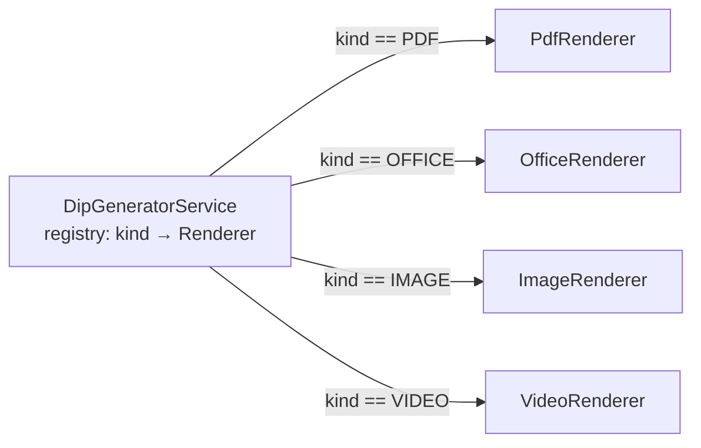
```mermaid
flowchart LR
    DGS[DipGeneratorService<br/>registry: kind → Renderer]
    PR[PdfRenderer]
    OR[OfficeRenderer]
    IR[ImageRenderer]
    VR[VideoRenderer]
    DGS -->|kind == PDF| PR
    DGS -->|kind == OFFICE| OR
    DGS -->|kind == IMAGE| IR
    DGS -->|kind == VIDEO| VR
```

---

## 1.1 PdfRenderer

### Mục đích

Chuyển PDF gốc thành **chuỗi PNG, mỗi page là một file** trong `derived-cache/{aipId}/page-{n}.png`. Frontend chỉ truy cập được các PNG này, không bao giờ chạm tới PDF gốc.

### Stack

- **Apache PDFBox 3.0.3** — Java native PDF parser/renderer.
- **DPI 150** (configurable qua `oais.rendering.pdf-dpi`) — cân bằng giữa rõ nét và size (~150-300 KB/page A4).
- **`PDFRenderer.renderImageWithDPI(i, dpi, ImageType.RGB)`** → `BufferedImage`.

### Flow diagram — Pipeline xử lý

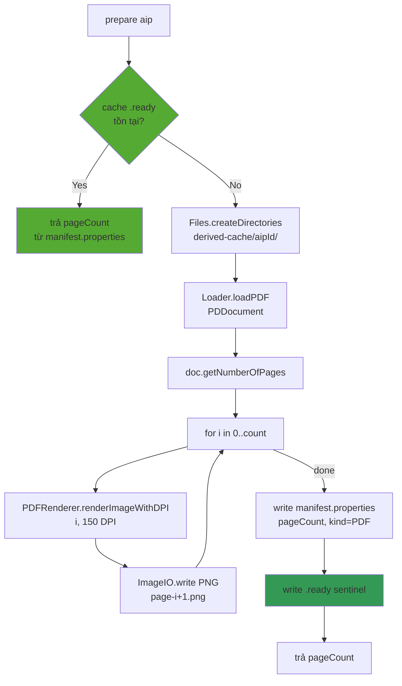
```mermaid
flowchart TB
    A[prepare aip] --> B{cache .ready<br/>tồn tại?}
    B -- Yes --> Z1[trả pageCount<br/>từ manifest.properties]
    B -- No --> C[Files.createDirectories<br/>derived-cache/aipId/]
    C --> D[Loader.loadPDF<br/>PDDocument]
    D --> E[doc.getNumberOfPages]
    E --> F[for i in 0..count]
    F --> G[PDFRenderer.renderImageWithDPI<br/>i, 150 DPI]
    G --> H[ImageIO.write PNG<br/>page-i+1.png]
    H --> F
    F -- done --> I[write manifest.properties<br/>pageCount, kind=PDF]
    I --> J[write .ready sentinel]
    J --> Z2[trả pageCount]

    style B fill:#5a3
    style Z1 fill:#5a3
    style J fill:#395
```

### Sequence diagram — Khi user xem PDF lần đầu

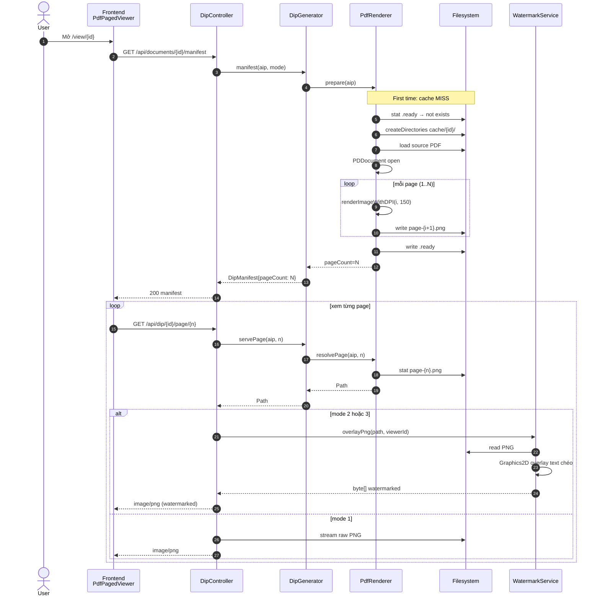
```mermaid
sequenceDiagram
    autonumber
    actor User
    participant FE as Frontend<br/>PdfPagedViewer
    participant DipC as DipController
    participant DG as DipGenerator
    participant PR as PdfRenderer
    participant FS as Filesystem
    participant WS as WatermarkService

    User->>FE: Mở /view/{id}
    FE->>DipC: GET /api/documents/{id}/manifest
    DipC->>DG: manifest(aip, mode)
    DG->>PR: prepare(aip)

    Note over PR,FS: First time: cache MISS
    PR->>FS: stat .ready → not exists
    PR->>FS: createDirectories cache/{id}/
    PR->>FS: load source PDF
    PR->>PR: PDDocument open
    loop mỗi page (1..N)
        PR->>PR: renderImageWithDPI(i, 150)
        PR->>FS: write page-{i+1}.png
    end
    PR->>FS: write .ready
    PR-->>DG: pageCount=N
    DG-->>DipC: DipManifest{pageCount: N}
    DipC-->>FE: 200 manifest

    loop xem từng page
        FE->>DipC: GET /api/dip/{id}/page/{n}
        DipC->>DG: servePage(aip, n)
        DG->>PR: resolvePage(aip, n)
        PR->>FS: stat page-{n}.png
        PR-->>DG: Path
        DG-->>DipC: Path
        alt mode 2 hoặc 3
            DipC->>WS: overlayPng(path, viewerId)
            WS->>FS: read PNG
            WS->>WS: Graphics2D overlay text chéo
            WS-->>DipC: byte[] watermarked
            DipC-->>FE: image/png (watermarked)
        else mode 1
            DipC->>FS: stream raw PNG
            DipC-->>FE: image/png
        end
    end
```

### Cache strategy

**Layout trên đĩa**:
```
derived-cache/{aipId}/
├── .ready                  # sentinel: render hoàn tất
├── manifest.properties     # pageCount, kind
├── page-1.png
├── page-2.png
└── page-N.png
```

**Idempotent rule**: gọi `prepare()` lần thứ N với cùng aipId chỉ render lần đầu.

**Cache hit detection**:
```java
if (Files.exists(readyMarker) && Files.exists(manifestFile)) {
    Properties p = loadProperties(manifestFile);
    int cached = parseInt(p.get("pageCount"));
    if (cached > 0) return cached;
}
```

**Race condition**: 2 request đồng thời cùng prepare 1 AIP → cả 2 cùng tạo cache. POC chấp nhận overhead này (rare). Production cần file-lock (xem `MIGRATION.md` §4.1).

### Edge cases & failure modes

| Tình huống | Hành vi |
|---|---|
| PDF corrupt | `Loader.loadPDF` throw → bubble ra controller → 500 |
| PDF có encryption | PDFBox throw `InvalidPasswordException` (POC không xử lý — assumption: DIP đã decrypt) |
| Disk đầy khi write PNG | IOException → render thất bại; sentinel `.ready` không tạo → lần sau retry |
| PDF rất lớn (>200MB) | Có thể OOM; cần `MemoryUsageSetting.setupMixed(temp)` cho production |
| Page format đặc biệt (lớn bất thường) | DPI 150 vẫn render, nhưng PNG size to. POC chấp nhận |

### Performance (đo trên POC test)

| Input | Time | Output |
|---|---|---|
| PDF 1MB / 14 pages | ~2.0s first render | 14 PNGs, ~150-300 KB mỗi cái |
| PDF 1MB / 14 pages cached | <50ms | Đọc thẳng từ disk |
| Với watermark mode 2 | +~30ms / page | PNG ~2x size do compression của watermark text |

---

## 1.2 OfficeRenderer

### Mục đích

Chuyển Office (DOCX/XLSX/PPTX/DOC/XLS/PPT) sang **PDF trung gian** rồi tái dùng `PdfRenderer` → cùng output là chuỗi PNG.

### Stack

- **LibreOffice headless** (system binary) — invoke qua `ProcessBuilder`.
- **Pipeline 2 stages**: convert → render PDF.
- **Tái dùng** `PdfRenderer.prepareFromPdfFile()` cho stage 2.

### Flow diagram — Pipeline 2 stage

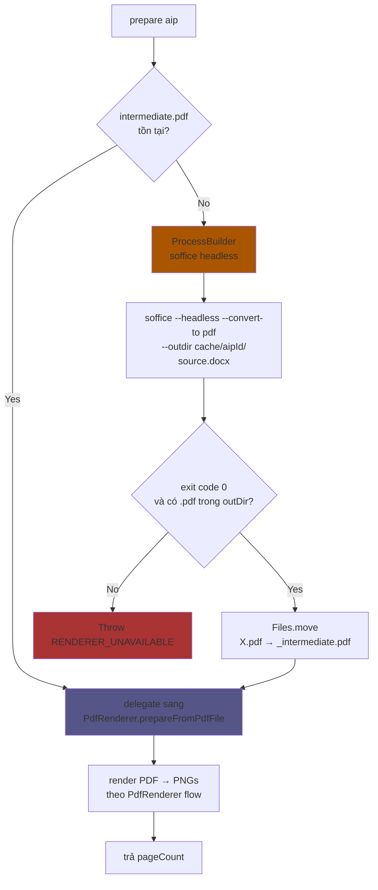
```mermaid
flowchart TB
    A[prepare aip] --> B{intermediate.pdf<br/>tồn tại?}
    B -- Yes --> J[delegate sang<br/>PdfRenderer.prepareFromPdfFile]
    B -- No --> C[ProcessBuilder<br/>soffice headless]
    C --> D[soffice --headless --convert-to pdf<br/>--outdir cache/aipId/<br/>source.docx]
    D --> E{exit code 0<br/>và có .pdf trong outDir?}
    E -- No --> F[Throw RENDERER_UNAVAILABLE]
    E -- Yes --> G[Files.move<br/>X.pdf → _intermediate.pdf]
    G --> J
    J --> K[render PDF → PNGs<br/>theo PdfRenderer flow]
    K --> Z[trả pageCount]

    style C fill:#a50
    style F fill:#a33
    style J fill:#558
```

### Sequence diagram — Khi user xem DOCX lần đầu

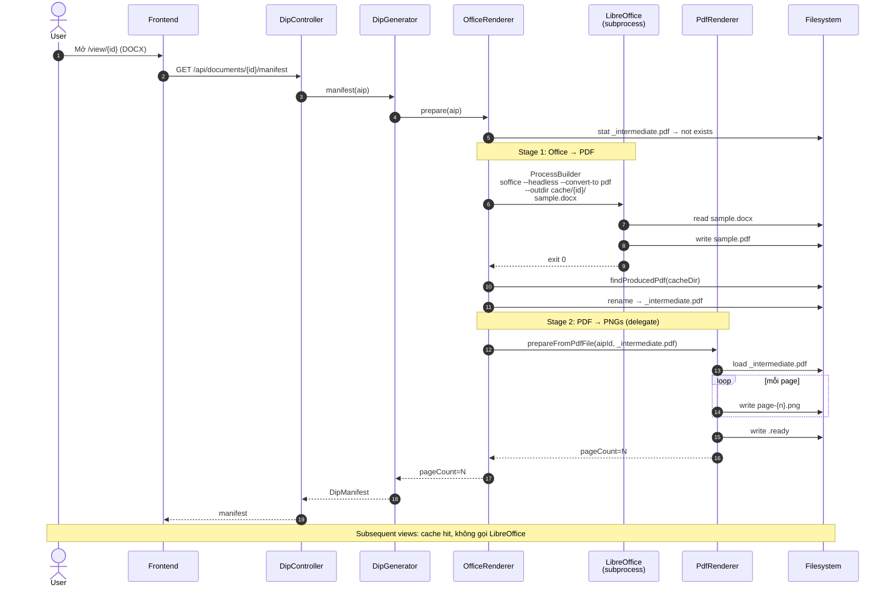
```mermaid
sequenceDiagram
    autonumber
    actor User
    participant FE as Frontend
    participant DipC as DipController
    participant DG as DipGenerator
    participant OR as OfficeRenderer
    participant LO as LibreOffice<br/>(subprocess)
    participant PR as PdfRenderer
    participant FS as Filesystem

    User->>FE: Mở /view/{id} (DOCX)
    FE->>DipC: GET /api/documents/{id}/manifest
    DipC->>DG: manifest(aip)
    DG->>OR: prepare(aip)
    OR->>FS: stat _intermediate.pdf → not exists

    Note over OR,LO: Stage 1: Office → PDF
    OR->>LO: ProcessBuilder<br/>soffice --headless --convert-to pdf<br/>--outdir cache/{id}/<br/>sample.docx
    LO->>FS: read sample.docx
    LO->>FS: write sample.pdf
    LO-->>OR: exit 0
    OR->>FS: findProducedPdf(cacheDir)
    OR->>FS: rename → _intermediate.pdf

    Note over OR,PR: Stage 2: PDF → PNGs (delegate)
    OR->>PR: prepareFromPdfFile(aipId, _intermediate.pdf)
    PR->>FS: load _intermediate.pdf
    loop mỗi page
        PR->>FS: write page-{n}.png
    end
    PR->>FS: write .ready
    PR-->>OR: pageCount=N
    OR-->>DG: pageCount=N
    DG-->>DipC: DipManifest
    DipC-->>FE: manifest

    Note over User,FS: Subsequent views: cache hit, không gọi LibreOffice
```

### Tại sao convert sang PDF trung gian?

Lý do duy nhất: **tái dùng pipeline đã proven** của PDFBox. Office formats có cấu trúc phức tạp, nhiều layout edge case (table, embedded objects, chart) — viết Office-specific renderer là dự án riêng.

LibreOffice cho phép convert ổn định + miễn phí. Tradeoff: dependency hệ thống + latency convert (~2-5s với DOCX 1MB).

### Cache strategy

**Layout**:
```
derived-cache/{aipId}/
├── .ready                  # sentinel
├── _intermediate.pdf       # output của LibreOffice (giữ lại để re-render nhanh nếu DPI đổi)
├── manifest.properties
├── page-1.png
└── page-N.png
```

`_intermediate.pdf` được giữ lại — nếu sau này đổi DPI, có thể re-render PDF→PNG mà không cần convert lại Office.

### Edge cases & failure modes

| Tình huống | Hành vi |
|---|---|
| LibreOffice không cài | `ProcessBuilder` throw `IOException("Cannot run program 'soffice'")` → wrap thành `RENDERER_UNAVAILABLE`; viewer hiển thị lỗi friendly |
| LibreOffice timeout (>60s) | `process.destroyForcibly()` → `RENDER_TIMEOUT` |
| LibreOffice crash (exit non-0) | Wrap stdout vào exception message để debug |
| Office file corrupt | LibreOffice trả exit 0 nhưng PDF rỗng → `findProducedPdf` vẫn tìm thấy nhưng `PdfRenderer` sẽ fail ở `getNumberOfPages()` |
| Filename có ký tự lạ (Unicode, space) | LibreOffice sometimes mangles output filename → `findProducedPdf` quét folder lấy file `.pdf` đầu tiên thay vì assume tên |
| Office password-protected | LibreOffice prompt → process treo → timeout (POC không hỗ trợ; assumption: DIP đã unlock) |

### Performance

| Input | Time | Note |
|---|---|---|
| DOCX 100KB / 5 pages | ~3s convert + ~1s render | Cold LibreOffice JVM dominate |
| DOCX 1MB / 50 pages | ~5s convert + ~5s render | LibreOffice CPU-bound |
| Subsequent views | <50ms (cache hit) | — |

LibreOffice headless chia sẻ JVM giữa các convert call, nên call thứ 2 nhanh hơn call đầu.

---

## 1.3 ImageRenderer

### Mục đích

Phục vụ trực tiếp file ảnh gốc (PNG/JPG/JPEG) như là "page 1" duy nhất — không có pipeline transform.

### Stack

- **Passthrough** — không dùng library nào.
- Watermark áp dụng ở `WatermarkService` cho mode 2/3 (nếu cần).

### Flow diagram — Trivial passthrough

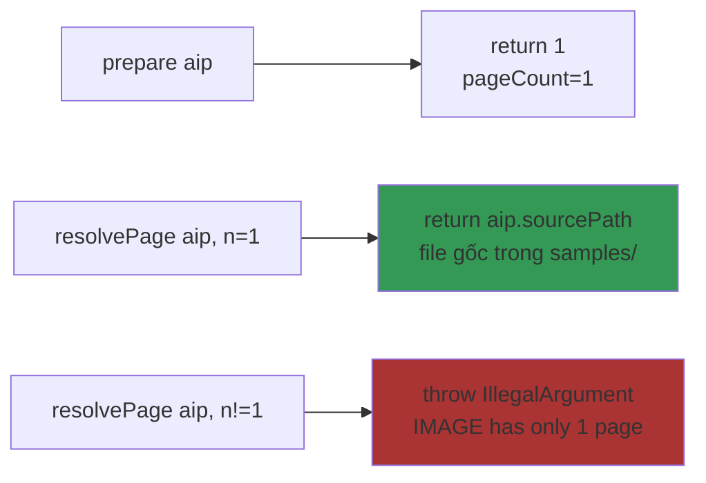
```mermaid
flowchart LR
    A[prepare aip] --> B[return 1<br/>pageCount=1]
    C[resolvePage aip, n=1] --> D[return aip.sourcePath<br/>file gốc trong samples/]
    C2[resolvePage aip, n!=1] --> E[throw IllegalArgument<br/>IMAGE has only 1 page]

    style D fill:#395
    style E fill:#a33
```

### Sequence diagram — Khi user xem PNG

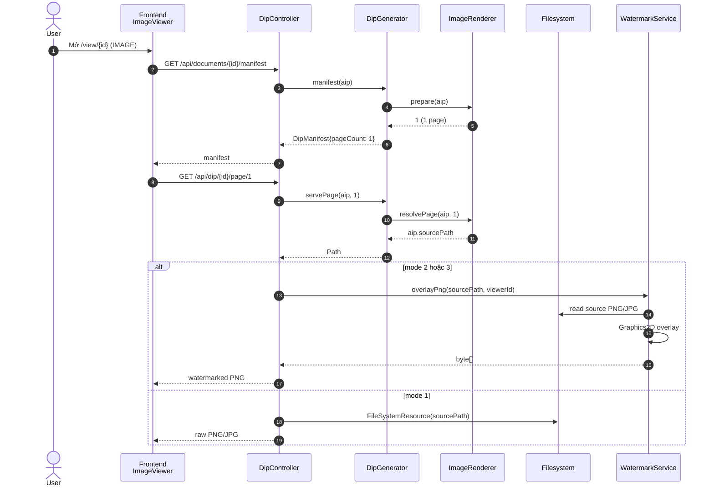
```mermaid
sequenceDiagram
    autonumber
    actor User
    participant FE as Frontend<br/>ImageViewer
    participant DipC as DipController
    participant DG as DipGenerator
    participant IR as ImageRenderer
    participant FS as Filesystem
    participant WS as WatermarkService

    User->>FE: Mở /view/{id} (IMAGE)
    FE->>DipC: GET /api/documents/{id}/manifest
    DipC->>DG: manifest(aip)
    DG->>IR: prepare(aip)
    IR-->>DG: 1 (1 page)
    DG-->>DipC: DipManifest{pageCount: 1}
    DipC-->>FE: manifest

    FE->>DipC: GET /api/dip/{id}/page/1
    DipC->>DG: servePage(aip, 1)
    DG->>IR: resolvePage(aip, 1)
    IR-->>DG: aip.sourcePath
    DG-->>DipC: Path

    alt mode 2 hoặc 3
        DipC->>WS: overlayPng(sourcePath, viewerId)
        WS->>FS: read source PNG/JPG
        WS->>WS: Graphics2D overlay
        WS-->>DipC: byte[]
        DipC-->>FE: watermarked PNG
    else mode 1
        DipC->>FS: FileSystemResource(sourcePath)
        DipC-->>FE: raw PNG/JPG
    end
```

### Cache strategy

**Không cache**. Trực tiếp serve file gốc. Lý do:
- File ảnh đã ở dạng phù hợp serve.
- Cache thêm copy → phí storage không có lợi ích.
- Watermark dynamic theo viewerId/timestamp → cache cũng vô nghĩa (mỗi viewer có watermark khác).

### Edge cases

| Tình huống | Hành vi |
|---|---|
| File quá lớn (>50MB) | Stream qua `FileSystemResource` không load full vào RAM — OK |
| JPG progressive | Render bình thường |
| GIF / SVG | Không support trong POC (DocumentKind không match) |
| EXIF orientation rotation | `` HTML tự xử lý — POC không can thiệp |
| Watermark JPG | `WatermarkService` dùng `BufferedImage` → output luôn PNG (alpha channel) — JPG nguồn → PNG out. Acceptable cho POC |

### Performance

| Input | Time |
|---|---|
| PNG 9KB | <10ms (mode 1) |
| PNG 9KB watermarked | ~30ms (Graphics2D overlay) |
| JPG 5MB | <50ms (mode 1, stream) |

---

## 1.4 VideoRenderer (HLS)

### Mục đích

Segment MP4 thành **HLS playlist** (`master.m3u8`) + nhiều `.ts` segments nhỏ (~6s mỗi cái) → user xem qua HLS protocol thay vì download nguyên file MP4.

### Stack

- **ffmpeg** (system binary) — invoke qua `ProcessBuilder`.
- **Codec copy** (không transcode) — giữ chất lượng gốc, tăng tốc xử lý.
- **HLS time 6s / segment** — tradeoff buffer vs latency.

### Flow diagram — Pipeline tạo HLS

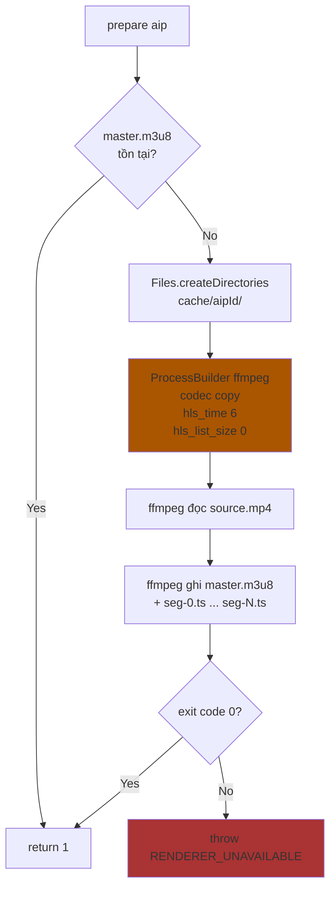
```mermaid
flowchart TB
    A[prepare aip] --> B{master.m3u8<br/>tồn tại?}
    B -- Yes --> Z[return 1]
    B -- No --> C[Files.createDirectories<br/>cache/aipId/]
    C --> D[ProcessBuilder ffmpeg<br/>codec copy<br/>hls_time 6<br/>hls_list_size 0]
    D --> E[ffmpeg đọc source.mp4]
    E --> F[ffmpeg ghi master.m3u8<br/>+ seg-0.ts ... seg-N.ts]
    F --> G{exit code 0?}
    G -- No --> H[throw RENDERER_UNAVAILABLE]
    G -- Yes --> Z

    style D fill:#a50
    style H fill:#a33
```

**Ví dụ ffmpeg command**:
```
ffmpeg -y -i sample.mp4 \
       -codec: copy \
       -start_number 0 \
       -hls_time 6 \
       -hls_list_size 0 \
       -hls_segment_filename cache/abc123/seg-%d.ts \
       -f hls cache/abc123/master.m3u8
```

### Sequence diagram — Khi user xem video

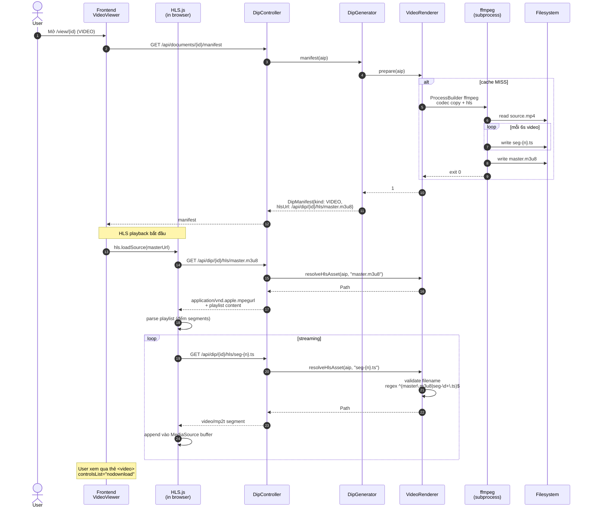
```mermaid
sequenceDiagram
    autonumber
    actor User
    participant FE as Frontend<br/>VideoViewer
    participant Hls as HLS.js<br/>(in browser)
    participant DipC as DipController
    participant DG as DipGenerator
    participant VR as VideoRenderer
    participant FF as ffmpeg<br/>(subprocess)
    participant FS as Filesystem

    User->>FE: Mở /view/{id} (VIDEO)
    FE->>DipC: GET /api/documents/{id}/manifest
    DipC->>DG: manifest(aip)
    DG->>VR: prepare(aip)

    alt cache MISS
        VR->>FF: ProcessBuilder ffmpeg<br/>codec copy + hls
        FF->>FS: read source.mp4
        loop mỗi 6s video
            FF->>FS: write seg-{n}.ts
        end
        FF->>FS: write master.m3u8
        FF-->>VR: exit 0
    end
    VR-->>DG: 1
    DG-->>DipC: DipManifest{kind: VIDEO,<br/>hlsUrl: /api/dip/{id}/hls/master.m3u8}
    DipC-->>FE: manifest

    Note over FE,Hls: HLS playback bắt đầu
    FE->>Hls: hls.loadSource(masterUrl)
    Hls->>DipC: GET /api/dip/{id}/hls/master.m3u8
    DipC->>VR: resolveHlsAsset(aip, "master.m3u8")
    VR-->>DipC: Path
    DipC-->>Hls: application/vnd.apple.mpegurl<br/>+ playlist content

    Hls->>Hls: parse playlist (đếm segments)
    loop streaming
        Hls->>DipC: GET /api/dip/{id}/hls/seg-{n}.ts
        DipC->>VR: resolveHlsAsset(aip, "seg-{n}.ts")
        VR->>VR: validate filename<br/>regex ^(master\.m3u8|seg-\d+\.ts)$
        VR-->>DipC: Path
        DipC-->>Hls: video/mp2t segment
        Hls->>Hls: append vào MediaSource buffer
    end

    Note over FE: User xem qua thẻ <video><br/>controlsList="nodownload"
```

### Cache strategy

**Layout**:
```
derived-cache/{aipId}/
├── master.m3u8       # playlist
├── seg-0.ts          # segment 0..N (mỗi cái ~6s video)
├── seg-1.ts
└── seg-N.ts
```

Không có file `.ready` — sự tồn tại của `master.m3u8` đóng vai trò sentinel.

### Tại sao HLS thay vì serve MP4 nguyên?

| Tiêu chí | Direct MP4 | HLS |
|---|---|---|
| User download được file gốc | ✅ Dễ — view-source URL | ❌ Khó — chỉ có segments .ts (cần concat lại) |
| Browser save | Lưu được nguyên MP4 | Phải capture và concat |
| Adaptive bitrate | ❌ | ✅ (dù POC chỉ làm 1 quality) |
| Range requests | Browser dùng để seek | HLS.js handle |
| Hidden URL của file gốc | ❌ Lộ trong Network tab | ✅ Chỉ thấy `master.m3u8` + `seg-*.ts` |

→ HLS raise the bar đáng kể cho việc save offline. Người quyết tâm vẫn capture được, nhưng casual user không.

### Edge cases & failure modes

| Tình huống | Hành vi |
|---|---|
| ffmpeg không cài | `ProcessBuilder` throw `IOException` → `RENDERER_UNAVAILABLE` |
| ffmpeg timeout (>300s default) | `destroyForcibly()` → `RENDER_TIMEOUT` |
| Source MP4 codec không tương thích HLS (legacy codecs) | `codec: copy` fail; cần re-encode `-c:v h264 -c:a aac` (POC không xử lý) |
| Path traversal qua HLS filename | Regex whitelist `^(master\.m3u8\|seg-\d+\.ts)$` chặn |
| Browser không hỗ trợ HLS | Safari native; non-Safari fallback HLS.js — POC dùng cả hai |
| Mode 3 token cho từng segment | POC dùng "session token" page=0 cho tất cả segments — đơn giản hoá |

### Performance

| Input | Time | Output |
|---|---|---|
| MP4 50MB / 5 phút | ~3-8s segment | ~50 segments ~1MB mỗi cái |
| MP4 200MB / 30 phút | ~30-60s segment | ~300 segments |
| Subsequent views | <50ms cache hit | — |

ffmpeg `codec: copy` chỉ remux (đổi container), không transcode → nhanh hơn nhiều so với re-encode.

---

# Phần II — Viewer Solutions (Frontend)

Tất cả viewer được mount bên trong `<div className="viewer-shell">` và bao bọc bởi 3 overlay (xem [§3.3](#33-anti-download-header-chain)).

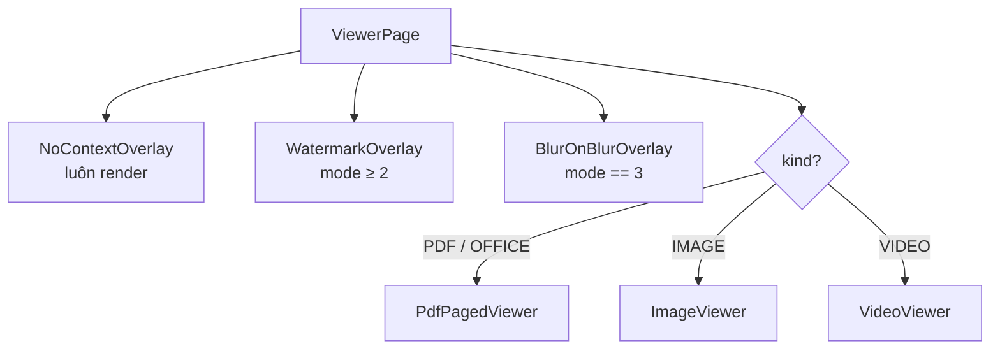
```mermaid
flowchart TB
    VP[ViewerPage] --> NS[NoContextOverlay<br/>luôn render]
    VP --> WS[WatermarkOverlay<br/>mode ≥ 2]
    VP --> BS[BlurOnBlurOverlay<br/>mode == 3]
    VP --> Dispatcher{kind?}
    Dispatcher -->|PDF / OFFICE| PV[PdfPagedViewer]
    Dispatcher -->|IMAGE| IV[ImageViewer]
    Dispatcher -->|VIDEO| VV[VideoViewer]
```

---

## 2.1 PdfPagedViewer

### Mục đích

Hiển thị từng page PDF (hoặc Office đã convert sang PDF) như image, với navigate prev/next, zoom, và token caching cho mode 3.

### Component architecture

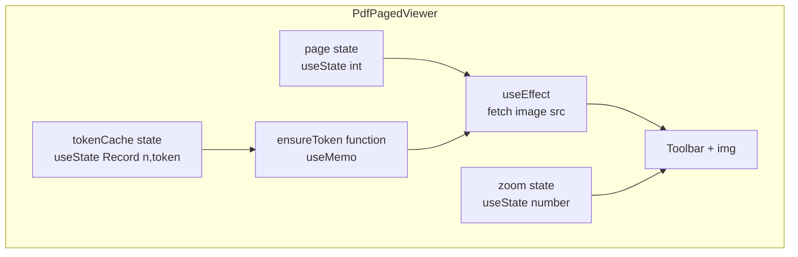
```mermaid
flowchart TB
    subgraph PdfPagedViewer
        State1[page state<br/>useState int]
        State2[zoom state<br/>useState number]
        State3[tokenCache state<br/>useState Record n,token]
        ET[ensureToken function<br/>useMemo]
        EFF[useEffect<br/>fetch image src]
        UI[Toolbar + img]
    end
    State1 --> EFF
    ET --> EFF
    EFF --> UI
    State3 --> ET
    State2 --> UI
```

### Flow diagram — Render 1 page

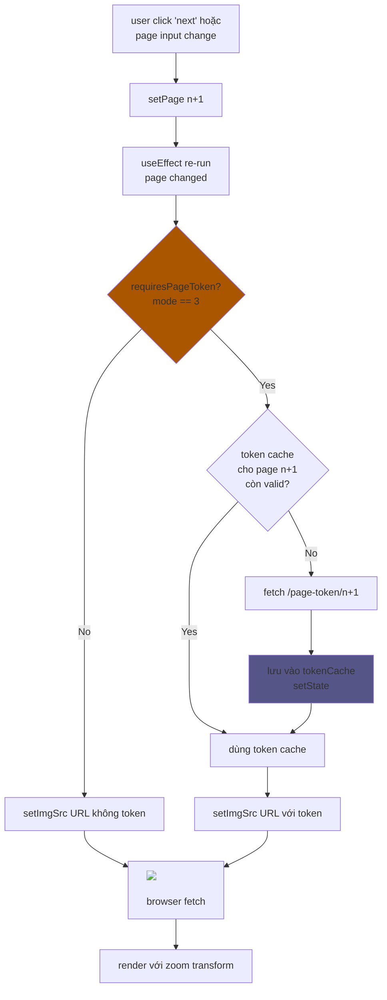
```mermaid
flowchart TB
    A[user click 'next' hoặc<br/>page input change] --> B[setPage n+1]
    B --> C[useEffect re-run<br/>page changed]
    C --> D{requiresPageToken?<br/>mode == 3}
    D -- No --> G[setImgSrc URL không token]
    D -- Yes --> E{token cache<br/>cho page n+1<br/>còn valid?}
    E -- Yes --> F[dùng token cache]
    E -- No --> H[fetch /page-token/n+1]
    H --> I[lưu vào tokenCache<br/>setState]
    I --> F
    F --> J[setImgSrc URL với token]
    G --> K[<img src=...><br/>browser fetch]
    J --> K
    K --> L[render với zoom transform]

    style D fill:#a50
    style I fill:#558
```

### Sequence diagram — Mode 3, page sang trang 5

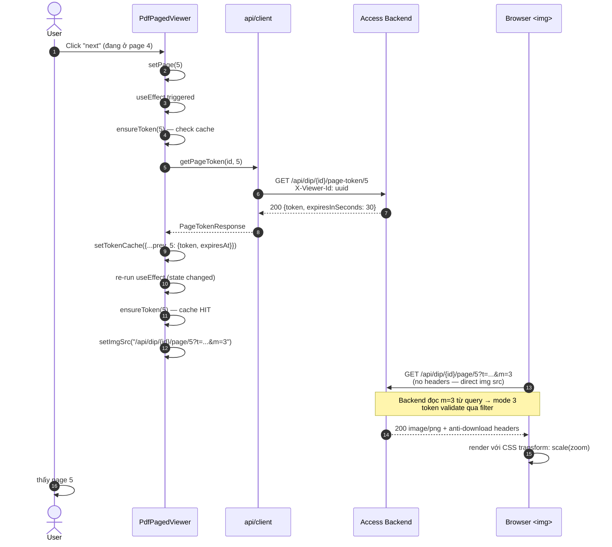
```mermaid
sequenceDiagram
    autonumber
    actor User
    participant V as PdfPagedViewer
    participant API as api/client
    participant BE as Access Backend
    participant Img as Browser <img>

    User->>V: Click "next" (đang ở page 4)
    V->>V: setPage(5)
    V->>V: useEffect triggered
    V->>V: ensureToken(5) — check cache
    V->>API: getPageToken(id, 5)
    API->>BE: GET /api/dip/{id}/page-token/5<br/>X-Viewer-Id: uuid
    BE-->>API: 200 {token, expiresInSeconds: 30}
    API-->>V: PageTokenResponse
    V->>V: setTokenCache({...prev, 5: {token, expiresAt}})
    V->>V: re-run useEffect (state changed)
    V->>V: ensureToken(5) — cache HIT
    V->>V: setImgSrc("/api/dip/{id}/page/5?t=...&m=3")

    Img->>BE: GET /api/dip/{id}/page/5?t=...&m=3<br/>(no headers — direct img src)
    Note over Img,BE: Backend đọc m=3 từ query → mode 3<br/>token validate qua filter
    BE-->>Img: 200 image/png + anti-download headers
    Img->>Img: render với CSS transform: scale(zoom)
    User->>User: thấy page 5
```

### Token caching strategy

**Khi nào fetch token mới**:
- Cache miss cho page n.
- Cache hit nhưng `expiresAt - now < 5_000ms` (5s buffer trước khi expire).

**Khi nào prefetch nhiều token**:
- POC chỉ fetch khi cần. Production có thể prefetch token cho page n+1, n+2 song song.

### Anti-download integration

| Mechanism | Code |
|---|---|
| Disable right-click | `onContextMenu={(e) => e.preventDefault()}` ở `` |
| Disable drag | `draggable={false}` ở `` |
| Disable selection | `userSelect: none` (CSS) ở container |
| No filename gợi ý khi save | Backend trả `Content-Disposition: inline; filename=""` |
| Watermark | Server-side trong PNG (mode 2+) + CSS overlay (`WatermarkOverlay`) |

### Performance

| Operation | Time |
|---|---|
| Fetch token (mode 3) | ~10ms |
| Fetch page image (cached server-side) | ~50ms |
| Browser render image | <16ms (1 frame @60fps) |
| Total page change UX (mode 1) | ~80ms |
| Total page change UX (mode 3) | ~100ms |

---

## 2.2 ImageViewer

### Mục đích

Hiển thị 1 ảnh duy nhất (page 1, vì IMAGE chỉ có 1 page). Đơn giản nhất trong các viewer.

### Flow diagram

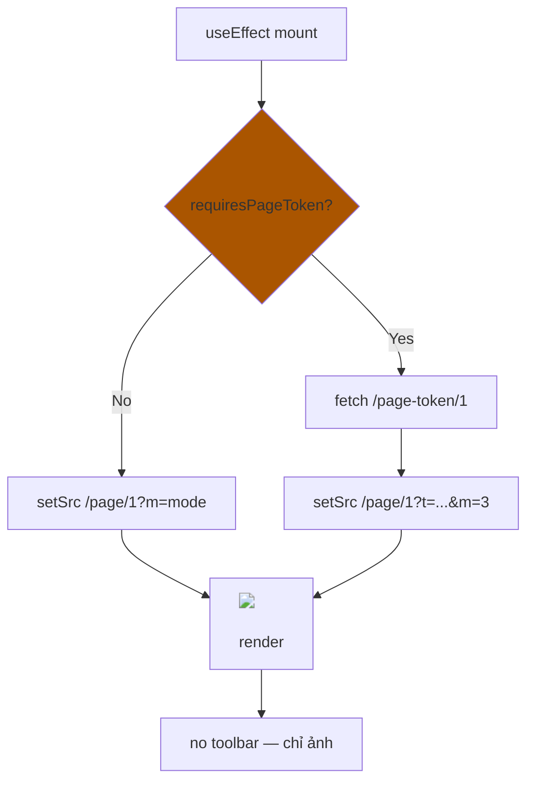
```mermaid
flowchart TB
    A[useEffect mount] --> B{requiresPageToken?}
    B -- No --> D[setSrc /page/1?m=mode]
    B -- Yes --> C[fetch /page-token/1]
    C --> D2[setSrc /page/1?t=...&m=3]
    D --> E[<img src=...><br/>render]
    D2 --> E
    E --> F[no toolbar — chỉ ảnh]

    style B fill:#a50
```

### Sequence diagram — Mode 1

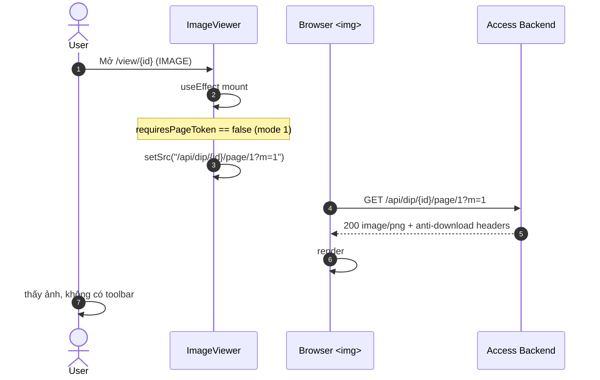
```mermaid
sequenceDiagram
    autonumber
    actor User
    participant V as ImageViewer
    participant Img as Browser <img>
    participant BE as Access Backend

    User->>V: Mở /view/{id} (IMAGE)
    V->>V: useEffect mount
    Note over V: requiresPageToken == false (mode 1)
    V->>V: setSrc("/api/dip/{id}/page/1?m=1")
    Img->>BE: GET /api/dip/{id}/page/1?m=1
    BE-->>Img: 200 image/png + anti-download headers
    Img->>Img: render
    User->>User: thấy ảnh, không có toolbar
```

### Anti-download

Cùng cơ chế như `PdfPagedViewer`:
- `draggable={false}`, `onContextMenu={preventDefault}`
- Backend headers (no-store, inline, filename="")
- Mode 2+: server-side watermark trong PNG

---

## 2.3 VideoViewer (HLS.js)

### Mục đích

Phát video MP4 dưới dạng HLS, không cho phép download nguyên file. Mode 3: inject session token vào tất cả segment requests.

### Architecture

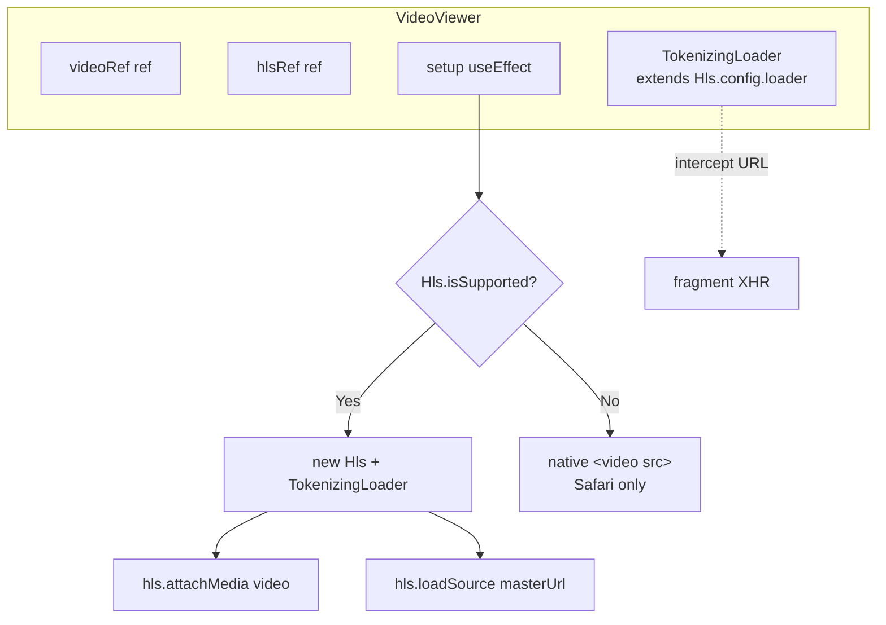
```mermaid
flowchart TB
    subgraph VideoViewer
        VRef[videoRef ref]
        HRef[hlsRef ref]
        Setup[setup useEffect]
        TL[TokenizingLoader<br/>extends Hls.config.loader]
    end
    Setup --> Get{Hls.isSupported?}
    Get -- Yes --> N[new Hls + TokenizingLoader]
    Get -- No --> Native[native &lt;video src&gt;<br/>Safari only]
    N --> Attach[hls.attachMedia video]
    N --> LS[hls.loadSource masterUrl]
    TL -.intercept URL.-> XHR[fragment XHR]
```

### Flow diagram — Bootstrap HLS

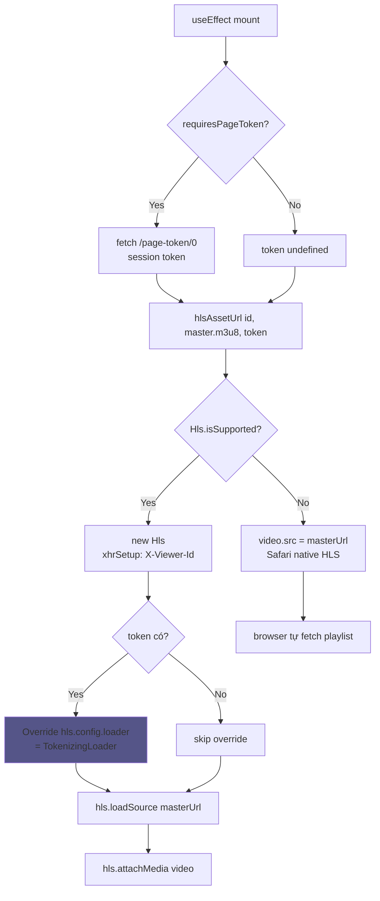
```mermaid
flowchart TB
    A[useEffect mount] --> B{requiresPageToken?}
    B -- Yes --> C[fetch /page-token/0<br/>session token]
    B -- No --> D[token undefined]
    C --> E[hlsAssetUrl id, master.m3u8, token]
    D --> E
    E --> F{Hls.isSupported?}
    F -- Yes --> G[new Hls<br/>xhrSetup: X-Viewer-Id]
    F -- No --> S[video.src = masterUrl<br/>Safari native HLS]
    G --> H{token có?}
    H -- Yes --> I[Override hls.config.loader<br/>= TokenizingLoader]
    H -- No --> J[skip override]
    I --> K[hls.loadSource masterUrl]
    J --> K
    K --> L[hls.attachMedia video]
    S --> M[browser tự fetch playlist]

    style I fill:#558
```

### TokenizingLoader — cách inject token vào tất cả URL

HLS.js fetch nhiều URL khác nhau (master.m3u8, các segment .ts, sub-playlists). POC override loader để rewrite URL trước XHR:

```typescript
class TokenizingLoader extends OrigLoader {
  load(context, config, callbacks) {
    const m = String(context.url).match(/\/api\/dip\/[^/]+\/hls\/([^?]+)/);
    if (m) {
      // Rewrite URL: thêm token + mode = 3
      context.url = hlsAssetUrl(manifest.id, m[1], sessionToken);
    }
    super.load(context, config, callbacks);
  }
}
```

### Sequence diagram — Mode 3 streaming

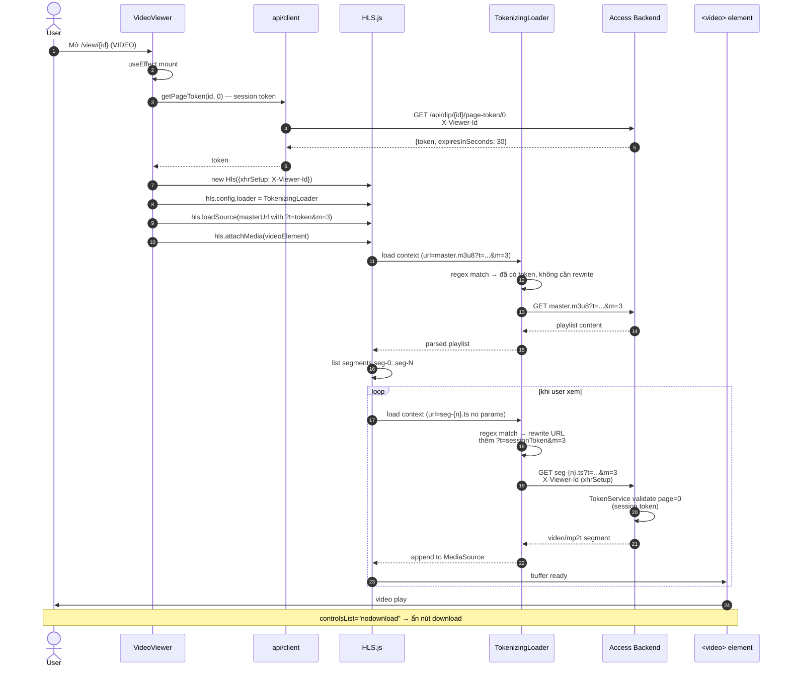
```mermaid
sequenceDiagram
    autonumber
    actor User
    participant V as VideoViewer
    participant API as api/client
    participant Hls as HLS.js
    participant TL as TokenizingLoader
    participant BE as Access Backend
    participant Vid as <video> element

    User->>V: Mở /view/{id} (VIDEO)
    V->>V: useEffect mount
    V->>API: getPageToken(id, 0) — session token
    API->>BE: GET /api/dip/{id}/page-token/0<br/>X-Viewer-Id
    BE-->>API: {token, expiresInSeconds: 30}
    API-->>V: token

    V->>Hls: new Hls({xhrSetup: X-Viewer-Id})
    V->>Hls: hls.config.loader = TokenizingLoader
    V->>Hls: hls.loadSource(masterUrl with ?t=token&m=3)
    V->>Hls: hls.attachMedia(videoElement)

    Hls->>TL: load context (url=master.m3u8?t=...&m=3)
    TL->>TL: regex match → đã có token, không cần rewrite
    TL->>BE: GET master.m3u8?t=...&m=3
    BE-->>TL: playlist content
    TL-->>Hls: parsed playlist

    Hls->>Hls: list segments seg-0..seg-N
    loop khi user xem
        Hls->>TL: load context (url=seg-{n}.ts no params)
        TL->>TL: regex match → rewrite URL<br/>thêm ?t=sessionToken&m=3
        TL->>BE: GET seg-{n}.ts?t=...&m=3<br/>X-Viewer-Id (xhrSetup)
        BE->>BE: TokenService validate page=0<br/>(session token)
        BE-->>TL: video/mp2t segment
        TL-->>Hls: append to MediaSource
        Hls->>Vid: buffer ready
    end

    Vid->>User: video play
    Note over User,Vid: controlsList="nodownload" → ẩn nút download
```

### Native HLS (Safari fallback)

Safari hỗ trợ HLS native qua `<video>`. POC fallback bằng `video.src = masterUrl`. **Hạn chế**: không thể inject token cho segment requests trong Safari (vì native video không expose loader hook).

→ Mode 3 không hoạt động hoàn hảo trên Safari (POC limit). Production nên đẩy validate token sang cookie để Safari support.

### Anti-download integration

| Mechanism | Code |
|---|---|
| Disable download menu | `controlsList="nodownload noremoteplayback noplaybackrate"` |
| Disable PiP | `disablePictureInPicture` |
| Disable right-click | `onContextMenu={preventDefault}` |
| Hidden source URL | HLS chỉ lộ `master.m3u8` + segments, không phải MP4 gốc |
| Watermark | CSS overlay từ `WatermarkOverlay` (không thể overlay vào segment .ts mà không re-encode) |

### Performance

| Operation | Time |
|---|---|
| Token fetch (mode 3) | ~10ms |
| Master playlist fetch | ~50ms |
| Segment fetch (cached) | ~50-100ms / segment |
| Initial buffer ready | ~500ms (depends on segment size) |
| Playback latency | ~6s lag (1 segment buffer) |

---

# Phần III — Cross-cutting Concerns

## 3.1 Cache layout trên đĩa

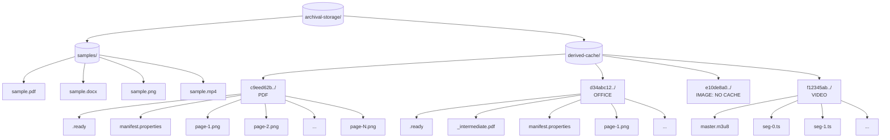
```mermaid
flowchart TB
    Root[(archival-storage/)]
    Samples[(samples/)]
    Cache[(derived-cache/)]
    Root --> Samples
    Root --> Cache

    Samples --> S1[sample.pdf]
    Samples --> S2[sample.docx]
    Samples --> S3[sample.png]
    Samples --> S4[sample.mp4]

    Cache --> C1[c9eed62b../<br/>PDF]
    Cache --> C2[d34abc12../<br/>OFFICE]
    Cache --> C3[e10de8a0../<br/>IMAGE: NO CACHE]
    Cache --> C4[f12345ab../<br/>VIDEO]

    C1 --> C1a[.ready]
    C1 --> C1b[manifest.properties]
    C1 --> C1c[page-1.png]
    C1 --> C1d[page-2.png]
    C1 --> C1e[...]
    C1 --> C1f[page-N.png]

    C2 --> C2a[.ready]
    C2 --> C2b[_intermediate.pdf]
    C2 --> C2c[manifest.properties]
    C2 --> C2d[page-1.png]
    C2 --> C2e[...]

    C4 --> C4a[master.m3u8]
    C4 --> C4b[seg-0.ts]
    C4 --> C4c[seg-1.ts]
    C4 --> C4d[...]
```

**Quy tắc**:
- Mỗi AIP có 1 thư mục cache theo `aipId` (SHA-1 hash của filename).
- File `.ready` đánh dấu render hoàn tất (dùng cho PDF/OFFICE).
- Video không có `.ready` — `master.m3u8` đóng vai trò sentinel.
- IMAGE không có thư mục cache — serve thẳng từ `samples/`.

## 3.2 Token lifecycle (Mode 3)

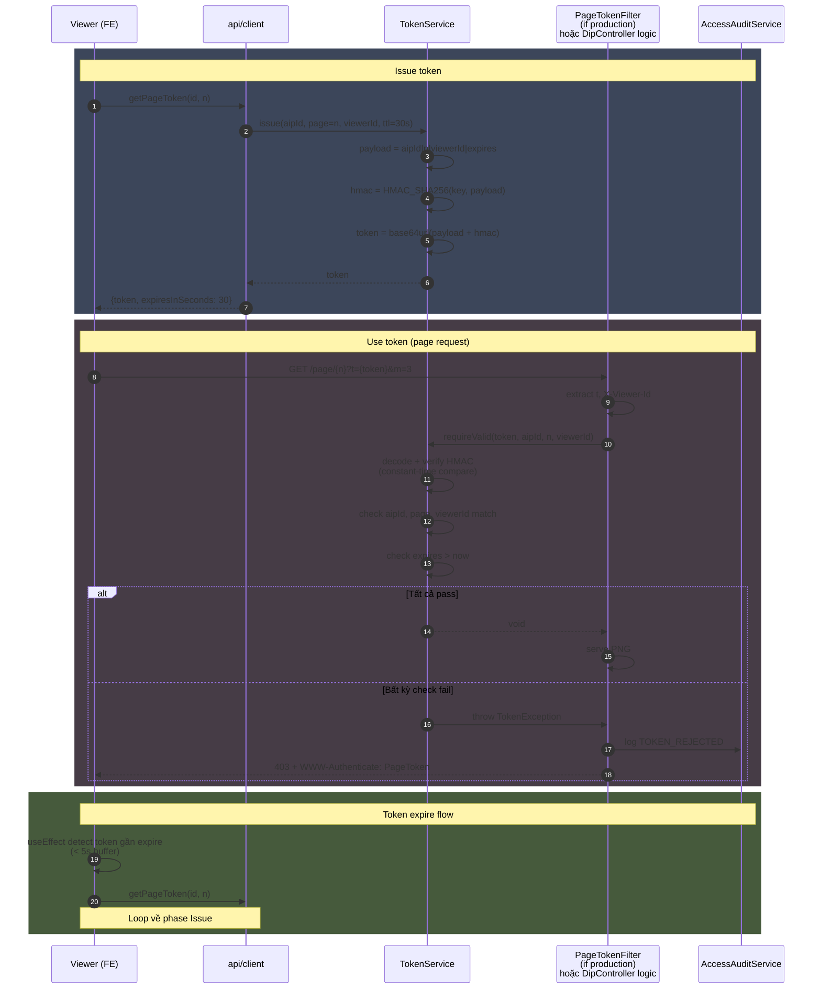
```mermaid
sequenceDiagram
    autonumber
    participant V as Viewer (FE)
    participant API as api/client
    participant TS as TokenService
    participant Filter as PageTokenFilter<br/>(if production)<br/>hoặc DipController logic
    participant Audit as AccessAuditService

    rect rgb(60, 70, 90)
    Note over V,Audit: Issue token
    V->>API: getPageToken(id, n)
    API->>TS: issue(aipId, page=n, viewerId, ttl=30s)
    TS->>TS: payload = aipId|n|viewerId|expires
    TS->>TS: hmac = HMAC_SHA256(key, payload)
    TS->>TS: token = base64url(payload + hmac)
    TS-->>API: token
    API-->>V: {token, expiresInSeconds: 30}
    end

    rect rgb(70, 60, 70)
    Note over V,Audit: Use token (page request)
    V->>Filter: GET /page/{n}?t={token}&m=3
    Filter->>Filter: extract t, X-Viewer-Id
    Filter->>TS: requireValid(token, aipId, n, viewerId)
    TS->>TS: decode + verify HMAC<br/>(constant-time compare)
    TS->>TS: check aipId, page, viewerId match
    TS->>TS: check expires > now
    alt Tất cả pass
        TS-->>Filter: void
        Filter->>Filter: serve PNG
    else Bất kỳ check fail
        TS->>Filter: throw TokenException
        Filter->>Audit: log TOKEN_REJECTED
        Filter-->>V: 403 + WWW-Authenticate: PageToken
    end
    end

    rect rgb(70, 90, 60)
    Note over V,Audit: Token expire flow
    V->>V: useEffect detect token gần expire<br/>(< 5s buffer)
    V->>API: getPageToken(id, n)
    Note over V,API: Loop về phase Issue
    end
```

**Token format chi tiết**:
```
Base64URL(
  "{aipId}|{page}|{viewerId}|{expiresEpochSec}|{hmac}"
)

ví dụ decoded:
e10de8a047408f3a|1|viewer-1|1777994505|cgcChb...
```

**Tại sao tách `page-token/{n}` thành endpoint riêng?**

Có thể issue token tự động khi gọi manifest. Nhưng:
- Token có TTL 30s — issue 1 lần khi load manifest sẽ hết hạn nhanh nếu user xem chậm.
- Tách → user navigate đến page n mới issue token cho page n → fresh.
- Cho phép prefetch token cho page n+1, n+2 song song.

## 3.3 Anti-download header chain

```mermaid
flowchart LR
    subgraph Backend
        DC[DipController]
        WS[WatermarkService]
        TS[TokenService]
    end
    subgraph Headers
        H1[Cache-Control: no-store]
        H2[Pragma: no-cache]
        H3[Content-Disposition: inline; filename=]
        H4[X-Content-Type-Options: nosniff]
        H5[Referrer-Policy: no-referrer]
        H6[Cross-Origin-Resource-Policy: same-origin]
        H7[X-Anti-Download-Mode: 1/2/3]
    end
    subgraph FrontendOverlays
        NCO[NoContextOverlay<br/>contextmenu/copy/dragstart preventDefault]
        WO[WatermarkOverlay<br/>CSS grid lưới chéo]
        BBO[BlurOnBlurOverlay<br/>visibilitychange + DevTools heuristic]
    end
    subgraph ViewerComponents
        IMG[<img draggable=false<br/>onContextMenu=prevent>]
        VID[<video controlsList=nodownload<br/>disablePictureInPicture>]
    end

    DC --> Headers
    Headers --> Browser
    Browser --> ViewerComponents
    ViewerComponents --> FrontendOverlays
    WS -.mode 2+.-> DC
    TS -.mode 3.-> DC

    style WS fill:#a50
    style TS fill:#a33
```

### Quy tắc layered defense

```mermaid
flowchart TB
    L1[Layer 1: HTTP headers<br/>Browser xử lý native] --> L2
    L2[Layer 2: HTML attributes<br/>controlsList, draggable, onContextMenu] --> L3
    L3[Layer 3: JS overlays<br/>NoContext, Watermark, Blur] --> L4
    L4[Layer 4: Image-based render<br/>Không serve PDF/MP4 gốc] --> L5
    L5[Layer 5: Token-based access<br/>Mode 3 only] --> L6
    L6[Layer 6: Server watermark<br/>Mode 2+ — dấu vết user trong file]

    style L1 fill:#358
    style L4 fill:#574
    style L6 fill:#857
```

Mỗi layer raise the bar. Chấp nhận: layer 1-3 bypass được bằng DevTools / browser extensions. Layer 4-6 bền vững hơn — ngay cả khi user save được, file đã transform khỏi binary gốc và có watermark.

> **Nguyên tắc**: tất cả layer cộng lại không = DRM thật. Defense-in-depth giảm casual leak, không loại bỏ.

---

## Tổng kết

| Loại tài liệu | Render | Cache | Viewer | Anti-DL kỹ thuật chính |
|---|---|---|---|---|
| **PDF** | PDFBox → PNG/page | `derived-cache/{id}/page-{n}.png` | `PdfPagedViewer` | Image-based render thay file gốc |
| **Office** | LibreOffice → PDF → PNG/page | tương tự PDF + `_intermediate.pdf` | `PdfPagedViewer` (chung) | Convert chain + image render |
| **Image** | Passthrough | Không cache | `ImageViewer` | Watermark + headers |
| **Video** | ffmpeg → HLS segments | `derived-cache/{id}/seg-*.ts` + master.m3u8 | `VideoViewer` (HLS.js) | HLS thay vì serve MP4 gốc |

3 mode anti-download hoạt động như **modifier** trên các pipeline trên:

| Mode | PDF/Office | Image | Video |
|---|---|---|---|
| 1 — Basic | Headers + image render | Headers + passthrough | Headers + HLS |
| 2 — +Watermark | + server overlay PNG | + server overlay PNG | + CSS overlay frontend |
| 3 — +Token | + HMAC token per page | + HMAC token per page | + HMAC session token cho HLS |

---

# Phần IV — TokenService — HMAC Page Token (Deep-dive)

## 4.1 Yêu cầu thiết kế

`TokenService` được thiết kế để cấp **page-token ngắn hạn** cho mode 3, với 5 yêu cầu chính:

| # | Yêu cầu | Cơ chế |
|---|---|---|
| 1 | Token không thể giả mạo | Chữ ký HMAC-SHA256 với khoá bí mật server |
| 2 | Token không thể share | Bind `viewerId` vào payload + verify với `X-Viewer-Id` header |
| 3 | Token hết hạn nhanh | TTL 30s mặc định trong payload + check `expiresEpoch > now` |
| 4 | Server **stateless** | Tất cả thông tin trong payload — không cần Redis/DB lookup |
| 5 | Resistance với timing attack | `MessageDigest.isEqual` (constant-time compare) |

**Stateless** là quyết định quan trọng — tránh bottleneck DB và phù hợp với scale ngang. Đánh đổi: không thể revoke token cụ thể (nhưng TTL 30s đủ để giảm thiểu risk).

---

## 4.2 Token format & encoding

### Layout

```
┌──────────────────────────────────────────────────────────────────┐
│                          PLAIN PAYLOAD                            │
│                                                                   │
│  aipId  │  page  │  viewerId  │  expiresEpochSec  │     hmac     │
│ 16 hex  │ int    │  uuid-like │  10-digit unix    │  base64url   │
│  chars  │        │            │                   │  (43 chars)  │
└──────────────────────────────────────────────────────────────────┘
                  │
                  ▼ (tất cả nối bởi `|` rồi base64url encode)
┌──────────────────────────────────────────────────────────────────┐
│                         FINAL TOKEN                               │
│                                                                   │
│   ZTEwZGU4YTA0NzQwOGYzYXwxfHZpZXdlci0xfDE3Nzc5OTQ1MDV8Y2djQ2hi…  │
│                                                                   │
└──────────────────────────────────────────────────────────────────┘
```

### Ví dụ thật từ POC

```
Plain payload:
e10de8a047408f3a|1|viewer-1|1777994505|cgcChbXz7tH8nF2qH...

Encoded token:
ZTEwZGU4YTA0NzQwOGYzYXwxfHZpZXdlci0xfDE3Nzc5OTQ1MDV8Y2djQ2hiWHo3dEg4bkYycUgu...
```

| Field | Mục đích | Length |
|---|---|---|
| `aipId` | SHA-1 hash của filename, identify document | 16 hex chars |
| `page` | Số page (1-indexed cho PDF/Office, 0 cho HLS session) | int |
| `viewerId` | UUID v4 của session (frontend tự sinh) | ~36 chars |
| `expiresEpochSec` | Unix timestamp khi expire | 10 digits |
| `hmac` | HMAC-SHA256 của payload trên (32 bytes → 43 base64url chars) | 43 chars |

### Vì sao Base64URL thay vì Base64 thường?

Token đi vào URL query param `?t=...`. Base64 thường có ký tự `+`, `/`, `=` cần URL-encode → biến token thành `%2B%2F%3D` xấu xí và dễ lỗi. Base64URL dùng `-`, `_`, không padding → URL-safe trực tiếp.

### Vì sao dùng `|` thay vì JSON?

- Token đã base64-encoded — không cần human-readable.
- JSON `{"aipId":"...","page":1,...}` lãng phí ~30 bytes overhead cho 5 fields nhỏ.
- Parse split string nhanh hơn JSON parse trong critical path.

---

## 4.3 HMAC-SHA256 — Vì sao và Cách hoạt động

### Sao không dùng SHA-256 đơn?

Chữ ký kiểu `signature = SHA256(secret + message)` **không an toàn** — bị **length extension attack**: attacker thêm dữ liệu vào sau message và recompute hash mà không cần biết secret. HMAC được thiết kế để **miễn nhiễm** với attack này.

### Sơ đồ HMAC

```
HMAC(K, m) = H((K' XOR opad) || H((K' XOR ipad) || m))

  K'    = adjusted key (pad nếu < block size, hash nếu > block size)
  ipad  = byte 0x36 lặp lại block size lần
  opad  = byte 0x5c lặp lại block size lần
  H     = SHA-256
  ||    = concatenation
```

### Visual flow

```mermaid
flowchart TB
    Key[Secret Key K<br/>32 bytes] --> Adjust{K size vs block?}
    Adjust -->|< 64B| Pad[Pad with zeros to 64B]
    Adjust -->|> 64B| Hash[SHA-256 K → 32B + pad]
    Adjust -->|= 64B| Asis[K' = K]
    Pad --> KPrime[K' = 64 bytes]
    Hash --> KPrime
    Asis --> KPrime

    KPrime --> Inner[K' XOR ipad 0x36...0x36]
    KPrime --> Outer[K' XOR opad 0x5c...0x5c]

    Msg[Message m<br/>aipId&#124;page&#124;viewerId&#124;expires] --> InnerConcat[concat]
    Inner --> InnerConcat
    InnerConcat --> InnerHash[SHA-256 inner block]

    InnerHash --> OuterConcat[concat]
    Outer --> OuterConcat
    OuterConcat --> OuterHash[SHA-256 outer block]

    OuterHash --> Mac[HMAC-SHA256<br/>32 bytes output]

    style Mac fill:#395
```

### Properties đảm bảo

1. **Pre-image resistance**: cho HMAC, không thể tìm message khác cho cùng output.
2. **Length-extension resistance**: nested hash structure phá vỡ attack.
3. **Pseudo-random**: HMAC output không có pattern (nếu key đủ entropy).
4. **Determinism**: cùng (key, message) → cùng HMAC. Cho phép verify mà không cần lưu state.

POC dùng JDK built-in `javax.crypto.Mac` — implement chuẩn **RFC 2104** + **FIPS 198-1**, được audit kỹ.

---

## 4.4 Issue Flow

### Sequence diagram

```mermaid
sequenceDiagram
    autonumber
    participant FE as Frontend<br/>PdfPagedViewer
    participant DipC as DipController
    participant TS as TokenService
    participant Mac as javax.crypto.Mac<br/>(JDK)

    FE->>DipC: GET /api/dip/{id}/page-token/{n}<br/>X-Viewer-Id: uuid-v4

    DipC->>DipC: load AipMetadata<br/>kiểm tra id tồn tại
    DipC->>TS: issue(aipId, page=n, viewerId, ttl=30s)

    TS->>TS: expires = now() + 30
    TS->>TS: payload = aipId|n|viewerId|expires
    Note over TS: ví dụ:<br/>e10de8a0…|1|viewer-1|1777994505

    TS->>Mac: Mac.getInstance("HmacSHA256")
    TS->>Mac: mac.init(SecretKeySpec(hmacKey, "HmacSHA256"))
    TS->>Mac: hash = mac.doFinal(payload.bytes)
    Mac-->>TS: hash 32 bytes

    TS->>TS: macStr = Base64URL(hash) — 43 chars
    TS->>TS: body = payload + "|" + macStr
    TS->>TS: token = Base64URL(body.bytes)

    TS-->>DipC: token (string)
    DipC-->>FE: 200 {token, expiresInSeconds: 30}
```

### Code path

```java
// TokenService.java:24
public String issue(String aipId, int page, String viewerId, Duration ttl) {
    long expires = Instant.now().plus(ttl).getEpochSecond();         // ① compute expiry
    String payload = aipId + "|" + page + "|" + viewerId + "|" + expires; // ② build payload
    String mac = sign(payload);                                       // ③ HMAC sign
    String body = payload + "|" + mac;                                // ④ append mac
    return Base64.getUrlEncoder().withoutPadding()                    // ⑤ encode final
        .encodeToString(body.getBytes(StandardCharsets.UTF_8));
}

// TokenService.java:74
private String sign(String payload) {
    Mac mac = Mac.getInstance("HmacSHA256");
    mac.init(new SecretKeySpec(hmacKey, "HmacSHA256"));
    byte[] hash = mac.doFinal(payload.getBytes(StandardCharsets.UTF_8));
    return Base64.getUrlEncoder().withoutPadding().encodeToString(hash);
}
```

---

## 4.5 Verify Flow

### Sequence diagram (happy + 3 failure paths)

```mermaid
sequenceDiagram
    autonumber
    participant Filter as DipController<br/>(mode 3 path)
    participant TS as TokenService
    participant Mac as javax.crypto.Mac
    participant Audit as AccessAuditService

    Filter->>TS: requireValid(token, aipId, page, viewerId)

    alt token null/empty
        TS-->>Filter: throw TOKEN_MISSING
        Filter->>Audit: log TOKEN_REJECTED
        Filter-->>Client: 403 + WWW-Authenticate
    end

    TS->>TS: decoded = Base64URL.decode(token).asString()
    Note over TS: nếu malformed → TOKEN_MALFORMED
    TS->>TS: parts = decoded.split("|")
    Note over TS: nếu len != 5 → TOKEN_MALFORMED

    TS->>TS: payload = parts[0..3].join("|")
    TS->>Mac: expectedMac = sign(payload)
    TS->>TS: MessageDigest.isEqual(expectedMac, parts[4])

    alt mac không khớp (constant-time compare)
        TS-->>Filter: throw TOKEN_SIGNATURE_INVALID
    end

    TS->>TS: aipId trong token = aipId expect?
    alt mismatch
        TS-->>Filter: throw TOKEN_AIP_MISMATCH
    end

    TS->>TS: page trong token = page expect?
    alt mismatch
        TS-->>Filter: throw TOKEN_PAGE_MISMATCH
    end

    TS->>TS: viewerId trong token = X-Viewer-Id?
    alt mismatch (chống share URL)
        TS-->>Filter: throw TOKEN_VIEWER_MISMATCH
    end

    TS->>TS: now > expiresEpoch?
    alt expired
        TS-->>Filter: throw TOKEN_EXPIRED
    end

    TS-->>Filter: void (valid)
    Filter->>Filter: serve PNG
```

### Code path

```java
// TokenService.java:32
public void requireValid(String token, String expectedAipId, int expectedPage, String expectedViewerId) {
    if (token == null || token.isBlank()) throw new TokenException("TOKEN_MISSING");

    String decoded;
    try {
        decoded = new String(Base64.getUrlDecoder().decode(token), StandardCharsets.UTF_8);
    } catch (IllegalArgumentException e) {
        throw new TokenException("TOKEN_MALFORMED");
    }

    String[] parts = decoded.split("\\|");
    if (parts.length != 5) throw new TokenException("TOKEN_MALFORMED");

    String aipId = parts[0];
    String pageStr = parts[1];
    String viewerId = parts[2];
    String expiresStr = parts[3];
    String mac = parts[4];

    String payload = aipId + "|" + pageStr + "|" + viewerId + "|" + expiresStr;
    String expectedMac = sign(payload);

    // ① constant-time compare — chống timing attack
    if (!MessageDigest.isEqual(
            expectedMac.getBytes(StandardCharsets.UTF_8),
            mac.getBytes(StandardCharsets.UTF_8))) {
        throw new TokenException("TOKEN_SIGNATURE_INVALID");
    }

    // ② kiểm tra fields
    if (!aipId.equals(expectedAipId)) throw new TokenException("TOKEN_AIP_MISMATCH");
    if (Integer.parseInt(pageStr) != expectedPage) throw new TokenException("TOKEN_PAGE_MISMATCH");
    if (expectedViewerId != null && !viewerId.equals(expectedViewerId)) {
        throw new TokenException("TOKEN_VIEWER_MISMATCH");
    }

    // ③ kiểm tra expiry
    long expires = Long.parseLong(expiresStr);
    if (Instant.now().getEpochSecond() > expires) {
        throw new TokenException("TOKEN_EXPIRED");
    }
}
```

### Thứ tự kiểm tra: HMAC TRƯỚC tất cả

Quan trọng: kiểm tra HMAC **trước** khi compare các field business (aipId, page, viewerId). Lý do:

- Nếu compare aipId trước HMAC → attacker thay đổi field nào đó và rò rỉ thông tin "aipId valid" thông qua thời gian phản hồi.
- Compare HMAC trước → tất cả invalid token fail tại 1 điểm với cùng latency, không leak nội dung.

---

## 4.6 Constant-time Compare & Timing Attack

### Bài toán

So sánh `expectedMac` với `mac` trong token. Nếu dùng `String.equals()` hoặc `Arrays.equals()`:

```java
// ❌ KHÔNG AN TOÀN
public boolean equals(byte[] a, byte[] b) {
    if (a.length != b.length) return false;
    for (int i = 0; i < a.length; i++) {
        if (a[i] != b[i]) return false;   // ← exit sớm
    }
    return true;
}
```

`return false` trong loop → **time-to-fail** tỉ lệ với số byte khớp ở đầu. Attacker đo thời gian phản hồi → suy luận từng byte HMAC → recover full HMAC từng byte một.

### Visual: Timing leak

```
Attempt 1: AAAAA…  → mismatch ngay byte 0  → t = 100μs
Attempt 2: BAAAA…  → mismatch ngay byte 0  → t = 100μs
Attempt 3: ZAAAA…  → mismatch ngay byte 0  → t = 100μs
Attempt 4: cAAAA…  → match byte 0, mismatch byte 1 → t = 105μs ← LEAK!
                                                         ▲
                                                         │
                                            attacker biết byte 0 = 'c'
```

Với network noise lớn, mỗi byte cần 1000+ requests để confident — nhưng vẫn khả thi với thời gian + bandwidth.

### Giải pháp: Constant-time compare

```java
// ✅ AN TOÀN — JDK MessageDigest.isEqual
public static boolean isEqual(byte[] a, byte[] b) {
    if (a == b) return true;
    if (a == null || b == null) return false;

    int lenA = a.length;
    int lenB = b.length;
    int diff = lenA ^ lenB;                    // diff = 0 nếu length bằng

    for (int i = 0; i < lenA && i < lenB; i++) {
        diff |= a[i] ^ b[i];                   // ← KHÔNG return sớm; OR mọi byte
    }
    return diff == 0;
}
```

- Always loop full length → mỗi compare cùng latency.
- `diff |= a[i] ^ b[i]` → bit nào khác sẽ set diff != 0; output là `diff == 0`.
- Không nhánh `if-return` trong loop → không phụ thuộc vào kết quả của byte cụ thể.

POC dùng `MessageDigest.isEqual()` — JDK đảm bảo constant-time với mọi input cùng length.

---

## 4.7 Key Management — POC vs Production

### POC behavior

```java
// TokenService.java:18
public TokenService() {
    this.hmacKey = new byte[32];                          // ← 256-bit key
    new SecureRandom().nextBytes(this.hmacKey);
    log.warn("TokenService HMAC key generated at startup — restart will invalidate existing tokens (POC behavior)");
}
```

**Hệ quả**:
- Mỗi lần restart Spring Boot → key mới → tất cả token đã issue **invalidated** (verify fail vì HMAC khác).
- POC chỉ chạy 1 instance → không có vấn đề key sync giữa nodes.

### Production requirements

| Aspect | POC | Production |
|---|---|---|
| **Storage** | RAM, sinh khi startup | Vault / AWS Secrets / Azure Key Vault |
| **Rotation** | Không | Rotate định kỳ (90 ngày) + grace period overlapping 2 keys |
| **Multi-instance** | N/A | Tất cả instance dùng cùng key |
| **Backup** | Không | Backup an toàn (hardware HSM) |
| **Audit** | Không | Log mỗi lần đọc key |
| **Compromise response** | Restart | Invalidate ngay + force re-login |

### Rotation strategy (production)

```mermaid
flowchart LR
    subgraph "Time T"
        K1A[Key v1<br/>active]
    end
    subgraph "Time T+90d"
        K1B[Key v1<br/>retiring]
        K2A[Key v2<br/>active]
    end
    subgraph "Time T+93d"
        K2B[Key v2<br/>active only]
    end

    K1A --> K1B
    K1B --> K2B
    K1A -.issue tokens v1.-> K1A
    K1B -.verify v1+v2.-> K2A
    K2A -.issue tokens v2.-> K2A
    K2B -.verify v2 only.-> K2B
```

- **Step 1**: phát hành Key v2 cùng tồn tại với v1 (3 ngày grace).
- **Step 2**: tất cả token mới ký bằng v2.
- **Step 3**: verify chấp nhận cả v1 và v2 (token cũ chưa expire vẫn valid).
- **Step 4**: sau grace period, retire v1. Tất cả token v1 đã expire (TTL 30s ≪ 3 ngày).

Token format có thể thêm `keyId` field: `aipId|page|viewerId|expires|keyId|hmac` để biết verify với key nào.

---

## 4.8 Threat Model & Attack Vectors

### Attack matrix

| Attack | Cơ chế | POC defense | Production needed |
|---|---|---|---|
| **Forge token** (sinh token giả) | Attacker đoán payload + tự ký | HMAC key 256-bit random, attacker không có | ✅ Đủ |
| **Replay** (dùng lại token cũ) | Lưu token, dùng lần thứ N | TTL 30s → token expire | ✅ Đủ với TTL ngắn |
| **Share URL** (gửi URL cho user khác) | URL chứa token vào tay người khác | `viewerId` bound trong payload + verify với header | ✅ Đủ |
| **Tamper** (sửa payload, giữ HMAC cũ) | Đổi page hoặc expires | HMAC verify fail | ✅ Đủ |
| **Tamper + recompute HMAC** | Đổi payload và tự ký | Cần biết key — không có | ✅ Đủ |
| **Length extension** | Thêm byte vào sau payload, recompute hash | HMAC nested structure miễn nhiễm | ✅ Đủ |
| **Brute force HMAC key** | Thử 2^256 key | Không khả thi với hardware hiện tại | ✅ Đủ |
| **Timing attack HMAC compare** | Đo latency response | `MessageDigest.isEqual` constant-time | ✅ Đủ |
| **Brute force token (random guessing)** | Submit random token, hy vọng pass | HMAC space = 2^256 — không khả thi | ✅ Đủ |
| **Side channel (cache, branch)** | Đo CPU cache hit khi sign | JDK Mac có trade-off — low priority cho POC | ⚠️ Production: HSM nếu cần |
| **Compromise key** (key leak) | Attacker có HMAC key | — | ❌ Production cần Vault + rotation |
| **Compromise viewerId** | Attacker có viewerId của user khác | — | ❌ Production: viewerId từ JWT/session, không trust frontend |

### Attack không trong scope token

| Attack | Tại sao không liên quan token |
|---|---|
| Screenshot màn hình | User có quyền xem nội dung — token chỉ chống share URL |
| Save PNG đơn lẻ qua DevTools | Token đã được serve — file đã tới browser |
| Browser plugin record | Hoạt động ở layer application, dưới level token |
| Camera ngoài | Vật lý — không liên quan |

→ Token bảo vệ **transport** (URL → file). Không bảo vệ **content** (file → con người).

---

## 4.9 Java Code Walkthrough

`backend/src/main/java/com/poc/oais/access/service/TokenService.java`:

```java
@Service
public class TokenService {

    private static final Logger log = LoggerFactory.getLogger(TokenService.class);
    private static final String ALG = "HmacSHA256";

    // ① HMAC key — 256-bit, sinh ngẫu nhiên khi startup
    private final byte[] hmacKey;

    public TokenService() {
        this.hmacKey = new byte[32];
        new SecureRandom().nextBytes(this.hmacKey);
        log.warn("TokenService HMAC key generated at startup ...");
    }

    // ② Issue token
    public String issue(String aipId, int page, String viewerId, Duration ttl) {
        long expires = Instant.now().plus(ttl).getEpochSecond();
        String payload = aipId + "|" + page + "|" + viewerId + "|" + expires;
        String mac = sign(payload);
        String body = payload + "|" + mac;
        return Base64.getUrlEncoder().withoutPadding()
            .encodeToString(body.getBytes(StandardCharsets.UTF_8));
    }

    // ③ Verify token (throws if invalid)
    public void requireValid(String token, String expectedAipId, int expectedPage, String expectedViewerId) {
        if (token == null || token.isBlank()) throw new TokenException("TOKEN_MISSING");

        String decoded;
        try {
            decoded = new String(Base64.getUrlDecoder().decode(token), StandardCharsets.UTF_8);
        } catch (IllegalArgumentException e) {
            throw new TokenException("TOKEN_MALFORMED");
        }
        String[] parts = decoded.split("\\|");
        if (parts.length != 5) throw new TokenException("TOKEN_MALFORMED");

        String aipId = parts[0];
        String pageStr = parts[1];
        String viewerId = parts[2];
        String expiresStr = parts[3];
        String mac = parts[4];

        // Recompute expected HMAC
        String payload = aipId + "|" + pageStr + "|" + viewerId + "|" + expiresStr;
        String expectedMac = sign(payload);

        // ④ Constant-time compare — quan trọng nhất
        if (!MessageDigest.isEqual(
                expectedMac.getBytes(StandardCharsets.UTF_8),
                mac.getBytes(StandardCharsets.UTF_8))) {
            throw new TokenException("TOKEN_SIGNATURE_INVALID");
        }

        // ⑤ Field checks — chỉ chạy nếu HMAC pass
        if (!aipId.equals(expectedAipId))               throw new TokenException("TOKEN_AIP_MISMATCH");
        if (Integer.parseInt(pageStr) != expectedPage)  throw new TokenException("TOKEN_PAGE_MISMATCH");
        if (expectedViewerId != null && !viewerId.equals(expectedViewerId))
            throw new TokenException("TOKEN_VIEWER_MISMATCH");

        // ⑥ Expiry check
        long expires = Long.parseLong(expiresStr);
        if (Instant.now().getEpochSecond() > expires)   throw new TokenException("TOKEN_EXPIRED");
    }

    // ⑦ HMAC sign helper
    private String sign(String payload) {
        try {
            Mac mac = Mac.getInstance(ALG);
            mac.init(new SecretKeySpec(hmacKey, ALG));
            byte[] hash = mac.doFinal(payload.getBytes(StandardCharsets.UTF_8));
            return Base64.getUrlEncoder().withoutPadding().encodeToString(hash);
        } catch (Exception e) {
            throw new IllegalStateException("HMAC signing failed", e);
        }
    }

    public static class TokenException extends RuntimeException {
        public TokenException(String message) { super(message); }
    }
}
```

### Annotations

| ID | Mục đích |
|---|---|
| ① | Key 32 bytes = 256 bits → HMAC-SHA256 yêu cầu key ≥ 256 bits cho full security |
| ② | Issue: build payload, ký, encode thành 1 string |
| ③ | Verify: throw exception cụ thể từng failure mode để debug + audit dễ |
| ④ | Constant-time — chi tiết §4.6 |
| ⑤ | Field check sau HMAC để không leak business field qua timing |
| ⑥ | Expiry check cuối — token tampered thường fail HMAC trước |
| ⑦ | `Mac` instance không thread-safe — POC tạo mới mỗi call. Production có thể dùng `ThreadLocal<Mac>` để tối ưu |

---

## 4.10 Test Coverage

`backend/src/test/java/com/poc/oais/access/service/TokenServiceTest.java` — 7 tests, tất cả PASS:

```mermaid
flowchart LR
    Test[TokenServiceTest]
    T1[issueAndValidate<br/>happy path]
    T2[rejectsAipMismatch]
    T3[rejectsPageMismatch]
    T4[rejectsViewerMismatch]
    T5[rejectsExpired]
    T6[rejectsTampered<br/>flip 4 chars cuối]
    T7[rejectsMissingToken<br/>null input]

    Test --> T1
    Test --> T2
    Test --> T3
    Test --> T4
    Test --> T5
    Test --> T6
    Test --> T7

    style T1 fill:#395
    style T2 fill:#583
    style T3 fill:#583
    style T4 fill:#583
    style T5 fill:#583
    style T6 fill:#583
    style T7 fill:#583
```

### Test design choices

| Test | Verify gì | Tại sao quan trọng |
|---|---|---|
| `issueAndValidate` | Token valid pass | Smoke test |
| `rejectsAipMismatch` | Token cho aip-1 dùng cho aip-2 → fail | Chống dùng token nhầm document |
| `rejectsPageMismatch` | Token page 3 dùng cho page 4 → fail | Chống bypass token cho page khác |
| `rejectsViewerMismatch` | Token viewer-x dùng với header viewer-y → fail | Core defense chống share URL |
| `rejectsExpired` | TTL âm → fail ngay | Verify time check |
| `rejectsTampered` | Sửa 4 chars cuối → HMAC fail | Verify integrity check |
| `rejectsMissingToken` | null input → fail | Verify null safety |

### Test thiếu (POC accept) — Production nên thêm

- **Concurrent issue/verify**: 1000 threads cùng issue + verify cùng token. Verify thread-safety.
- **Performance benchmark**: issue/verify p99 dưới 1ms.
- **Fuzzing**: random byte input → không bao giờ trả PASS, không crash.
- **Time skew**: clock drift giữa nodes → token sinh node A có valid trên node B?

---

# Phần V — Prefetch Strategy (Mode 3)

## 5.1 Bài toán: TTL ngắn × UX mượt

### Conflict cốt lõi

| Yêu cầu | Hệ quả |
|---|---|
| Token TTL **30s** (security) | An toàn trước replay/share |
| User xem 1 page **30 giây - 5 phút** | Token hết hạn khi đang đọc |
| Page change phải **instant** | Không thể chờ fetch token mỗi lần |

→ Reactive approach (fetch token khi cần) gây 2 vấn đề:
1. **First page change latency**: page change → fetch token (~10ms) → fetch image → render. Người dùng cảm nhận lag.
2. **Token expire mid-view**: user đọc page 5 quá 30s → khi click "next", token cho page 6 cần fetch mới.

→ Cần **proactive**: prefetch token cho page sắp xem **trước khi** user click.

---

## 5.2 Cache + Lookahead Strategy

### 3 nguyên tắc

```mermaid
flowchart TB
    P1[Nguyên tắc 1<br/>Cache token theo page<br/>Record n → token, expiresAt]
    P2[Nguyên tắc 2<br/>Lookahead window<br/>Prefetch N page kế tiếp]
    P3[Nguyên tắc 3<br/>Refresh threshold<br/>Re-fetch khi remaining < 5s]

    P1 --> P2
    P2 --> P3
```

### Visual cache state

```
Cache state (current page = 5, lookahead = 3):

  page  │ token            │ expiresAt          │ status
  ──────┼──────────────────┼────────────────────┼─────────
   3    │ tok_3            │ 13:42:05Z          │ ⚠️ used, expire soon
   4    │ tok_4            │ 13:42:08Z          │ ⚠️ used, expire soon
   5    │ tok_5            │ 13:42:30Z          │ ✅ active (current)
   6    │ tok_6            │ 13:42:35Z          │ ✅ prefetched
   7    │ tok_7            │ 13:42:38Z          │ ✅ prefetched
   8    │ tok_8            │ 13:42:42Z          │ ✅ prefetched
                                                  ▲ window N=3
```

### Tradeoff

| Yếu tố | Hệ quả tăng |
|---|---|
| TTL ngắn hơn | Server load tăng (nhiều fetch); UX có thể lag nếu cache miss |
| Lookahead lớn hơn | Server load tăng (prefetch token cho page user không xem); UX mượt |
| Refresh threshold lớn hơn | Token đổi mới sớm; ít risk expire mid-view; nhiều fetch hơn |

POC chọn: **TTL = 30s, lookahead = 1 (chỉ page hiện tại), threshold = 5s**. Đủ cho demo, không tối ưu.

---

## 5.3 Implementation: PdfPagedViewer

### State management

```typescript
// frontend/src/components/viewer/PdfPagedViewer.tsx

interface TokenCacheEntry {
  token: string;
  expiresAt: number;     // epoch ms
}

const [page, setPage] = useState(1);
const [tokenCache, setTokenCache] = useState<Record<number, TokenCacheEntry>>({});

const ensureToken = useMemo(() => {
  return async (n: number): Promise<string | undefined> => {
    if (!requiresToken) return undefined;

    const cached = tokenCache[n];
    // Threshold: nếu còn > 5s thì dùng cache
    if (cached && cached.expiresAt > Date.now() + 5_000) return cached.token;

    // Cache miss hoặc gần expire → fetch mới
    const res = await api.getPageToken(manifest.id, n);
    const expiresAt = Date.now() + res.expiresInSeconds * 1000;
    setTokenCache((prev) => ({ ...prev, [n]: { token: res.token, expiresAt } }));
    return res.token;
  };
}, [manifest.id, requiresToken, tokenCache]);

useEffect(() => {
  let cancelled = false;
  (async () => {
    const tok = await ensureToken(page);
    if (!cancelled) setImgSrc(pageImageUrl(manifest.id, page, tok));
  })();
  return () => { cancelled = true; };
}, [page, manifest.id, ensureToken]);
```

### Functional flow

```mermaid
flowchart TB
    User([User click 'next']) --> SP[setPage n+1]
    SP --> EFF[useEffect re-run<br/>page changed]
    EFF --> ETOK[await ensureToken n+1]
    ETOK --> Q1{requiresToken?}
    Q1 -- No --> Ret1[return undefined]
    Q1 -- Yes --> Q2{cache n+1<br/>còn > 5s?}
    Q2 -- Yes --> Ret2[return cache.token]
    Q2 -- No --> FETCH[api.getPageToken id, n+1]
    FETCH --> SAVE[setTokenCache n+1: token]
    SAVE --> Ret3[return token]
    Ret1 --> SETIMG[setImgSrc URL không token]
    Ret2 --> SETIMG2[setImgSrc URL với cached token]
    Ret3 --> SETIMG3[setImgSrc URL với fresh token]
    SETIMG --> RENDER[<img src=...> render]
    SETIMG2 --> RENDER
    SETIMG3 --> RENDER

    style Q2 fill:#a50
    style FETCH fill:#558
    style RENDER fill:#395
```

### Re-render loop khi state thay đổi

```mermaid
sequenceDiagram
    autonumber
    participant React
    participant V as PdfPagedViewer
    participant API as api/client

    User->>V: setPage(6)
    V->>React: state change → re-render

    Note over V: useEffect dependency [page, ...] → fire
    V->>V: ensureToken(6)
    V->>V: cache MISS
    V->>API: getPageToken(id, 6)
    API-->>V: {token, expiresAt}
    V->>V: setTokenCache({...prev, 6: ...})
    V->>React: state change → re-render

    Note over V: useEffect deps [tokenCache] cũng change<br/>→ fire LẠI
    V->>V: ensureToken(6)
    V->>V: cache HIT (vừa set)
    V->>V: setImgSrc(url + cached token)
    V->>React: state change → re-render

    Note over V,React: useEffect không fire nữa<br/>(deps không change)
    V->>V: <img src> trigger browser fetch
```

> ⚠️ **Note**: `ensureToken` là `useMemo` với `tokenCache` trong deps. Khi cache update, `ensureToken` được tạo lại → useEffect re-fire. Lần thứ 2 cache hit → không fetch lại → idempotent. Đây là pattern **eventual consistency** trong React state.

---

## 5.4 Decision Tree: khi nào fetch

```mermaid
flowchart TB
    Start[ensureToken n called] --> Mode{requiresToken?}
    Mode -- No --> Skip[return undefined<br/>không cần token]
    Mode -- Yes --> CacheCheck{tokenCache n<br/>tồn tại?}

    CacheCheck -- No --> Fetch[FETCH /page-token/n]
    CacheCheck -- Yes --> ExpireCheck{expiresAt - now<br/>> 5000ms?}

    ExpireCheck -- Yes --> Use[Use cached token]
    ExpireCheck -- No --> Fetch

    Fetch --> NetCheck{API success?}
    NetCheck -- Yes --> Update[setTokenCache n: token]
    NetCheck -- No --> Throw[throw Error<br/>useQuery sẽ retry hoặc<br/>useEffect fallback]

    Update --> ReturnFresh[return fresh token]
    Use --> ReturnCached[return cached token]
    Skip --> ReturnNone[return undefined]

    style Fetch fill:#558
    style Use fill:#395
    style Throw fill:#a33
```

### 5.4.1 Quy tắc 5 giây buffer

```typescript
if (cached && cached.expiresAt > Date.now() + 5_000) return cached.token;
```

Nếu token còn 4 giây nữa expire:
- Server-side: token **hợp lệ** (verify pass).
- Client-side: **không dùng** vì:
  1. Network latency: request có thể tới server sau khi expire.
  2. Image load: `` fetch có thể delay vài trăm ms; server dùng `now()` ở thời điểm xử lý request.
  3. Clock skew: client clock có thể chạy chậm hơn server vài giây.

5s buffer = an toàn margin cho 3 yếu tố trên.

---

## 5.5 Sequence Diagrams cho các kịch bản

### 5.5.1 Happy path — User navigate forward

```mermaid
sequenceDiagram
    autonumber
    actor User
    participant V as PdfPagedViewer
    participant API
    participant BE as Backend

    Note over V: page=4, cache có token cho page 4 (còn 25s)
    User->>V: Click "next" → setPage(5)
    V->>V: ensureToken(5) — cache MISS
    V->>API: GET /page-token/5
    API->>BE: forward
    BE-->>API: {token, expiresInSeconds: 30}
    API-->>V: token
    V->>V: tokenCache[5] = {token, expiresAt: now+30s}
    V->>V: setImgSrc("/page/5?t=...&m=3")
    V->>BE: GET /page/5?t=...&m=3 (browser <img>)
    BE-->>V: PNG
    Note over V: Render. Latency tổng ≈ 100ms
```

### 5.5.2 Cache hit — Navigate qua lại 4-5

```mermaid
sequenceDiagram
    autonumber
    actor User
    participant V as PdfPagedViewer
    participant BE as Backend

    Note over V: cache có token cho page 4, 5 (còn ~20s mỗi token)
    User->>V: Click "prev" → setPage(4)
    V->>V: ensureToken(4) — cache HIT
    V->>V: setImgSrc(...&t=cachedToken)
    V->>BE: GET /page/4?t=...
    BE-->>V: PNG
    Note over V: Latency ≈ 50ms — không có round-trip token
```

### 5.5.3 Token gần expire — Refresh tự động

```mermaid
sequenceDiagram
    autonumber
    actor User
    participant V as PdfPagedViewer
    participant API
    participant BE as Backend

    Note over V: cache token page 5 còn 3s — DƯỚI threshold 5s
    User->>V: setPage(5) (revisit)
    V->>V: ensureToken(5) — cache HIT NHƯNG EXPIRE SOON
    V->>API: GET /page-token/5 (re-issue)
    API->>BE: forward
    BE-->>API: token mới
    API-->>V: token
    V->>V: tokenCache[5] = {newToken, expiresAt: now+30s}
    V->>V: setImgSrc(...&t=newToken)
    V->>BE: GET /page/5?t=newToken
    BE-->>V: PNG
    Note over V: Tránh được TOKEN_EXPIRED 403
```

### 5.5.4 Network failure — Token fetch fail

```mermaid
sequenceDiagram
    autonumber
    actor User
    participant V as PdfPagedViewer
    participant API
    participant BE as Backend

    User->>V: setPage(7)
    V->>V: ensureToken(7) — cache MISS
    V->>API: GET /page-token/7
    API-->>V: ❌ Network error
    V->>V: ensureToken throws Error

    Note over V: useEffect catch error<br/>(POC: log; production: toast/retry)
    V->>V: setImgSrc("/page/7") — không token

    V->>BE: GET /page/7 (no token, mode=3)
    BE-->>V: 403 TOKEN_MISSING

    Note over V: Browser <img> hiển thị broken
    V->>V: TODO production: error UI + retry button
```

> POC chấp nhận behavior này. Production cần: try-catch + retry với backoff + error UI.

### 5.5.5 Rapid page navigation — Spam click

```mermaid
sequenceDiagram
    autonumber
    actor User
    participant V as PdfPagedViewer
    participant API
    participant BE as Backend

    User->>V: setPage(6)
    activate V
    V->>API: GET /page-token/6
    User->>V: setPage(7) — trước khi 6 xong
    V->>V: useEffect cleanup: cancelled=true
    deactivate V
    V->>V: useEffect re-fire cho page 7
    V->>API: GET /page-token/7

    par Both pending
        API->>BE: token-6 request
        BE-->>API: token-6
    and
        API->>BE: token-7 request
        BE-->>API: token-7
    end

    API-->>V: token-6 arrives first
    Note over V: But cancelled=true cho effect cũ → ignore
    V->>V: tokenCache[6] = ... (still updated)

    API-->>V: token-7 arrives
    V->>V: setImgSrc cho page 7

    Note over V: Race-condition handle bằng cancelled flag<br/>UI luôn show page user chọn cuối cùng
```

> POC handle tốt rapid navigation thông qua `cancelled` flag trong useEffect cleanup. Tokens "stale" (cho page user đã rời khỏi) vẫn cache để revisit.

---

## 5.6 Edge Cases & Failure Modes

| Edge case | Behavior POC | Cải thiện cho production |
|---|---|---|
| **Page n nằm ngoài [1..pageCount]** | Backend trả 404 PAGE_OUT_OF_RANGE; frontend disable next button | Validate trước khi fetch token |
| **Manifest pageCount đổi (DIP version)** | Cache vẫn giữ token cho page cũ → có thể stale | Thêm `dipVersion` trong cache key |
| **Multiple tabs cùng viewer** | Mỗi tab có viewerId riêng (sessionStorage) → không share cache | Acceptable; mỗi tab fetch token riêng |
| **User đóng tab mid-fetch** | Browser cancel XHR; useEffect cleanup không fire (component unmount) | Acceptable |
| **Server restart → key mới** | Token đã issue invalid; client tiếp tục dùng → 403 từ chối | Frontend retry: 403 → invalidate cache → re-issue token; production: rotation graceful |
| **Concurrent prefetch cho cùng 1 page** | Possible race: 2 fetch song song → 2 setTokenCache, last-write-wins | Acceptable; tokens equivalent |
| **Clock skew** (client lệch giờ server) | 5s buffer chấp nhận lệch ≤ 5s | NTP sync; hoặc đo clock offset từ server response time |
| **Long idle** (user mở tab rồi để đó 1h) | Token đầu tiên expire; click next → fetch mới | OK |
| **Network restore sau outage** | Stale tokens trong cache đã expire; fetch mới khi user navigate | OK |

---

## 5.7 Tradeoffs & Alternatives

### 5.7.1 Tradeoffs hiện tại

| Quyết định | Pros | Cons |
|---|---|---|
| TTL 30s | An toàn cao trước replay | Nhiều fetch khi user xem chậm |
| Lookahead = 1 | Đơn giản, ít memory | Page change đầu tiên có round-trip |
| Cache trong React state | Không cần lib, đơn giản | Mất khi component unmount; useEffect re-fire khi cache change |
| Server-side TokenService stateless | Scale ngang dễ; không cần Redis | Không revoke được token cụ thể; phải đợi expire |

### 5.7.2 Alternatives đã cân nhắc

#### A. Cookie-based session token

Thay query param `?t=...` bằng `Set-Cookie: pagetoken=...; HttpOnly; SameSite=Strict`.

**Pros**:
- Không lộ token trong URL, không lưu trong history.
- Browser tự gửi token cho mọi request (kể cả `` src).
- HttpOnly chống JS đọc → giảm risk XSS.

**Cons**:
- Cookie scope rộng — token cho page n có thể "lạc" sang request khác.
- Cần per-page cookie hoặc token chứa cả page → revoke phức tạp.
- CORS/SameSite phức tạp hơn nếu đa-domain.

→ POC không dùng vì query param đơn giản hơn cho mode 3 demo.

#### B. JWT thay vì raw HMAC token

Dùng JJWT library với JWS HS256.

**Pros**:
- Standard format (RFC 7519).
- Có ecosystem (jjwt, nimbus-jose-jwt).
- Fields chuẩn (`iat`, `exp`, `sub`, `aud`).

**Cons**:
- Overhead format: header `{"alg":"HS256","typ":"JWT"}` luôn ~36 bytes.
- Token dài hơn — quan trọng khi đặt vào URL.

→ POC chọn raw HMAC vì compact + control nhiều hơn. Production có thể switch sang JWT để dễ tooling.

#### C. One-time URL signing (presigned URL kiểu S3)

Tạo URL có TTL nhúng signature. Sau khi serve 1 lần → invalidate (cần state — Redis).

**Pros**:
- Replay protection mạnh nhất (1 URL = 1 view).

**Cons**:
- Cần state Redis/DB → vi phạm stateless.
- Browser có thể retry XHR (network glitch) → URL bị consume → load fail.

→ POC không dùng. Phù hợp với download 1-time files, không phù hợp với image-stream nhiều page.

#### D. WebSocket/SSE để push token

Frontend mở WebSocket; server push token chủ động khi gần expire.

**Pros**:
- Latency thấp nhất (push thay vì pull).
- Server kiểm soát hoàn toàn rotation.

**Cons**:
- Phức tạp triển khai.
- Connection state làm phức tạp scale.
- Overkill cho use case này.

→ POC không dùng. Có thể phù hợp khi 1 user xem 100+ pages liên tục.

### 5.7.3 Đề xuất production

Cho production, đề xuất:

1. **Giữ HMAC token model** từ POC — đã proven, simple, stateless.
2. **Tăng lookahead = 3** — prefetch token cho page hiện tại + 2 page kế.
3. **Token TTL = 60s** thay vì 30s — giảm fetch frequency 50%, vẫn an toàn (vẫn rất ngắn).
4. **Refresh threshold = 10s** — nhiều buffer hơn cho slow networks.
5. **Add retry logic**: nếu fetch token fail → retry 1 lần với 500ms backoff trước khi error UI.
6. **Add metrics**: track `token.cache.hit-ratio`, `token.fetch.latency.p99`, `token.expired-on-use.count` để tune parameters.

```mermaid
flowchart LR
    POC[POC<br/>TTL=30s, look=1, threshold=5s]
    PROD[Production<br/>TTL=60s, look=3, threshold=10s]
    POC -->|tăng lookahead| MID1[TTL=30s, look=3, threshold=5s]
    MID1 -->|tăng TTL + threshold| PROD
    style POC fill:#a50
    style PROD fill:#395
```

---

## Tham chiếu

- POC overview: [`POC.md`](./POC.md)
- Migration plan: [`MIGRATION.md`](./MIGRATION.md)
- TokenService source: `backend/src/main/java/com/poc/oais/access/service/TokenService.java`
- TokenService test: `backend/src/test/java/com/poc/oais/access/service/TokenServiceTest.java`
- PdfPagedViewer source: `frontend/src/components/viewer/PdfPagedViewer.tsx`
- PDFBox 3.x API: https://pdfbox.apache.org/3.0/
- LibreOffice headless: `man soffice`
- HLS spec: RFC 8216
- HLS.js: https://github.com/video-dev/hls.js
- HMAC RFC: https://tools.ietf.org/html/rfc2104
- HMAC-SHA256 FIPS: https://csrc.nist.gov/publications/detail/fips/198/1/final
- JWT (alternative): https://tools.ietf.org/html/rfc7519
