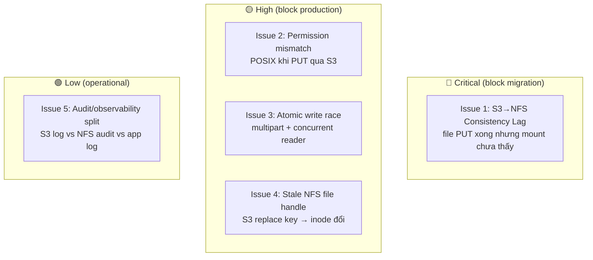
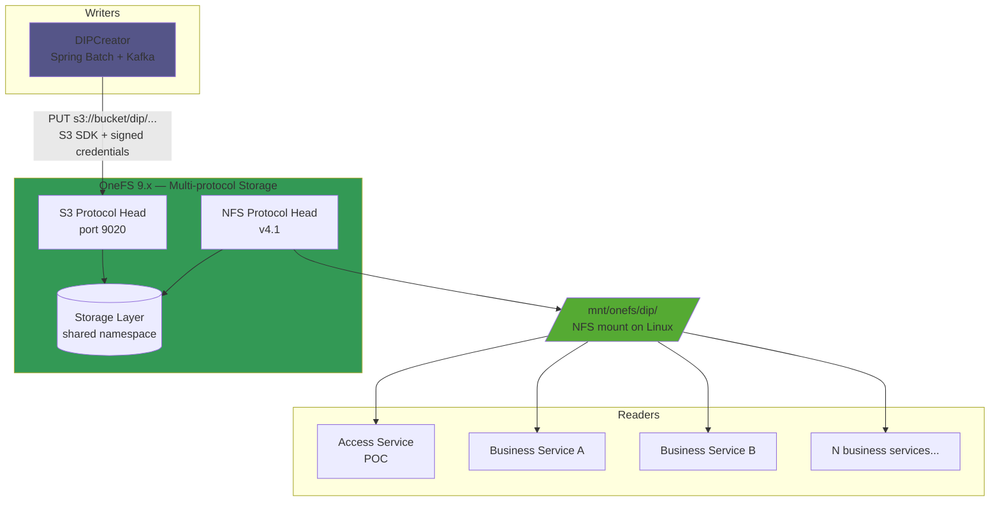
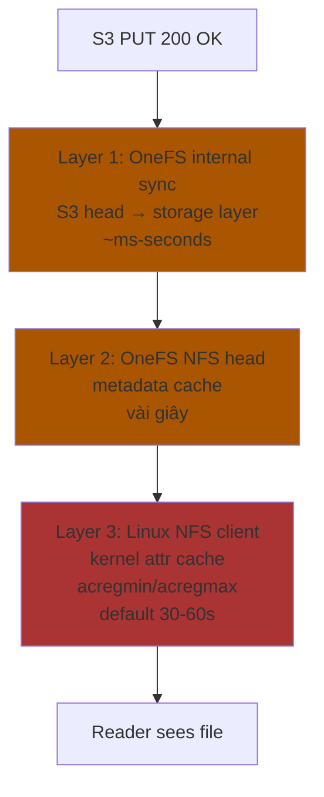
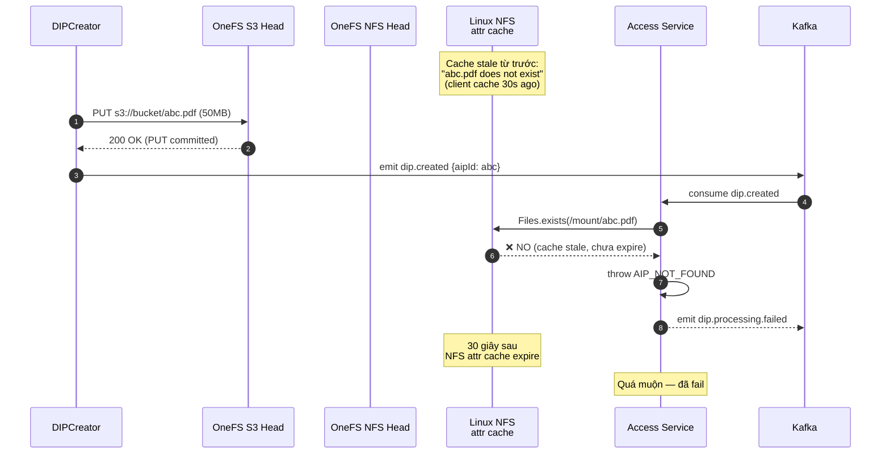
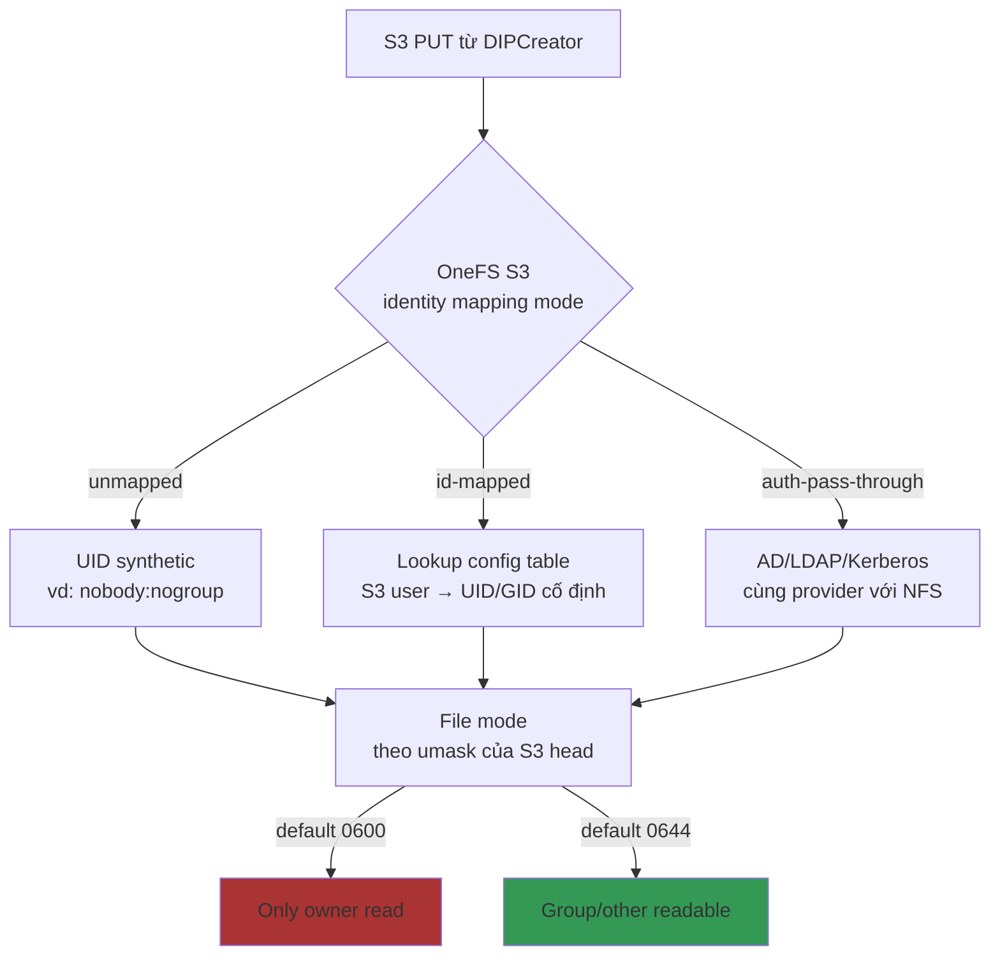
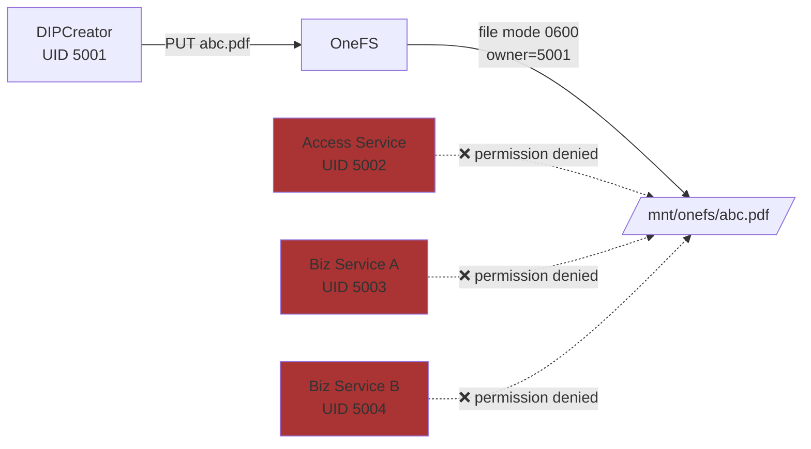
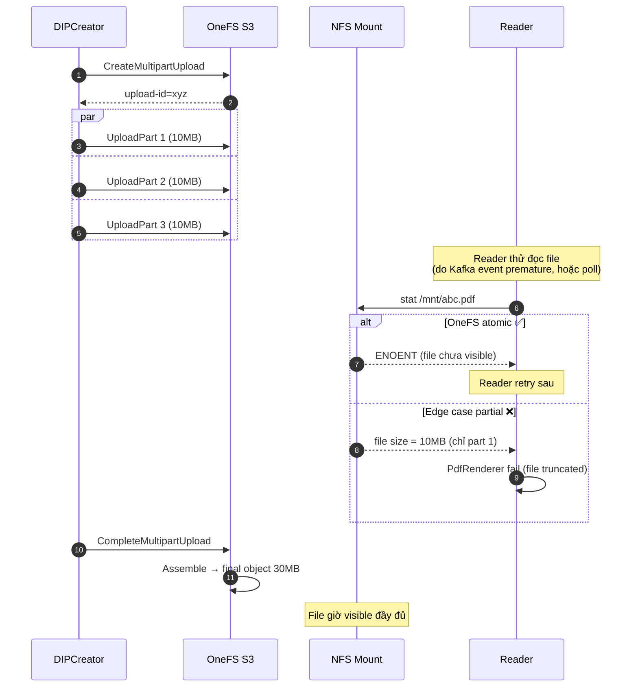
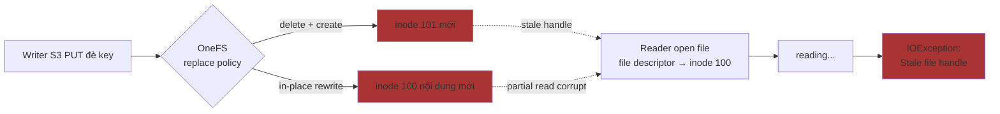
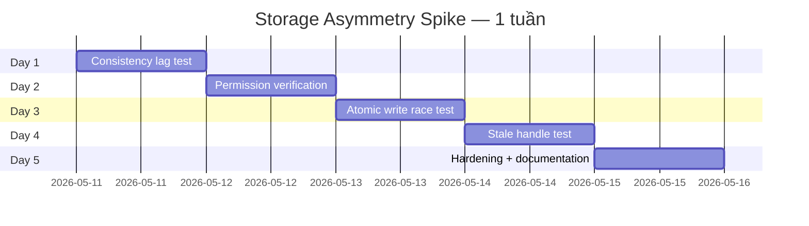

# Storage Asymmetry — Issues & Engineering

**Phạm vi**: Phân tích kỹ thuật pattern **write-via-S3 / read-via-mount** trên OneFS, các issue tiềm ẩn, và engineering pattern để mitigate.

**Đối tượng đọc**: Backend Engineer, Infra/Ops, SRE, Architect.

**Status**: Draft — chờ spike validation kết quả thực tế.

---

## 1. Tóm tắt (TL;DR)

| Yêu cầu | Trả lời |
|---|---|
| Pattern hiện tại có bị broken không? | ❌ Không — OneFS multi-protocol design hỗ trợ |
| Có issue nghiêm trọng không? | ⚠️ Có 4-5 issue cần engineering pattern cụ thể |
| Có nên đổi sang single-protocol? | ❌ Không — fix engineering, không đổi pattern |
| Effort hardening cho POC migration? | ~5-7 ngày dev + 1 tuần spike validation |

**5 issue ưu tiên xử lý**:



---

## 2. Bối cảnh — Kiến trúc hiện tại

### 2.1 Pattern asymmetric



### 2.2 Lý do giữ pattern asymmetric

| Direction | Protocol | Lý do |
|---|---|---|
| Write | **S3 SDK** | Multipart upload, retry logic, signed credentials, server-side encryption — toolchain trưởng thành; DIPCreator là **single writer** nên dễ control |
| Read | **NFS mount** | Backward compat với nhiều business service đã hoạt động; POSIX semantics; latency thấp; tools standard (`ls`, `cat`, `find`) |

Đổi reader sang S3 SDK tốn kém vì phải migrate **N service** đồng thời — risk + effort không tương xứng với benefit.

### 2.3 Multi-protocol consistency của OneFS

OneFS thiết kế cho cùng namespace: **file PUT qua S3 → eventually visible qua NFS** (và ngược lại). Tuy nhiên "eventually" chứa nhiều layer cache có time-window hữu hạn — chính nguồn gốc các issue dưới đây.

---

## 3. Issue 1 — S3→NFS Consistency Lag (🔴 Critical)

### 3.1 Cơ chế

3 nguồn delay giữa S3 PUT 200 OK và file visible trên mount:



Layer 3 thường là thủ phạm chính — Linux NFS client cache attribute (file size, mtime, exists?) trong RAM để tránh round-trip mỗi `stat()`. Mặc định `acregmin=3, acregmax=60` (giây).

### 3.2 Sequence race điển hình



### 3.3 Mitigation pattern

#### A. Mount option `actimeo`

```
mount -t nfs -o vers=4.1,actimeo=3,hard,intr onefs:/dip /mnt/dip
```

Giảm attr cache xuống 3 giây — chấp nhận lag tối đa 3s. Tradeoff: metadata performance giảm vì mỗi `stat()` đi network nhiều hơn (tăng ~3-5x latency cho metadata-heavy workload).

`actimeo=0` tắt cache hoàn toàn nhưng quá tốn — không khuyến nghị trừ khi consistency tuyệt đối cần.

#### B. Verify-then-notify (Recommended) ✅

DIPCreator phải **prove file visible qua mount** trước khi emit Kafka event:

```java
@Service
public class DipPublisher {

    private final S3Client s3;
    private final KafkaTemplate<String, DipReadyEvent> kafka;

    @Value("${oais.storage.mount-root}")
    private Path mountRoot;

    public void publishDipReady(String aipId, String s3Key, long expectedSize) {
        // Step 1: PUT đã thành công (caller đã làm)
        Path mountPath = mountRoot.resolve(s3Key);

        // Step 2: Verify visibility qua mount
        Awaitility.await()
            .alias("DIP visible on mount: " + s3Key)
            .atMost(Duration.ofSeconds(30))
            .pollInterval(Duration.ofMillis(500))
            .until(() -> Files.exists(mountPath)
                      && Files.size(mountPath) == expectedSize);

        // Step 3: Verify content readable
        try (InputStream in = Files.newInputStream(mountPath)) {
            in.read(new byte[1024]);  // touch first KB
        } catch (IOException e) {
            throw new IllegalStateException("Mount visibility verified but read failed", e);
        }

        // Step 4: Chỉ emit khi đã verify
        kafka.send("dip.created", new DipReadyEvent(aipId, s3Key, expectedSize));
    }
}
```

**Pattern**: *don't notify until you can prove the next consumer can read*.

#### C. Consumer retry với backoff (defense-in-depth)

Cho trường hợp DIPCreator chưa kịp verify (legacy code chưa migrate hoặc race khác):

```java
@KafkaListener(topics = "dip.created")
public void onDipReady(DipReadyEvent ev) {
    Path mountPath = mountRoot.resolve(ev.s3Key());

    try {
        Awaitility.await()
            .atMost(Duration.ofSeconds(60))
            .pollInterval(Duration.ofSeconds(1))
            .ignoreException(NoSuchFileException.class)
            .until(() -> Files.exists(mountPath));
    } catch (ConditionTimeoutException e) {
        log.error("DIP {} not visible on mount after 60s — likely race or actual missing", ev.aipId());
        kafka.send("dip.processing.failed", new ProcessingFailedEvent(ev.aipId(), "MOUNT_TIMEOUT"));
        return;
    }

    renderPages(mountPath);
}
```

#### D. Stale-aware retry trong Access service (cho user-facing path)

Khi user request DIP, nếu gặp `NoSuchFileException`:

```java
public DipManifest getManifest(String aipId) {
    Path mountPath = resolveMount(aipId);
    int attempts = 0;
    while (true) {
        try {
            if (Files.exists(mountPath)) return buildManifest(mountPath);
            throw new NoSuchFileException(mountPath.toString());
        } catch (NoSuchFileException e) {
            if (++attempts >= 3) throw new AipNotFoundException(aipId);
            try { Thread.sleep(500); } catch (InterruptedException ie) { Thread.currentThread().interrupt(); }
        }
    }
}
```

### 3.4 Effort estimate

| Task | Effort |
|---|---|
| Mount option tuning | 0.5 ngày (cấu hình + restart mount) |
| Verify-then-notify trong DIPCreator | 1-2 ngày |
| Consumer retry trong Access | 0.5 ngày |
| Stale-aware retry user-facing | 0.5 ngày |
| Test chaos (kill OneFS S3 head, verify retry) | 1 ngày |
| **Tổng Issue 1** | **3.5–4 ngày** |

---

## 4. Issue 2 — Permission Mismatch (🟡 High)

### 4.1 Cơ chế

S3 và POSIX dùng 2 model auth khác nhau:

| Aspect | S3 | POSIX (NFS) |
|---|---|---|
| Identity | Access Key / Secret | UID / GID |
| Permission | Bucket policy + ACL | mode (rwx for owner/group/other) |
| Inheritance | Bucket-level default | Directory inherit (depend on FS) |

Khi DIPCreator PUT qua S3, OneFS phải map S3 user → POSIX UID/GID. Mapping mode:



### 4.2 Vấn đề thường gặp



File chỉ owner đọc được. Reader fail "permission denied" mặc dù mount thành công.

### 4.3 Mitigation

#### A. Standardize service account identity (Recommended)

Tất cả service liên quan dùng cùng **POSIX group** (vd: `dip-readers` GID 6000):

```bash
# Linux side
groupadd --gid 6000 dip-readers
usermod -aG dip-readers dipcreator-svc
usermod -aG dip-readers access-svc
usermod -aG dip-readers bizA-svc
# ...

# OneFS side: cấu hình S3 head để PUT tạo file với group=6000
isi s3 buckets modify dip --default-acl FULL_CONTROL,GROUP=dip-readers,READ
```

#### B. Default ACL ở OneFS bucket

Cấu hình OneFS S3 bucket để file mới luôn có ACL `group:read`:

```bash
# Pseudo-code admin
isi s3 buckets modify dip-bucket \
    --default-object-acl "owner:rw,group:r,other:none" \
    --default-group dip-readers
```

Thực tế command syntax tùy version OneFS — verify với infra team.

#### C. Verify spike (1-2 ngày)

```bash
# 1. PUT file qua DIPCreator
aws s3 cp test.pdf s3://onefs-bucket/test/ \
    --endpoint-url https://onefs:9020

# 2. Verify ownership
sudo -u root stat /mnt/onefs/dip/test/test.pdf
# Mong đợi: rw-r--r-- owner=dipcreator-svc group=dip-readers

# 3. Verify đọc được từ Access UID
sudo -u access-svc cat /mnt/onefs/dip/test/test.pdf > /dev/null
echo "Access exit: $?"

# 4. Verify đọc được từ Biz UID
sudo -u bizA-svc cat /mnt/onefs/dip/test/test.pdf > /dev/null
echo "BizA exit: $?"
```

Nếu bất kỳ exit != 0 → cấu hình OneFS / mount lại chưa đúng.

### 4.4 Effort estimate

| Task | Effort |
|---|---|
| Spike verify ownership pattern | 0.5 ngày |
| Cấu hình OneFS S3 default ACL | 0.5 ngày (cùng infra team) |
| Standardize service account UID/GID | 0.5-1 ngày (nếu chưa làm) |
| Update DIPCreator nếu cần explicit ACL khi PUT | 0.5 ngày |
| **Tổng Issue 2** | **2-2.5 ngày** |

---

## 5. Issue 3 — Atomic Write Race (🟡 High)

### 5.1 Cơ chế

S3 multipart upload chia file lớn thành parts:

```
1. CreateMultipartUpload         → upload-id
2. UploadPart × N (parallel)     → part 1, 2, 3, ...
3. CompleteMultipartUpload       → assemble final object
```

Trong window 2→3, file đang được build. Behavior tùy implementation:

| Implementation | Behavior |
|---|---|
| AWS S3 (canonical) | File NOT visible cho đến CompleteMultipartUpload — atomic ✅ |
| OneFS 9.x (theo spec) | Atomic ✅ (theo spec) |
| OneFS 9.x edge cases | Có thể leak partial nếu network glitch khi Complete retry |

### 5.2 Race scenario



### 5.3 Mitigation: Staging pattern (Recommended) ✅

Tạo file ở key tạm trước, xong rồi mới copy sang key cuối:

```mermaid
flowchart LR
    DC[DIPCreator] -->|1. PUT s3://bucket/.staging/uuid.pdf<br/>multipart upload| Stage[Staging key]
    Stage -->|2. Verify size + checksum| Verify
    Verify -->|3. S3 CopyObject<br/>.staging/uuid → dip/aipId<br/>SERVER-SIDE ATOMIC| Final[Final key]
    Final -->|4. Delete staging| Cleanup
    Cleanup -->|5. Verify mount visibility<br/>(Issue 1 mitigation)| Notify[Emit Kafka]

    Reader -.never sees.-> Stage
    Reader -->|chỉ thấy<br/>khi step 3 xong| Final

    style Stage fill:#a50
    style Final fill:#395
```

S3 `CopyObject` trên cùng OneFS = **server-side copy, atomic** (không streaming bytes qua client). Reader không bao giờ thấy file ở `dip/` ở trạng thái nửa.

### 5.4 Code

```java
@Service
public class DipUploader {

    private final S3Client s3;
    private static final String STAGING_PREFIX = ".staging/";

    public void uploadDip(String aipId, Path sourceFile) throws IOException {
        long expectedSize = Files.size(sourceFile);
        String stagingKey = STAGING_PREFIX + UUID.randomUUID() + ".pdf";
        String finalKey = "dip/" + aipId + ".pdf";

        try {
            // Step 1: Multipart upload to staging
            s3.putObject(b -> b.bucket(BUCKET).key(stagingKey),
                         RequestBody.fromFile(sourceFile));

            // Step 2: Verify size
            HeadObjectResponse head = s3.headObject(b -> b.bucket(BUCKET).key(stagingKey));
            if (head.contentLength() != expectedSize) {
                throw new IOException("Staging size mismatch: " + head.contentLength()
                                       + " != " + expectedSize);
            }

            // Step 3: Atomic server-side copy
            s3.copyObject(b -> b
                .sourceBucket(BUCKET).sourceKey(stagingKey)
                .destinationBucket(BUCKET).destinationKey(finalKey));

        } finally {
            // Step 4: Cleanup staging (best-effort)
            try {
                s3.deleteObject(b -> b.bucket(BUCKET).key(stagingKey));
            } catch (Exception e) {
                log.warn("Staging cleanup failed (non-fatal): {}", stagingKey, e);
            }
        }

        // Step 5: Verify mount visibility before emitting event (Issue 1)
        publishDipReady(aipId, finalKey, expectedSize);
    }
}
```

### 5.5 Lifecycle policy cho staging

OneFS S3 lifecycle rule auto-delete `.staging/*` sau N giờ → cleanup file orphaned khi DIPCreator crash giữa step 3-4:

```json
{
  "Rules": [{
    "ID": "expire-staging",
    "Status": "Enabled",
    "Filter": { "Prefix": ".staging/" },
    "Expiration": { "Days": 1 }
  }]
}
```

### 5.6 Effort estimate

| Task | Effort |
|---|---|
| Implement staging pattern trong DIPCreator | 1-2 ngày |
| OneFS lifecycle rule cho staging cleanup | 0.5 ngày |
| Test với multipart 200MB file + concurrent reader | 1 ngày |
| **Tổng Issue 3** | **2.5–3.5 ngày** |

---

## 6. Issue 4 — Stale NFS File Handle (🟡 High)

### 6.1 Cơ chế

Khi DIPCreator PUT đè key đã tồn tại:



### 6.2 Mitigation

#### A. Immutable naming policy (Recommended) ✅

Không bao giờ overwrite cùng key:

```
dip/abc123/v1/sample.pdf    ← phiên bản 1, immutable
dip/abc123/v2/sample.pdf    ← phiên bản 2 (mới), immutable
dip/abc123/latest -> v2/    ← symlink hoặc metadata pointer
```

Reader đang đọc v1 → giữ inode đó cho đến khi đóng file. v1 vẫn tồn tại trên disk → không stale.

OneFS lifecycle policy auto-delete v1 sau N ngày khi v2 trở thành latest → tránh tích storage vô hạn.

```mermaid
flowchart TB
    Update[DIPCreator update DIP] --> NewVer[PUT s3://bucket/dip/abc/v3/file.pdf]
    NewVer --> Pointer[Update metadata:<br/>abc/latest = v3]
    Pointer --> Notify[Emit dip.updated<br/>{aipId: abc, version: 3}]

    Notify --> ReaderOld[Reader đang đọc v2]
    ReaderOld --> Continue[Continue v2 đến khi xong]

    Notify --> ReaderNew[Reader mới]
    ReaderNew --> ReadV3[Đọc v3]

    Lifecycle[OneFS lifecycle<br/>retention=7d] -.cleanup v1, v2 sau 7d.-> Cleanup

    style NewVer fill:#395
    style Continue fill:#395
```

#### B. Retry on stale handle (defense-in-depth)

```java
public BufferedImage renderPage(Path pdfPath, int pageNum) throws IOException {
    int attempts = 0;
    while (true) {
        try (PDDocument doc = Loader.loadPDF(pdfPath.toFile())) {
            return new PDFRenderer(doc).renderImageWithDPI(pageNum, 150);
        } catch (IOException e) {
            String msg = e.getMessage() != null ? e.getMessage().toLowerCase() : "";
            if ((msg.contains("stale") || msg.contains("handle")) && ++attempts < 3) {
                log.warn("Stale handle on {}, retry {}/3", pdfPath, attempts);
                try { Thread.sleep(500); } catch (InterruptedException ie) {
                    Thread.currentThread().interrupt();
                }
                continue;
            }
            throw e;
        }
    }
}
```

#### C. Coordination via Kafka

Trước khi DIPCreator overwrite, emit `dip.about-to-replace`. Reader (vd: Access service cache) invalidate trước:

```java
// DIPCreator
kafka.send("dip.about-to-replace", new ReplaceEvent(aipId)).get();
Thread.sleep(2000);  // give readers time to drain
s3.copyObject(..., finalKey);  // now safe to replace

// Access service
@KafkaListener(topics = "dip.about-to-replace")
public void onReplace(ReplaceEvent ev) {
    closeOpenHandles(ev.aipId());
    invalidateCache(ev.aipId());
}
```

Phức tạp hơn — chỉ làm khi pattern A không khả thi.

### 6.3 Effort estimate

| Task | Effort |
|---|---|
| Implement immutable versioning trong DIPCreator | 1 ngày |
| Update Access service resolve "latest version" | 0.5 ngày |
| Retry logic cho stale handle | 0.5 ngày |
| OneFS lifecycle rule cho old versions | 0.5 ngày |
| **Tổng Issue 4** | **2-2.5 ngày** |

---

## 7. Issue 5 — Audit/Observability Split (🟢 Low)

### 7.1 Vấn đề

```mermaid
flowchart TB
    Event1[DIPCreator PUT file] --> AuditS3[OneFS S3 access log]
    Event2[Service đọc file qua mount] --> AuditNFS[OneFS NFS audit<br/>nếu enable]
    Event3[User xem page qua POC] --> AuditApp[App: AccessAuditService<br/>JSON line log]
    Event4[Business service đọc bulk] --> AuditNFS

    AuditS3 --> Different[3 source khác nhau<br/>format khác, retention khác]
    AuditNFS --> Different
    AuditApp --> Different

    Different --> Hard[Compliance audit:<br/>"Ai đã access doc X lúc nào?"<br/>→ phải merge 3 source]

    style Hard fill:#a50
```

### 7.2 Mitigation

#### A. Centralize qua app layer (POC pattern đã đúng)

POC `AccessAuditService` ghi mọi user-facing access vào `access-audit.log` — đây là **source of truth** cho compliance:

- Storage-layer audit (S3 / NFS) chỉ dùng cho ops debugging.
- Compliance audit chỉ dựa vào app log.

#### B. Aggregate vào centralized observability

```
S3 access log → CloudWatch / Splunk
NFS audit → Splunk / Elasticsearch
App audit → Kafka → ELK
```

Aggregate vào 1 dashboard với common fields: `userId, aipId, action, timestamp, ip`.

#### C. Structured logging cho app audit

POC hiện tại ghi JSON line — production nên thêm:

```json
{
  "ts": "2026-05-06T10:15:30Z",
  "trace_id": "abc-123",
  "viewer_id": "user-uuid",
  "user_id": "real-user-from-auth",  // ← thêm
  "aip_id": "doc-hash",
  "event": "PAGE_DELIVERED",
  "page": 5,
  "mode": 3,
  "ip": "10.0.0.5",
  "duration_ms": 47
}
```

Thêm `trace_id` để correlate với DIPCreator log + S3 access log nếu cần.

### 7.3 Effort estimate

| Task | Effort |
|---|---|
| Mở rộng AccessAuditService với trace_id + real user | 0.5 ngày |
| Setup centralized log aggregation (nếu chưa có) | 1-3 ngày (depend trên infra) |
| Documentation runbook reconcile 3 source | 0.5 ngày |
| **Tổng Issue 5** | **0.5-2 ngày app + infra** |

---

## 8. Severity Matrix Tổng Hợp

```mermaid
quadrantChart
    title Storage Asymmetry Issues — Likelihood × Impact
    x-axis Low Impact --> High Impact
    y-axis Low Likelihood --> High Likelihood
    quadrant-1 Address now (critical)
    quadrant-2 Monitor (likely)
    quadrant-3 Defer
    quadrant-4 Plan ahead
    Issue 1 — Consistency lag: [0.9, 0.95]
    Issue 2 — Permission mismatch: [0.85, 0.6]
    Issue 3 — Atomic write race: [0.7, 0.55]
    Issue 4 — Stale handle: [0.65, 0.55]
    Issue 5 — Audit split: [0.3, 0.4]
```

| Issue | Likelihood | Impact | Effort | Priority |
|---|---|---|---|---|
| 1. Consistency lag | 🔴 Rất cao | 🔴 Block first access | 3.5–4 ngày | **P0 — phải fix** |
| 2. Permission mismatch | 🟡 Cao (1-time setup) | 🔴 Block hoàn toàn nếu sai | 2–2.5 ngày | **P0 — phải fix** |
| 3. Atomic write race | 🟡 Trung | 🟡 Render fail / partial | 2.5–3.5 ngày | **P1** |
| 4. Stale handle | 🟡 Trung | 🟡 Sporadic render fail | 2–2.5 ngày | **P1** |
| 5. Audit split | 🟢 Thấp | 🟢 Compliance overhead | 0.5–2 ngày | **P2** |

**Tổng effort hardening**: ~10–13 ngày (1 dev FT) hoặc ~5–7 ngày (2 dev parallel).

---

## 9. Spike Validation Plan (1 tuần)

Trước khi đi vào Phase A của migration, dành 1 tuần verify thực tế trên môi trường staging:



### 9.1 Day 1 — Consistency lag

```bash
#!/bin/bash
# spike/consistency-lag.sh
TOTAL=100
LAG_LOG=lag.log
> $LAG_LOG

for i in $(seq 1 $TOTAL); do
  KEY="test-lag-$i.bin"
  dd if=/dev/urandom of=/tmp/$KEY bs=1M count=10 2>/dev/null
  PUT_START=$(date +%s%N)

  # PUT via S3
  aws s3 cp /tmp/$KEY s3://onefs-bucket/test/$KEY \
      --endpoint-url https://onefs:9020 --quiet
  PUT_END=$(date +%s%N)

  # Poll mount
  STAT_START=$(date +%s%N)
  while [ ! -f /mnt/onefs/test/$KEY ]; do sleep 0.1; done
  STAT_END=$(date +%s%N)

  LAG_MS=$(( (STAT_END - PUT_END) / 1000000 ))
  echo "$KEY $LAG_MS" >> $LAG_LOG
  rm /tmp/$KEY
done

echo "=== Lag distribution ==="
awk '{print $2}' $LAG_LOG | sort -n | awk '
  BEGIN {c=0}
  {a[c++]=$1}
  END {
    print "p50:", a[int(c*0.5)], "ms"
    print "p95:", a[int(c*0.95)], "ms"
    print "p99:", a[int(c*0.99)], "ms"
    print "max:", a[c-1], "ms"
  }'
```

**Pass criteria**: p99 < 5000ms (5 giây). Nếu cao hơn → tune `actimeo` hoặc dùng verify-then-notify.

### 9.2 Day 2 — Permission verification

```bash
#!/bin/bash
# spike/permission-test.sh
SVCS=("dipcreator-svc" "access-svc" "biz-a-svc" "biz-b-svc")
KEY="perm-test-$(date +%s).pdf"

# PUT từ DIPCreator
sudo -u dipcreator-svc aws s3 cp ./test.pdf s3://onefs-bucket/test/$KEY \
    --endpoint-url https://onefs:9020

# Verify ownership
echo "=== File metadata ==="
stat -c '%a %U %G' /mnt/onefs/test/$KEY

# Test mỗi service đọc
echo "=== Read test per service ==="
for svc in "${SVCS[@]}"; do
  if sudo -u $svc cat /mnt/onefs/test/$KEY > /dev/null 2>&1; then
    echo "✅ $svc: OK"
  else
    echo "❌ $svc: PERMISSION DENIED"
  fi
done
```

**Pass criteria**: Tất cả service expected reader → exit 0.

### 9.3 Day 3 — Atomic write race

```bash
#!/bin/bash
# spike/atomic-write.sh
KEY="atomic-test-$(date +%s).pdf"
SIZE_MB=200

# Background reader: poll mount mỗi 100ms
(
  while true; do
    if [ -f /mnt/onefs/test/$KEY ]; then
      SIZE=$(stat -c %s /mnt/onefs/test/$KEY)
      echo "$(date +%s%N) size=$SIZE"
    fi
    sleep 0.1
  done
) > reader.log &
READER_PID=$!

# Writer: multipart PUT
dd if=/dev/urandom of=/tmp/$KEY bs=1M count=$SIZE_MB 2>/dev/null
aws s3 cp /tmp/$KEY s3://onefs-bucket/test/$KEY \
    --endpoint-url https://onefs:9020

sleep 5
kill $READER_PID

# Analyze: reader có bao giờ thấy size khác $SIZE_MB không?
echo "=== Reader observed sizes ==="
awk '{print $2}' reader.log | sort -u

EXPECTED_SIZE=$((SIZE_MB * 1024 * 1024))
PARTIAL=$(awk -v exp=$EXPECTED_SIZE '$2 != "size="exp && $2 != ""{print}' reader.log | wc -l)
if [ "$PARTIAL" -eq 0 ]; then
  echo "✅ Atomic: reader chỉ thấy full size hoặc không thấy"
else
  echo "❌ Non-atomic: reader thấy $PARTIAL lần partial"
fi
```

**Pass criteria**: Reader chỉ thấy `size=expected` hoặc không thấy file. Nếu thấy partial → bắt buộc dùng staging pattern.

### 9.4 Day 4 — Stale handle test

```java
// spike/StaleHandleTest.java
public class StaleHandleTest {
    public static void main(String[] args) throws Exception {
        Path file = Paths.get("/mnt/onefs/test/stale.pdf");

        // Create initial file
        Files.write(file, "v1 content".getBytes());

        // Open in reader
        try (FileChannel reader = FileChannel.open(file, READ)) {
            ByteBuffer buf = ByteBuffer.allocate(1024);
            reader.read(buf);
            System.out.println("Read v1: " + new String(buf.array()).trim());

            // Replace via S3 in another process (subprocess)
            new ProcessBuilder("aws", "s3", "cp", "v2.pdf",
                "s3://onefs-bucket/test/stale.pdf",
                "--endpoint-url", "https://onefs:9020").start().waitFor();
            Thread.sleep(2000);

            // Try read again from same handle
            buf.clear();
            try {
                int n = reader.read(buf);
                System.out.println("Read after replace: " + new String(buf.array()).trim());
            } catch (IOException e) {
                System.out.println("Got: " + e.getMessage());  // expect "Stale file handle"
            }
        }
    }
}
```

**Document**: Behavior thực tế (stale exception? partial read? new content?). Quyết định pattern A (immutable) hay B (retry).

### 9.5 Day 5 — Hardening final

- Document mount options chuẩn cho production.
- Document OneFS S3 ACL config.
- Document OneFS lifecycle policy cho staging + old versions.
- Output: `STORAGE-OPS-CHECKLIST.md` checklist cho ops team apply config.

---

## 10. Production Runbook (Quick Reference)

### 10.1 Common errors & first-aid

| Symptom | Likely cause | First check |
|---|---|---|
| `AIP_NOT_FOUND` ngay sau khi DIP created | Issue 1 (lag) | `Files.exists()` after 5s; check Kafka event order |
| `Permission denied` reading mount | Issue 2 | `stat -c '%a %U %G' file`; verify service UID/GID |
| Partial PDF render / corrupt content | Issue 3 (race) | Verify staging pattern in DIPCreator; check OneFS multipart settings |
| `Stale file handle` IOException | Issue 4 | Check if key was overwritten; verify immutable naming |
| Compliance audit gap | Issue 5 | Check `access-audit.log` first (source of truth) |

### 10.2 Health check script

```bash
#!/bin/bash
# /opt/oais/health-check.sh

# 1. Mount accessible
if ! mountpoint -q /mnt/onefs/dip; then
  echo "CRITICAL: Mount not active"; exit 2
fi

# 2. Mount writable test
TEST_FILE=/mnt/onefs/dip/.health-check-$(date +%s)
if ! touch $TEST_FILE 2>/dev/null; then
  echo "WARN: Mount read-only or permission issue"; exit 1
fi
rm $TEST_FILE

# 3. S3 endpoint reachable
if ! curl -sf -o /dev/null https://onefs:9020/health; then
  echo "WARN: OneFS S3 endpoint unreachable"; exit 1
fi

# 4. PUT-then-mount-read smoke
TEST_KEY=health-$(date +%s).txt
echo "test" > /tmp/$TEST_KEY
aws s3 cp /tmp/$TEST_KEY s3://onefs-bucket/health/$TEST_KEY \
    --endpoint-url https://onefs:9020 --quiet || { echo "CRITICAL: S3 PUT failed"; exit 2; }

# Wait up to 30s for visibility
for i in $(seq 1 60); do
  [ -f /mnt/onefs/health/$TEST_KEY ] && break
  sleep 0.5
done

if [ ! -f /mnt/onefs/health/$TEST_KEY ]; then
  echo "CRITICAL: Lag exceeded 30s"; exit 2
fi

aws s3 rm s3://onefs-bucket/health/$TEST_KEY --endpoint-url https://onefs:9020 --quiet
rm /tmp/$TEST_KEY
echo "OK: All checks passed"
exit 0
```

Chạy mỗi 5 phút từ monitoring system.

### 10.3 Mount option recommendation

```
# /etc/fstab
onefs:/dip  /mnt/onefs/dip  nfs  vers=4.1,actimeo=3,hard,intr,rsize=1048576,wsize=1048576,timeo=50,retrans=2  0  0
```

| Option | Lý do |
|---|---|
| `vers=4.1` | NFSv4 file locking + better consistency than v3 |
| `actimeo=3` | Attr cache 3s — balance consistency vs metadata perf |
| `hard,intr` | Hard mount + interruptible — survive transient outage |
| `rsize/wsize=1MB` | Lớn hơn default; tốt cho file PDF/PNG |
| `timeo=50,retrans=2` | Fail nhanh hơn default (mặc định = treo) |

---

## 11. Decision: Asymmetric vs Single-Protocol?

| Option | Pros | Cons | Recommendation |
|---|---|---|---|
| **Giữ asymmetric** (status quo) | Backward compat; minimal change | 5 issue cần engineering (10-13 ngày) | ✅ **Recommended** |
| Migrate readers sang S3 | Eliminate Issue 1, 4 | Migrate N business services; mất POSIX semantics; effort tháng | ❌ Quá tốn |
| Migrate writers sang NFS | Đơn giản hóa | Mất S3 SDK ergonomics, signed URL ingestion | ❌ Bước lùi |
| Hybrid (1 số read S3, 1 số read NFS) | Linh hoạt | 2x complexity; khó maintain | ❌ Chỉ khi thật sự cần |

→ **Pattern asymmetric không phải lỗi thiết kế** — nó là tradeoff hợp lý cho hệ thống đa-consumer trên OneFS. 5 issue trên là **cost of doing business** với pattern này, và có engineering pattern proven để mitigate.

---

## 12. Sign-off Checklist

Trước khi go-live migration phase A, đảm bảo:

- [ ] Spike 1 tuần đã chạy với kết quả document trong `STORAGE-OPS-CHECKLIST.md`
- [ ] DIPCreator implement verify-then-notify (Issue 1 mitigation B)
- [ ] DIPCreator implement staging pattern (Issue 3)
- [ ] DIPCreator implement immutable naming với version path (Issue 4)
- [ ] Access service implement stale-aware retry (Issue 1, 4)
- [ ] Mount options đã apply: `actimeo=3,hard,intr,timeo=50` trên tất cả node
- [ ] OneFS S3 ACL default đã cấu hình group-readable
- [ ] OneFS lifecycle rule cho `.staging/*` (1 day) và old versions (7 day)
- [ ] Health check script deployed + alerting setup
- [ ] Service account UID/GID standardized cross all consumers
- [ ] AccessAuditService extended với trace_id + real user
- [ ] Runbook documented trong `docs/OPS-RUNBOOK.md` (hoặc tài liệu này §10)
- [ ] On-call team trained trên 5 common errors + first-aid

---

## 13. Tham chiếu

- POC overview: [`POC.md`](./POC.md)
- Migration plan: [`MIGRATION.md`](./MIGRATION.md)
- Render+Viewer detail: [`RENDER-VIEWER-DETAIL.md`](./RENDER-VIEWER-DETAIL.md)
- OneFS S3 docs: https://www.dell.com/support/manuals/onefs (varies by version)
- AWS S3 atomicity guarantees: https://docs.aws.amazon.com/AmazonS3/latest/userguide/Welcome.html#ConsistencyModel
- Linux NFS attr cache: `man 5 nfs` → `acregmin`, `acregmax`, `acdirmin`, `acdirmax`
- Awaitility library: https://github.com/awaitility/awaitility
