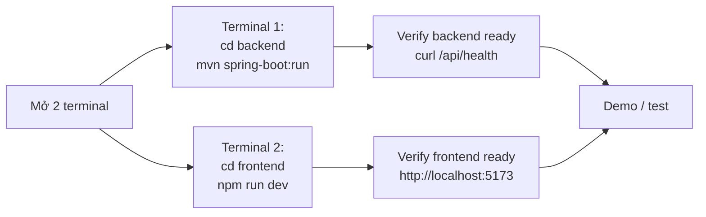

# User Guide — POC OAIS Access

**Đối tượng đọc**: 2 nhóm:
- **End User** (§3): người dùng cuối — truy cập viewer, xem tài liệu
- **Operator** (§4): người vận hành — chạy POC để demo/test cho stakeholder

**Mục đích tài liệu**: hướng dẫn thực hành, không yêu cầu kiến thức kỹ thuật sâu. Tham chiếu sang [`POC.md`](./POC.md) cho thuyết minh thiết kế.

---

## Mục lục

1. [Tổng quan — POC này là gì?](#1-tổng-quan--poc-này-là-gì)
2. [Bắt đầu nhanh (5 phút)](#2-bắt-đầu-nhanh-5-phút)
3. [Hướng dẫn End User](#3-hướng-dẫn-end-user)
4. [Hướng dẫn Operator](#4-hướng-dẫn-operator)
5. [Kịch bản demo cho stakeholder](#5-kịch-bản-demo-cho-stakeholder)
6. [Troubleshooting](#6-troubleshooting)
7. [FAQ](#7-faq)
8. [Hiệu năng & giới hạn](#8-hiệu-năng--giới-hạn)

---

## 1. Tổng quan — POC này là gì?

### 1.1 Một dòng tóm tắt

POC chứng minh khả năng cho phép user **xem tài liệu trên trình duyệt** mà **không cho phép tải file gốc về máy**, lấy cảm hứng từ chuẩn OAIS (Open Archival Information System).

### 1.2 Ai dùng cho cái gì?

| Vai trò | Mục đích sử dụng POC |
|---|---|
| **Tech Lead / Architect** | Đánh giá tính khả thi của giải pháp anti-download |
| **Product Owner** | Demo trước stakeholder, validate yêu cầu PRD |
| **Developer** | Tham khảo code reuse cho production migration |
| **QA / Test Engineer** | Verify hành vi 3 mode anti-download |
| **Compliance / Security** | Kiểm tra defense-in-depth, threat model |

### 1.3 POC có và không có gì

| ✅ POC có | ❌ POC không có |
|---|---|
| Render PDF page-by-page thành ảnh, xem từng trang | DRM thật (Widevine/PlayReady) |
| Watermark text chéo dynamic theo session | Authentication thật (JWT/OIDC) |
| HMAC token bound viewerId, TTL 30s | Upload UI |
| 3 mode anti-download switch runtime | Search / list filtering nâng cao |
| Audit log mỗi request access | High availability / multi-instance scale |
| Hot-reload tài liệu test | Production-ready security hardening |

> **Quan trọng**: POC raise the bar cho casual download, không phải solution chống screenshot bằng OS / camera ngoài.

---

## 2. Bắt đầu nhanh (5 phút)

### 2.1 Yêu cầu trên máy

| Tool | Version | Kiểm tra |
|---|---|---|
| Java | 21+ | `java -version` |
| Node.js | 20+ | `node -v` |
| Maven | 3.9+ | `mvn -v` |

> Tools optional cho Office/Video: LibreOffice + ffmpeg. POC chạy được không có chúng (chỉ thiếu DOCX/MP4).

### 2.2 Khởi động trong 5 phút

```powershell
# Terminal 1 — Backend
cd D:\projects\claudeCode\poc-oais-access\backend
mvn spring-boot:run
# → đợi log "Started AccessApplication" (~10 giây)

# Terminal 2 — Frontend
cd D:\projects\claudeCode\poc-oais-access\frontend
npm install        # lần đầu
npm run dev
# → đợi log "Local: http://localhost:5173"
```

Mở trình duyệt: **http://localhost:5173**

### 2.3 Verify chạy đúng

| Test | Cách kiểm tra | Kỳ vọng |
|---|---|---|
| Backend up | `curl http://localhost:8090/api/health` | `{"status":"ok",...}` |
| Frontend up | Mở `http://localhost:5173` | Thấy "OAIS Access — POC" header |
| Có tài liệu | `archival-storage/samples/` chứa file | Card hiển thị ở Home |

> Không thấy card? Xem [§4.2 Bổ sung tài liệu test](#42-bổ-sung-tài-liệu-test).

---

## 3. Hướng dẫn End User

### 3.1 Truy cập ứng dụng

Mở trình duyệt vào **http://localhost:5173**. Bạn sẽ thấy:

```
┌─────────────────────────────────────────────────────────────────────┐
│  📄 OAIS Access — POC    [Tài liệu]  [OAIS Mapping]    [Mode 1│2│3] │ ← Header
├─────────────────────────────────────────────────────────────────────┤
│  Tài liệu khả dụng                              [↻ Rescan]          │
│  OAIS Access · DIP được generate khi bạn click vào tài liệu.        │
│                                                                      │
│  ┌─────────────┐  ┌─────────────┐  ┌─────────────┐                  │
│  │     📕      │  │     🖼️      │  │     🎬      │                  │
│  │ sample.pdf  │  │ photo.png   │  │ video.mp4   │                  │
│  │ [PDF] 14tr  │  │ [IMAGE] 1tr │  │ [VIDEO]     │                  │
│  │ application │  │ image/png   │  │ video/mp4   │                  │
│  │ /pdf        │  │             │  │             │                  │
│  └─────────────┘  └─────────────┘  └─────────────┘                  │
└─────────────────────────────────────────────────────────────────────┘
```

| Phần | Chức năng |
|---|---|
| Logo "OAIS Access — POC" (trái) | Click → quay về Home |
| "Tài liệu" / "OAIS Mapping" (giữa) | Navigation |
| ModeSelector (phải) | Chuyển đổi 3 mode anti-download — xem [§3.5](#35-chuyển-đổi-3-mode-anti-download) |
| Cards | Mỗi card = 1 tài liệu. Click → mở viewer |
| Nút ↻ Rescan | Re-scan thư mục samples nếu vừa thêm/xóa file |

### 3.2 Xem tài liệu PDF

1. Click card có icon 📕 (PDF).
2. Trang viewer mở ra:

```
┌─────────────────────────────────────────────────────────────────────┐
│  ← Tài liệu                                                          │
│  sample.pdf                                                          │
│  [PDF] [Mode 1] [14 trang]                                          │
├─────────────────────────────────────────────────────────────────────┤
│  ┌─────────────────────────────────────────────────────────────────┐│
│  │ [⏮] [←] Trang [3] / 14 [→] [⏭]            [-] 100% [+]         ││
│  ├─────────────────────────────────────────────────────────────────┤│
│  │                                                                  ││
│  │            (Hiển thị page 3 dưới dạng ảnh)                       ││
│  │                                                                  ││
│  └─────────────────────────────────────────────────────────────────┘│
└─────────────────────────────────────────────────────────────────────┘
```

**Điều khiển**:

| Nút | Phím tắt | Chức năng |
|---|---|---|
| ⏮ | — | Trang đầu |
| ← | — | Trang trước |
| Trang [N] | Gõ số | Nhảy thẳng tới trang N |
| → | — | Trang kế |
| ⏭ | — | Trang cuối |
| − / + | — | Zoom out / in (50% – 300%) |

### 3.3 Xem ảnh

Click card có icon 🖼️ (IMAGE). Ảnh hiển thị toàn khung viewer, không có toolbar phức tạp (vì chỉ 1 trang).

### 3.4 Xem video

Click card có icon 🎬 (VIDEO). Video hiển thị trong `<video>` element với controls chuẩn của browser, **trừ nút Download** (đã bị ẩn qua `controlsList="nodownload"`).

> Lưu ý: video chạy qua HLS streaming (chia nhỏ thành các segment 6 giây). User không thể save nguyên file MP4 gốc qua các nút thông thường.

### 3.5 Chuyển đổi 3 mode anti-download

Trên header, click một trong 3 nút **Mode 1 / Mode 2 / Mode 3**. Lựa chọn được lưu trong session, áp dụng cho tất cả tài liệu.

#### Mode 1 — Basic (mặc định)

| Hành vi | Cảm nhận |
|---|---|
| Right-click bị chặn | Menu chuột phải không xuất hiện |
| Drag & drop bị chặn | Không kéo ảnh ra desktop được |
| Copy text bị chặn | Ctrl+C không hoạt động trên viewer |
| Backend trả `Cache-Control: no-store` | Browser không lưu cache |

**Khi nào dùng**: demo cơ bản, performance tốt nhất (không có overhead watermark/token).

#### Mode 2 — Watermark

Tất cả của Mode 1 + **watermark dynamic** in chéo lên mỗi trang:

```
   {viewerId-8-chars}-2026-05-06 14:30:15
```

Watermark thay đổi mỗi 5 giây (timestamp). Dù user save được PNG đơn lẻ, ảnh đã có dấu vết user + thời điểm.

**Khi nào dùng**: demo tracability, tài liệu nhạy cảm.

#### Mode 3 — Strong (Token + Blur)

Tất cả của Mode 2 + 2 tính năng strict:

1. **HMAC token TTL 30 giây**: mỗi page request cần token tươi. URL copy ra ngoài session → 403.
2. **Blur khi mất focus**: viewer tự động blur khi:
   - Click sang tab/cửa sổ khác (Alt+Tab)
   - Tab inactive (`document.visibilityState === "hidden"`)
   - Mở DevTools (F12)

**Khi nào dùng**: demo strict scenario, document highly confidential.

> Mode 3 có UX trade-off: nếu mạng chậm hoặc DevTools mở vô tình, viewer blur. Đây là deter by design.

---

## 4. Hướng dẫn Operator

### 4.1 Khởi động hệ thống

#### Workflow chuẩn



#### Khởi động backend

```powershell
cd D:\projects\claudeCode\poc-oais-access\backend
mvn spring-boot:run

# Log mong đợi:
# ...
# o.s.b.w.embedded.tomcat.TomcatWebServer  : Tomcat started on port 8090
# c.p.o.a.AccessApplication                : Started AccessApplication in 2.123 seconds
```

Nếu lỗi `Port 8090 was already in use` → xem [§6.2](#62-port-8090-bị-chiếm).

#### Khởi động frontend

```powershell
cd D:\projects\claudeCode\poc-oais-access\frontend
npm install        # lần đầu hoặc khi đổi package.json
npm run dev

# Log mong đợi:
#   VITE v5.4.21  ready in 412 ms
#   ➜  Local:   http://localhost:5173/
#   ➜  press h + enter to show help
```

#### Override port nếu cần

```powershell
# Backend chạy port khác
$env:SERVER_PORT = "9000"; mvn spring-boot:run

# Khi đổi backend port, sửa frontend/vite.config.ts:
#   target: "http://localhost:9000"
```

### 4.2 Bổ sung tài liệu test

POC scan `archival-storage/samples/` lúc startup. Có 2 cách thêm tài liệu:

#### Cách 1 — Hot-reload (Recommended)

```powershell
# Bước 1: copy file vào samples/
Copy-Item "C:\path\to\my-doc.pdf" "D:\projects\claudeCode\poc-oais-access\archival-storage\samples\"

# Bước 2: bấm nút ↻ Rescan trên Home page
# HOẶC qua curl:
curl -X POST http://localhost:8090/api/admin/rescan
# → {"indexedCount":3,"elapsedMs":12,"scannedAt":"2026-05-06T..."}
```

#### Cách 2 — Restart backend

```powershell
# Kill backend cũ
Get-NetTCPConnection -LocalPort 8090 -State Listen | ForEach-Object {
    Stop-Process -Id $_.OwningProcess -Force
}

# Start lại
cd backend
mvn spring-boot:run
```

#### File hỗ trợ

| Extension | Renderer | Yêu cầu |
|---|---|---|
| `.pdf` | PdfRenderer | Built-in |
| `.png`, `.jpg`, `.jpeg` | ImageRenderer | Built-in |
| `.docx`, `.xlsx`, `.pptx`, `.doc`, `.xls`, `.ppt` | OfficeRenderer | LibreOffice cài trên máy |
| `.mp4` | VideoRenderer | ffmpeg cài trên máy |

#### Quy tắc filename

- Filename không bắt đầu bằng dấu chấm (`.`)
- Không dùng tên trùng `README.txt`
- Tốt nhất: ASCII không space, ví dụ `report-q1.pdf` (filename Vietnamese vẫn chạy nhưng đôi khi LibreOffice mangle)

### 4.3 Reset cache rendered

Khi muốn force re-render từ đầu (vd: đổi DPI, fix bug renderer):

```powershell
Remove-Item -Recurse -Force "D:\projects\claudeCode\poc-oais-access\archival-storage\derived-cache\*"
# Bấm ↻ Rescan hoặc click vào tài liệu — sẽ tự render lại
```

Cache layout (để tham khảo):

```
archival-storage/derived-cache/
├── {aipId}/                  # 1 thư mục per AIP
│   ├── .ready                # sentinel: render xong
│   ├── manifest.properties   # metadata
│   ├── page-1.png
│   ├── page-2.png
│   └── ...
└── ...
```

Xoá thư mục `{aipId}/` cụ thể nếu muốn re-render chỉ 1 tài liệu.

### 4.4 Kiểm tra audit log

Mọi page request ghi 1 dòng JSON vào `backend/logs/access-audit.log`:

```powershell
# Xem 20 dòng cuối
Get-Content "D:\projects\claudeCode\poc-oais-access\backend\logs\access-audit.log" -Tail 20

# Theo dõi realtime
Get-Content "D:\projects\claudeCode\poc-oais-access\backend\logs\access-audit.log" -Wait -Tail 0

# Đếm số request theo viewerId hôm nay
Get-Content "D:\projects\claudeCode\poc-oais-access\backend\logs\access-audit.log" |
    ConvertFrom-Json |
    Group-Object viewerId |
    Sort-Object Count -Descending
```

Mỗi entry có format:
```json
{
  "ts": "2026-05-06T08:21:11.935Z",
  "aipId": "c9eed62bd1534c38",
  "viewerId": "abc-123-uuid",
  "event": "PAGE_DELIVERED",
  "details": {"page": 5, "ip": "127.0.0.1", "mode": 2}
}
```

Event types: `PAGE_DELIVERED`, `HLS_SEGMENT_DELIVERED`, `MANIFEST_FETCHED`, `TOKEN_REJECTED`.

### 4.5 Dừng hệ thống

```powershell
# Frontend (Terminal 2)
Ctrl+C

# Backend (Terminal 1)
Ctrl+C
# HOẶC kill process port 8090:
Get-NetTCPConnection -LocalPort 8090 -State Listen | ForEach-Object {
    Stop-Process -Id $_.OwningProcess -Force
}
```

### 4.6 Run unit tests

```powershell
cd D:\projects\claudeCode\poc-oais-access\backend
mvn test
# Tests run: 81, Failures: 0, Errors: 0, Skipped: 0
# BUILD SUCCESS
```

Báo cáo chi tiết: `backend/target/surefire-reports/`.

### 4.7 Run frontend production build

```powershell
cd D:\projects\claudeCode\poc-oais-access\frontend
npm run build
# Output: dist/index.html, dist/assets/...
npm run preview
# Serve dist/ tại http://localhost:4173
```

---

## 5. Kịch bản demo cho stakeholder

### 5.1 Demo 5 phút — Cơ bản

**Mục tiêu**: chứng minh user xem được tài liệu mà không tải về.

| Bước | Thao tác | Lời thuyết minh |
|---|---|---|
| 1 | Mở `http://localhost:5173` | "Đây là Home page liệt kê tài liệu khả dụng" |
| 2 | Click card "sample.pdf" | "Click để mở tài liệu — backend render từng trang thành ảnh, không gửi file gốc" |
| 3 | Navigate qua nhiều trang | "User xem được toàn bộ nội dung — page nào, font gì, hình gì cũng giữ nguyên" |
| 4 | Right-click → menu bị chặn | "Browser không cho phép Save Image, Save Page, View Source" |
| 5 | Mở DevTools → Network tab → click 1 page | "Bạn thấy URL trả về `image/png`, không phải `application/pdf`. Filename trống — browser không gợi ý 'Save As'" |
| 6 | Refresh trang | "Backend log mỗi request — có thể audit ai xem trang nào lúc nào" |

### 5.2 Demo 10 phút — Anti-download nâng cao

Thêm vào sau §5.1:

| Bước | Thao tác | Lời thuyết minh |
|---|---|---|
| 7 | Switch sang Mode 2 trên header | "Mode 2 thêm watermark dynamic" |
| 8 | Mở lại trang PDF | "Mỗi trang có watermark chéo: ID người xem + thời gian. Nếu user save được PNG đơn lẻ, watermark tracability vẫn còn" |
| 9 | Save As ảnh trang | "Mở file đã save — vẫn dính watermark" |
| 10 | Switch sang Mode 3 | "Mode 3 thêm token-based access và blur" |
| 11 | DevTools → copy URL `/api/dip/.../page/3?t=...` | "Token có TTL 30 giây" |
| 12 | Paste URL vào incognito tab | "→ 403 Forbidden, vì token bound viewerId của session gốc" |
| 13 | Quay lại tab gốc, mở DevTools (F12) | "Viewer blur — phát hiện user đang mở DevTools" |
| 14 | Alt+Tab sang app khác | "Viewer blur khi tab inactive — chống screenshot lén" |

### 5.3 Demo 15 phút — Architecture overview

Thêm vào sau §5.2:

| Bước | Thao tác | Lời thuyết minh |
|---|---|---|
| 15 | Show file `docs/POC.md` diagram | "Đây là kiến trúc: Frontend React + Backend Spring Boot + Renderer dispatcher" |
| 16 | Show OAIS mapping page (`/about`) | "Mỗi component map vào OAIS functional entity Access" |
| 17 | `tail -f backend/logs/access-audit.log` rồi click 1 tài liệu | "Audit log realtime — mỗi page request có 1 dòng JSON. Đây là source of truth cho compliance" |
| 18 | Show file `docs/MIGRATION.md` | "Đây là kế hoạch migrate vào hệ thống production hiện tại — chỉ 3-6 tuần effort" |

---

## 6. Troubleshooting

### 6.1 "Không thấy tài liệu nào"

**Triệu chứng**: Home page hiển thị "Chưa có tài liệu".

**Check list**:
```powershell
# 1. Có file trong samples/ không?
Get-ChildItem "D:\projects\claudeCode\poc-oais-access\archival-storage\samples\"

# 2. Backend đã scan chưa?
curl http://localhost:8090/api/documents
# → Nếu trả [], file extension có thể không hỗ trợ

# 3. Click ↻ Rescan trên header
```

**Nguyên nhân thường gặp**:
- Extension không hỗ trợ (xem [§4.2](#42-bổ-sung-tài-liệu-test))
- Filename bắt đầu bằng `.` → bị skip
- File tên `README.txt` → hardcode skip

### 6.2 Port 8090 bị chiếm

**Triệu chứng**: backend log `Port 8090 was already in use`.

**Fix**:
```powershell
# Tìm process đang chiếm
Get-NetTCPConnection -LocalPort 8090 -State Listen |
    Select-Object LocalPort, OwningProcess, @{n='Name';e={(Get-Process -Id $_.OwningProcess).ProcessName}}

# Kill nó (nếu chắc chắn không phải cái đang cần giữ)
Get-NetTCPConnection -LocalPort 8090 -State Listen |
    ForEach-Object { Stop-Process -Id $_.OwningProcess -Force }

# HOẶC chạy backend port khác:
$env:SERVER_PORT = "9000"; mvn spring-boot:run
# Nhớ sửa frontend/vite.config.ts
```

### 6.3 Frontend không kết nối backend

**Triệu chứng**: Browser hiện "API Error: Unable to connect" hoặc lỗi CORS.

**Check list**:
```powershell
# 1. Backend đang chạy?
curl http://localhost:8090/api/health
# → expect 200 + JSON

# 2. Vite proxy đúng port?
Select-String -Path "D:\projects\claudeCode\poc-oais-access\frontend\vite.config.ts" -Pattern "target"
# → expect: target: "http://localhost:8090"

# 3. CORS allow đúng origin?
Select-String -Path "D:\projects\claudeCode\poc-oais-access\backend\src\main\resources\application.yml" -Pattern "allowed-origins"
# → expect: http://localhost:5173
```

### 6.4 PDF không render / "Render failed"

**Triệu chứng**: Click card PDF → viewer hiển thị error.

**Check**:
```powershell
# Backend log gì?
# Trong terminal backend, tìm dòng "ERROR" hoặc "Exception"

# Có thể PDF corrupt — verify bằng tool khác:
# Mở PDF gốc trong Adobe Reader / Edge để confirm file OK
```

**Nguyên nhân**:
- PDF có encryption → POC không xử lý
- PDF corrupt
- File size quá lớn → memory issue (xem [§8](#8-hiệu-năng--giới-hạn))

### 6.5 DOCX không render

**Triệu chứng**: Click card DOCX → 503 RENDERER_UNAVAILABLE.

**Nguyên nhân**: LibreOffice (`soffice`) chưa cài trên máy.

**Fix**:
```powershell
# Windows
winget install TheDocumentFoundation.LibreOffice

# Verify
soffice --version
# → LibreOffice 7.x.y ...

# Restart backend
```

Chi tiết: [README.md → Yêu cầu môi trường](../README.md).

### 6.6 MP4 không render

**Triệu chứng**: Click card video → error.

**Fix**:
```powershell
# Windows
winget install Gyan.FFmpeg

# Verify
ffmpeg -version

# Restart backend
```

### 6.7 Mode 3 token expire ngay lập tức

**Triệu chứng**: Mode 3 → 403 TOKEN_EXPIRED ngay lần đầu request.

**Nguyên nhân**: Clock của máy lệch (NTP không sync).

**Fix**:
```powershell
# Windows: force NTP sync
w32tm /resync

# HOẶC tăng TTL trong application.yml:
# oais.anti-download.page-token-ttl-seconds: 60
```

### 6.8 Watermark trông kỳ / không hiện

**Mode 2/3 watermark hiển thị ở đâu?**

- Server-side: in trực tiếp lên ảnh PNG → không thể remove qua DevTools
- Client-side: CSS overlay `position: fixed` → có thể hide qua DevTools (POC limit)

Nếu thấy overlay client biến mất khi mở DevTools — đó là expected behavior cho POC. Production sẽ có MutationObserver re-attach.

### 6.9 Backend log spam "Stale handle" (production scenario)

Không xảy ra trong POC local (filesystem local). Chỉ relevant khi deploy với NFS mount — xem [`STORAGE-ASYMMETRY.md`](./STORAGE-ASYMMETRY.md).

### 6.10 Test fail "Failed to load ApplicationContext"

Nếu chạy `mvn test` mà gặp lỗi context, kiểm tra:

```powershell
# File này phải có
ls backend/src/test/resources/application.yml
# → expect tồn tại
```

Nếu thiếu → restore từ git history.

---

## 7. FAQ

### Q1: Tôi (user) có thể save file PDF gốc về máy không?

**A**: **Không trực tiếp**. POC chỉ gửi cho browser ảnh PNG của từng trang, không phải file PDF. Bạn có thể save từng trang dưới dạng PNG (Mode 1), nhưng không có file PDF gốc nào tới browser.

Trong Mode 2/3, ảnh PNG còn có watermark — dù save được, tracability vẫn còn.

### Q2: Mode nào nên dùng cho production?

**A**: Tùy yêu cầu:
- **Tài liệu công khai (low sensitivity)**: Mode 1 đủ
- **Tài liệu nội bộ (medium)**: Mode 2 — watermark giúp deter casual leak
- **Tài liệu confidential**: Mode 3 — strict control, accept UX trade-off

### Q3: Watermark hiển thị thông tin gì?

**A**: `{viewerId-8-chars}-{YYYY-MM-DD HH:mm:ss}` — VD: `abc12345-2026-05-06 14:30:15`. ViewerId là UUID per session (tự sinh, không phải user thật trong POC).

Production sẽ thay viewerId bằng `userId` từ auth provider (OIDC/JWT) → tracability theo người thật.

### Q4: Token TTL 30 giây có quá ngắn không?

**A**: Cho POC: vừa đủ chứng minh khái niệm. Cho production: tăng lên 60s và frontend prefetch tokens cho page lookahead — chi tiết [`RENDER-VIEWER-DETAIL.md` §5.7](./RENDER-VIEWER-DETAIL.md#57-tradeoffs--alternatives).

### Q5: Tôi có thể test trên Safari / Firefox không?

**A**:
- **Chrome / Edge**: full support, tested
- **Firefox**: full support, hành vi tương đương
- **Safari**: PDF/Image OK; Mode 3 video gặp limit (Safari native HLS không inject token được — POC limit)

### Q6: Backend có lưu trạng thái viewerId không?

**A**: **Không**. Backend stateless: viewerId chỉ tồn tại trong:
- Token HMAC (validate per-request)
- Audit log (ghi để tham chiếu)

Restart backend → tokens cũ bị invalidate (key sinh mới mỗi lần startup — POC behavior). Production dùng Vault key.

### Q7: Tôi có thể chia sẻ link viewer cho người khác không?

**A**: 
- **Mode 1, 2**: link copy được, người khác mở thấy giống bạn (no auth)
- **Mode 3**: link không hoạt động cho người khác — token bound vào viewerId session gốc

Đây là feature, không phải bug.

### Q8: POC có integrate được vào hệ thống hiện có không?

**A**: Có — xem [`MIGRATION.md`](./MIGRATION.md) cho phương án migrate (Phase A→D, ~3-6 tuần). POC code design để tái dụng.

### Q9: Thêm loại tài liệu mới (vd: TIFF, ODP) thì sao?

**A**: Đăng ký renderer mới:
1. Thêm vào enum `DocumentKind` + `DocumentKind.fromExtension()`
2. Implement interface `Renderer`
3. Spring auto-pick lên (constructor injection của `List<Renderer>` trong `DipGeneratorService`)

Chi tiết: [`POC.md` §6.3](./POC.md#63-dipgeneratorservice--renderer-strategy).

### Q10: Có dashboard / admin UI không?

**A**: POC không có. Production cần build separately. POC chỉ có:
- Nút **↻ Rescan** trên Home (cho operator test)
- Trang `/about` (cho dev tham khảo)

### Q11: Hiệu năng thế nào với tài liệu lớn?

**A**: Đo từ POC test:
| Loại | Render | Cache hit |
|---|---|---|
| PDF 1MB / 14 pages | ~2 giây first | <50ms |
| Watermark | +30ms / page | n/a (no cache) |

POC chưa optimize cho file >50MB — production cần streaming PDF lib (xem [`MIGRATION.md` §8.1](./MIGRATION.md#81-critical-risks-cần-spike-sớm)).

### Q12: Báo cáo bug / xin feature mới đâu?

**A**: POC không có issue tracker chính thức. Hiện tại:
- Sửa file `prd.md` ở project root để ghi yêu cầu
- Hoặc commit message khi update code

Production sẽ migrate sang Jira/Linear.

---

## 8. Hiệu năng & giới hạn

### 8.1 Số liệu đo thực tế

| Metric | Giá trị | Ghi chú |
|---|---|---|
| Backend startup | ~10 giây | Cold start với 4 sample files |
| Frontend dev start | ~500ms | Vite HMR |
| PDF render (1MB / 14 pages) | ~2 giây first | Cached subsequent <50ms |
| Mode 1 page serve | <50ms | Stream PNG raw |
| Mode 2 page serve | ~80ms | + Java2D watermark |
| Mode 3 page serve | ~100ms | + token verify |
| Token issue | <10ms | HMAC compute |
| Token verify | <5ms | Constant-time compare |
| Frontend bundle (production) | 740 KB raw, 232 KB gzip | HLS.js chiếm phần lớn |
| Test suite (mvn test) | ~30 giây | 81 tests |

### 8.2 Giới hạn POC

| Giới hạn | Chi tiết |
|---|---|
| Authentication | Pseudo viewerId UUID per session, không phải user thật |
| File size | Tested OK với <50MB PDF; >100MB chưa test, có thể OOM |
| Concurrent users | Single-instance backend, ~10-50 concurrent OK; không tested xa hơn |
| HMAC key persistence | Sinh ngẫu nhiên khi startup — restart = tokens invalid |
| Storage | Local filesystem `archival-storage/` — không scale ngoài 1 host |
| Audit log | File local — không centralized |
| DRM | Không có DRM thật — defense-in-depth, không bullet-proof |
| Browser screenshot | Không thể chống được OS / camera tools |

### 8.3 Khi nào POC "đủ" cho mục đích của bạn?

✅ **POC đủ** nếu bạn muốn:
- Demo concept "view but no download" cho stakeholder
- Test 3 cấp độ anti-download để chọn cho production
- Reference implementation cho team migrate
- Audit log structure để tham khảo

❌ **POC chưa đủ** nếu bạn cần:
- Chạy production scale (1000+ concurrent, file >200MB)
- DRM thật cho video
- Authentication tích hợp với corporate SSO
- Multi-tenant / per-user permissions
- High availability

→ Cần production migration: [`MIGRATION.md`](./MIGRATION.md).

---

## 9. Tham chiếu nhanh

| Tài liệu | Nội dung |
|---|---|
| [`README.md`](../README.md) | Setup nhanh, API reference, config |
| [`POC.md`](./POC.md) | Thuyết minh kỹ thuật tổng thể |
| [`MIGRATION.md`](./MIGRATION.md) | Phương án migrate vào production |
| [`RENDER-VIEWER-DETAIL.md`](./RENDER-VIEWER-DETAIL.md) | Deep-dive render + viewer + token + prefetch |
| [`STORAGE-ASYMMETRY.md`](./STORAGE-ASYMMETRY.md) | OneFS asymmetric pattern issues |
| `prd.md` (project root) | PRD gốc |

### Endpoints quick reference

```
GET   /api/health
GET   /api/documents
GET   /api/documents/{id}
GET   /api/documents/{id}/manifest
POST  /api/admin/rescan
GET   /api/dip/{id}/page-token/{n}
GET   /api/dip/{id}/page/{n}?t={token}&m={mode}
GET   /api/dip/{id}/hls/{file}?t={token}&m={mode}
```

### Useful commands

```powershell
# Health check
curl http://localhost:8090/api/health

# List docs
curl http://localhost:8090/api/documents | python -m json.tool

# Force rescan
curl -X POST http://localhost:8090/api/admin/rescan

# Watch audit log
Get-Content backend/logs/access-audit.log -Wait -Tail 0

# Run tests
cd backend && mvn test

# Reset cache
Remove-Item -Recurse -Force archival-storage/derived-cache/*
```

---

## 10. Liên hệ & feedback

POC này là phiên bản proof-of-concept theo `prd.md`. Mọi feedback / câu hỏi:
- Đọc các tài liệu kỹ thuật trong `docs/`
- Tham khảo source code trong `backend/`, `frontend/`
- Test với samples trong `archival-storage/samples/`

Chúc demo thành công! 🎯
